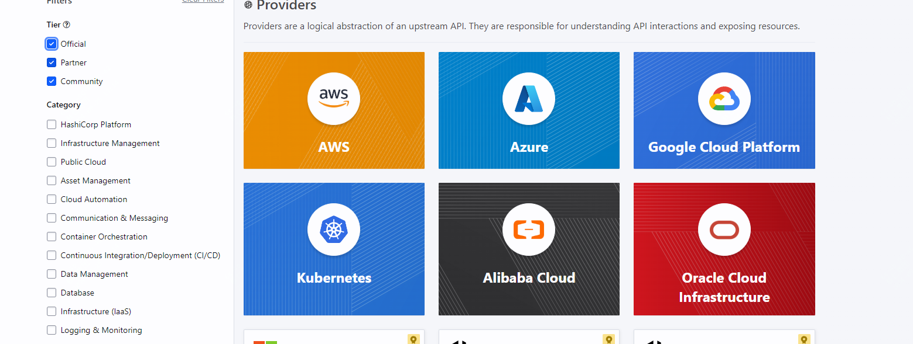
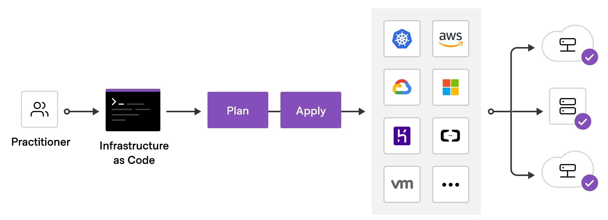
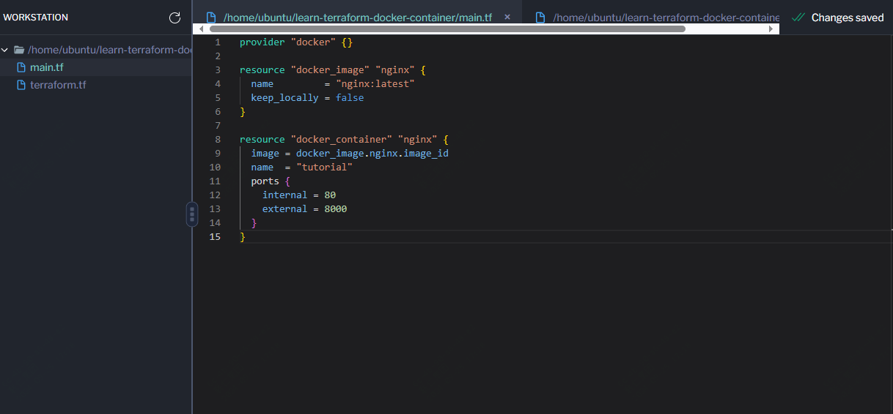
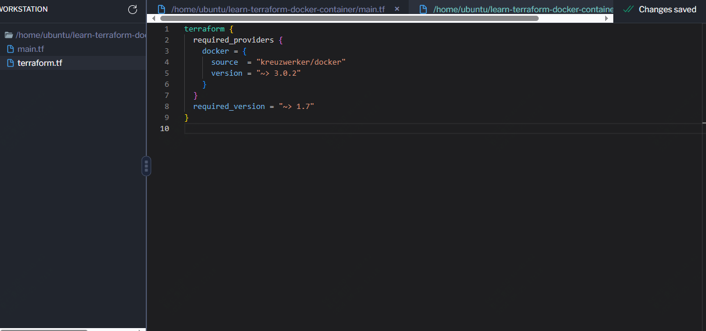
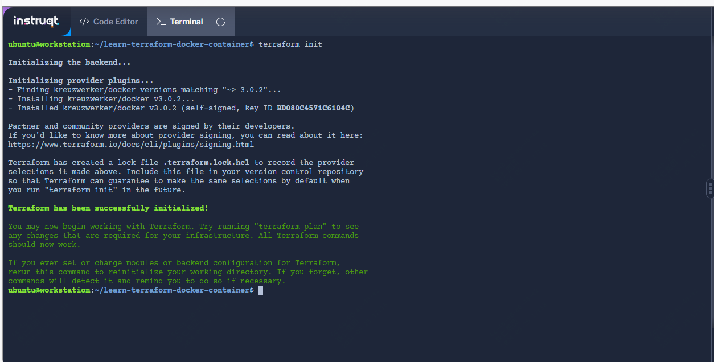
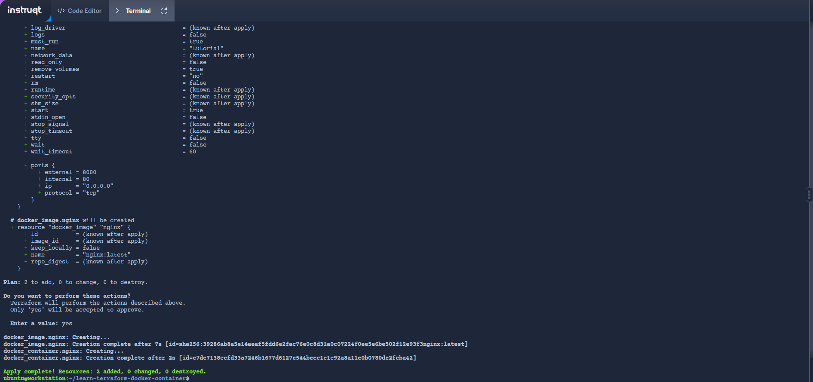
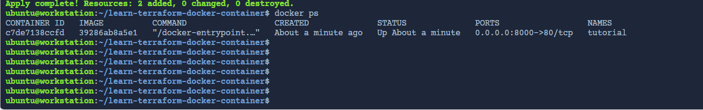
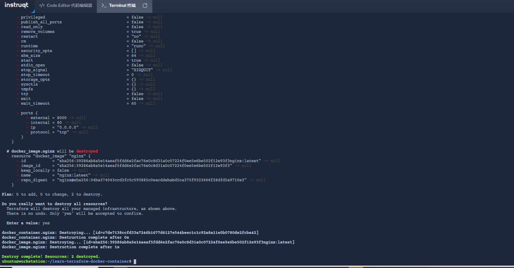
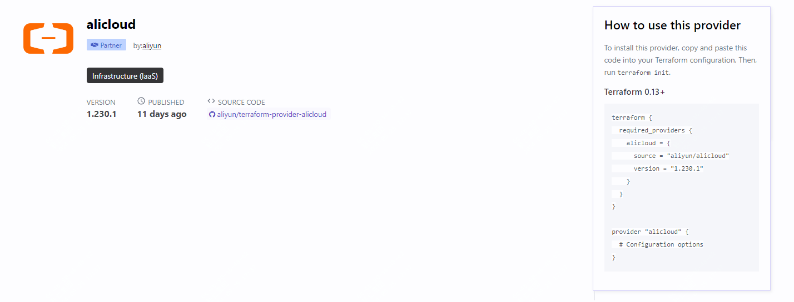
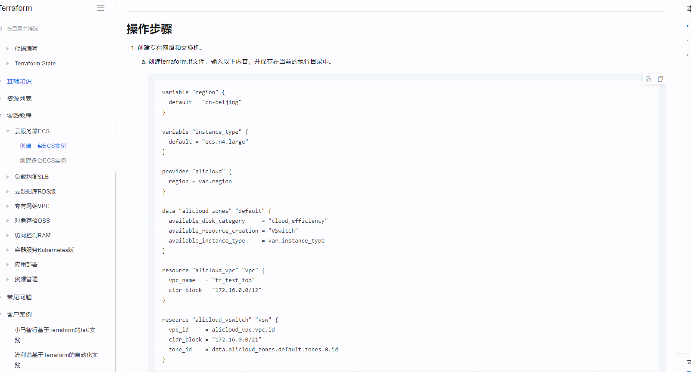

什么是Iac？什么是terraform？两者什么关系


基础设施即代码 (IaC) 工具允许您使用配置文件而不是通过图形用户界面来管理基础设施。 IaC 允许您通过定义可版本化、重用和共享的资源配置，以安全、一致和可重复的方式构建、更改和管理您的基础设施。


Terraform 是 HashiCorp 的基础设施即代码工具。它允许您在人类可读的声明性配置文件中定义资源和基础设施，并管理基础设施的生命周期。与手动管理基础设施相比，使用 Terraform 有几个优点：

- Terraform 可以管理多个云平台上的基础设施。
- 人类可读的配置语言可帮助您快速编写基础架构代码。
- Terraform 的状态允许您跟踪整个部署过程中的资源变化。
- 您可以将配置提交给版本控制，以便在基础架构上安全地进行协作。

## 管理任何基础设施

称为提供程序的 Terraform 插件让 Terraform 通过其应用程序编程接口 (API) 与云平台和其他服务进行交互。 

HashiCorp 和 Terraform 社区已经编写了 1,000 多个提供程序来管理 Amazon Web Services (AWS)、Azure、Google Cloud Platform (GCP)、Kubernetes、Helm、GitHub、Splunk 和 aliyun 等上的资源。



查找您已在Terraform 注册表中使用的许多平台和服务的提供商。如果您找不到所需的提供程序，您可以编写自己的提供程序。


## 标准化您的部署工作流程

提供商将基础设施的各个单元（例如计算实例或专用网络）定义为资源。您可以将来自不同提供商的资源组合成可重用的 Terraform 配置（称为模块），并使用一致的语言和工作流程来管理它们。

Terraform 的配置语言是声明性的，这意味着它描述了基础设施所需的最终状态，这与需要分步指令来执行任务的过程编程语言形成鲜明对比。 Terraform 提供程序会自动计算资源之间的依赖关系，以按照正确的顺序创建或销毁它们。



使用 Terraform 部署基础设施：

- 范围- 确定项目的基础设施。
- 作者- 为您的基础设施编写配置。
- 初始化- 安装 Terraform 管理基础设施所需的插件。
- 计划- 预览 Terraform 将做出的更改以匹配您的配置。
- 应用- 进行计划的更改。

## 跟踪您的基础设施

Terraform 在状态文件中跟踪您的真实基础设施，该文件充当您的环境的事实来源。 Terraform 使用状态文件来确定对基础设施进行的更改，以便它与您的配置相匹配。

## 合作

Terraform 允许您通过其远程状态后端在基础设施上进行协作。当您使用 HCP Terraform（最多 5 个用户免费）时，您可以安全地与队友共享您的状态，为 Terraform 运行提供稳定的环境，并防止多人同时更改配置时出现竞争情况。

您还可以将 HCP Terraform 连接到 GitHub、GitLab 等版本控制系统 (VCS)，从而在您向 VCS 提交配置更改时自动提出基础架构更改建议。这使您可以通过版本控制来管理基础架构的更改，就像使用应用程序代码一样。


## 如下是一个通过terraform来部署docker的示例

你需要提前安装好terraform,centos系统可以参考如下步骤

```
sudo yum install -y yum-utils
sudo yum-config-manager --add-repo https://rpm.releases.hashicorp.com/RHEL/hashicorp.repo
sudo yum -y install terraform
```

主要涉及如下两个配置文件，main.tf和terraform块，它定义了您将在此项目中使用的提供程序和 Terraform 版本。

mian.tf内容如下：
```
provider "docker" {}

resource "docker_image" "nginx" {
  name         = "nginx:latest"
  keep_locally = false
}

resource "docker_container" "nginx" {
  image = docker_image.nginx.image_id
  name  = "tutorial"
  ports {
    internal = 80
    external = 8000
  }
}
```





初始化项目，该项目会下载一个名为提供程序的插件，让 Terraform 与 Docker 交互。

```
terraform init
```


```
terraform apply
```

该命令Terraform 会打印出执行计划，该计划描述了 Terraform 将采取的操作，以便更改您的基础设施以匹配配置。






然后你可以通过如下命令来释放资源

```
terraform destroy
```



如果你是阿里云的用户，那么也可以尝试下直接通过terraform来新建资源，看起来更新还是蛮频繁的。



阿里云官网也有相关的文档

