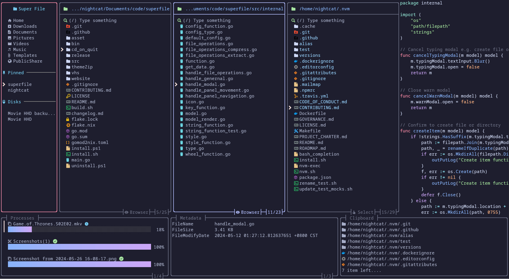
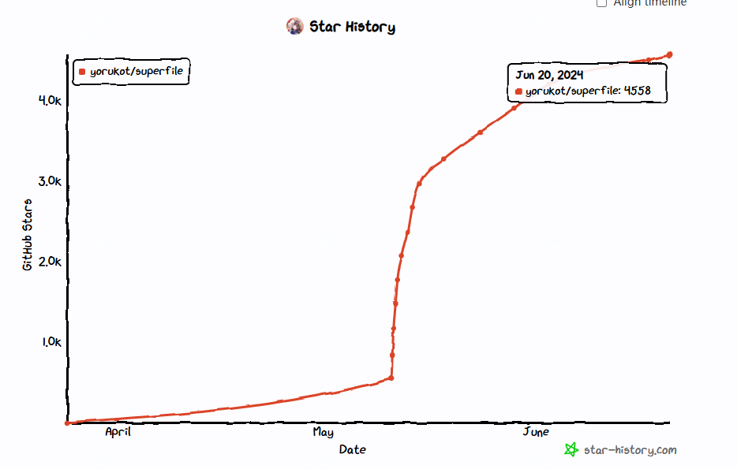
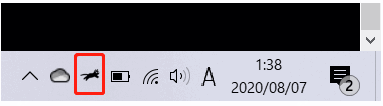
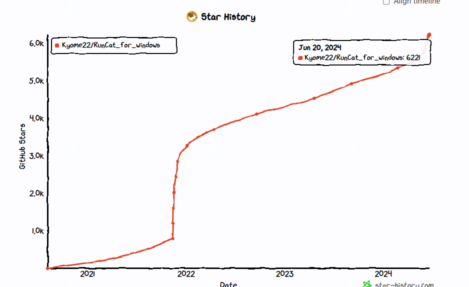
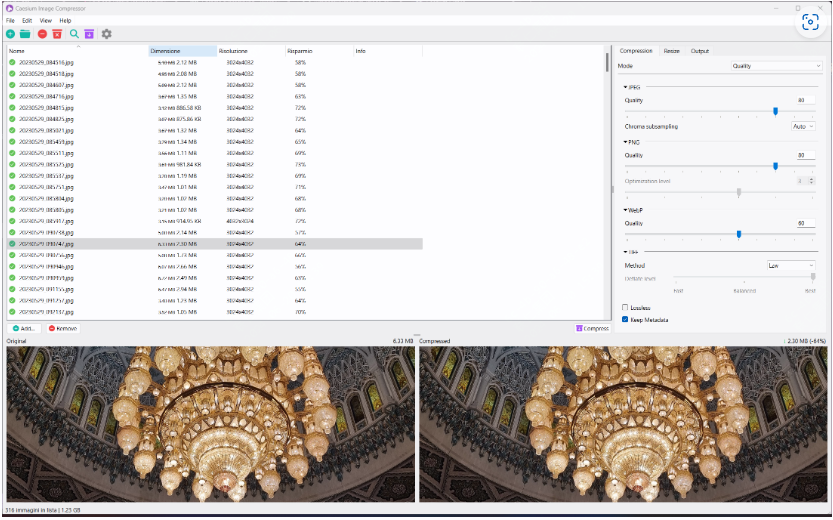
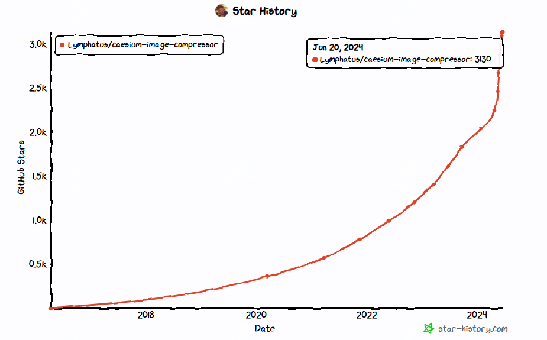
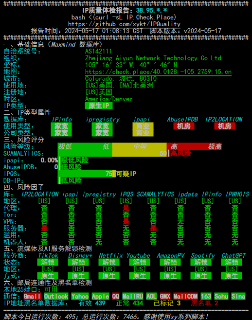
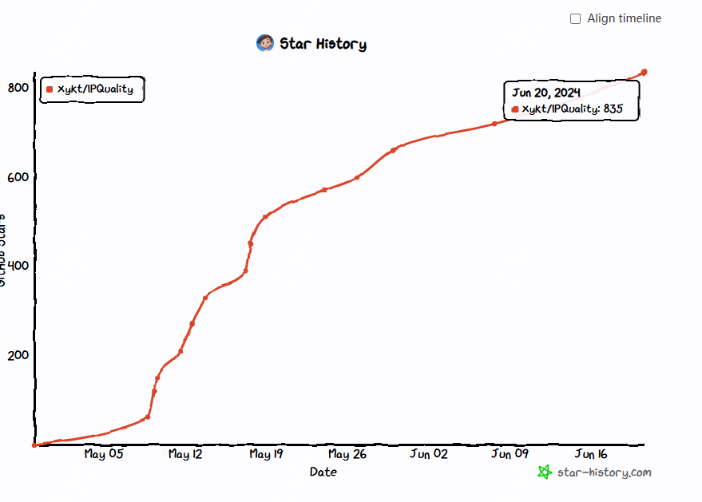
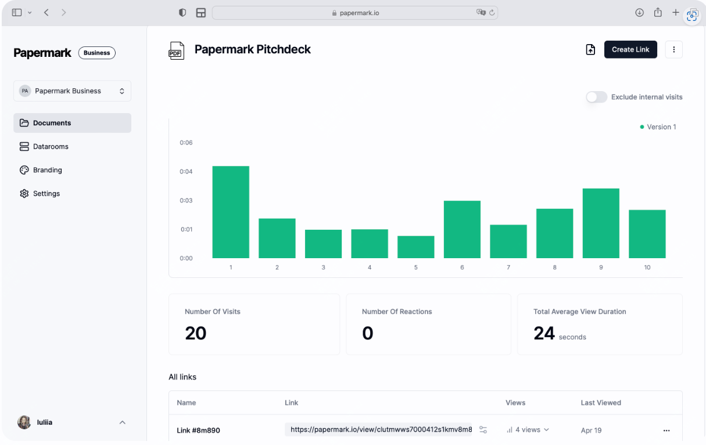
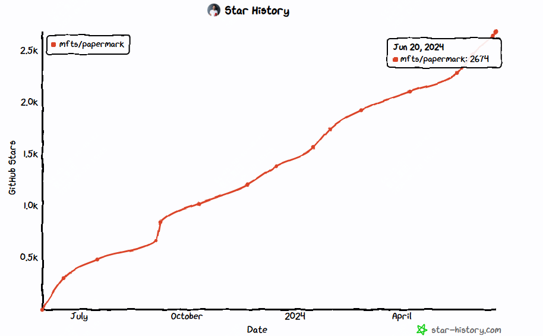

开源世界总是充满惊喜，每周都有新的项目激发我们的想象力。本周，我精选了五个热门的开源项目，它们不仅功能强大，而且各具特色，从文件管理到娱乐，再到专业的图像处理，应有尽有。一起来看下这些项目，看看它们如何能够提升我们的工作效率和生活乐趣。

# 本周开源热门项目推荐

## 1.终端文件管理器：SuperFile

>项目地址：https://github.com/yorukot/superfile

### 项目简介

这是一款go语言写的酷炫的终端文件管理器，可以在命令行高效管理你本地的文件，支持批量文件操作，如重命名、移动、删除等，还支持版本控制，可以查看历史文件，支持多终端linux、mac、windows等。

### star增长图

## 2.跑动的猫：RunCat_for_windows

>项目地址：https://github.com/Kyome22/RunCat_for_windows

### 项目简介

这是一个C#写的无聊却有趣的项目，它可以在你windows任务管理的位置启动一只在跑动的猫，而且随着主机负载的升高，这只猫的跑动会提高。

### star增长图

## 3.图片压缩工具：Caesium Image Compressor 

>项目地址：https://github.com/Lymphatus/caesium-image-compressor

### 项目简介

这是一款主要由C++开发的图像处理工具，是免费开源的，支持图片压缩、多格式支持，而且能够批量处理，多终端支持，可以根据需要调节压缩的比例

### star增长图

## 4. IP质量图：IPQuality

>项目地址：https://github.com/xykt/IPQuality

### 项目简介

IPQuality是一个shell写的用于快速收集IP信息的工具，如果对shell脚本感兴趣的，可以去查看下。

### star增长图

## 5.文档共享：Papermark

>项目地址：https://github.com/mfts/papermark

### 项目简介

这是一款typescript写的开源的文档共享平台，提供了类似DocSend的功能。它允许用户通过自定义链接安全地分享文档，并支持自定义域名和品牌。此外，Papermark内置了文档追踪分析功能，即将推出逐页分析。作为一个自托管的解决方案，用户可以在自己的服务器上部署Papermark，完全控制数据和定制化。

### star增长图

## 总结

本周的开源项目推荐展示了多样化的工具和应用，从SuperFile的高效文件管理到RunCat_for_windows的趣味性，每个项目都有其独特之处。

Caesium Image Compressor的图像压缩功能对于需要处理大量图片的用户来说是一大福音。IPQuality提供了快速的IP信息收集，对于网络管理员和安全专家来说非常有用。最后，Papermark的文档共享平台为企业和个人提供了一个安全、可定制的文档管理解决方案。

## 往期回顾

