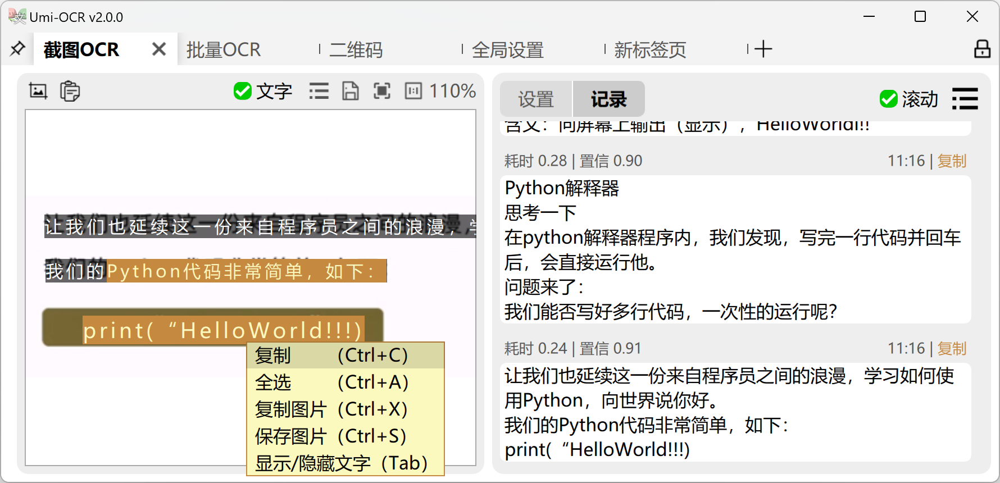

好用的开源OCR工具推荐，Umi-ocr

ocr工具有很多，甚至有些朋友已经习惯用微信自带的文字提取，但是如果你有一些复杂的需求，那么这款工具的用途就很大了。

>项目地址：https://github.com/hiroi-sora/Umi-OCR

### Umi-ocr项目简介

这是一款开源免费的支持离线部署的OCR软件，它有一些特殊的功能，区别于常规的ocr软件

比如说它支持批量识别处理，可以排除掉一些干扰的信息，从而得到你最需要的内容

### 如何安装

最简单的方法，就是去开源github-releases中下载，可以看到下载量已经有217k了。

当然了，作者也提供了其它安装下载方式，可以直接去github上查看。

如果你有一定的动手能力，那么可以去下载源码学习一下，本地构建一下

### 功能特点

关于功能特点，前面已经有所介绍

这里再补充介绍下，在实际使用后，有几个点还是要和大家说一下的。

- 多语言支持，虽然我们用到最多的是中文，但这款工具是支持英文和繁体中文的
- 二维码解析，不得不说，这个功能也是用到最多的，他可以识别二维码并且生成对应二维码包含的内容信息
- 支持文档格式多，如常规的pdf、epub、mobi等都是支持的，而且对于一些页眉、页脚等可以设置忽略
- 批量功能，比如你有一批图片，那么这个功能用着就很爽了

更多其它功能，可以去自行尝试下

### star增长图

star数也是在持续增长中，可以看出该项目的热门程度

