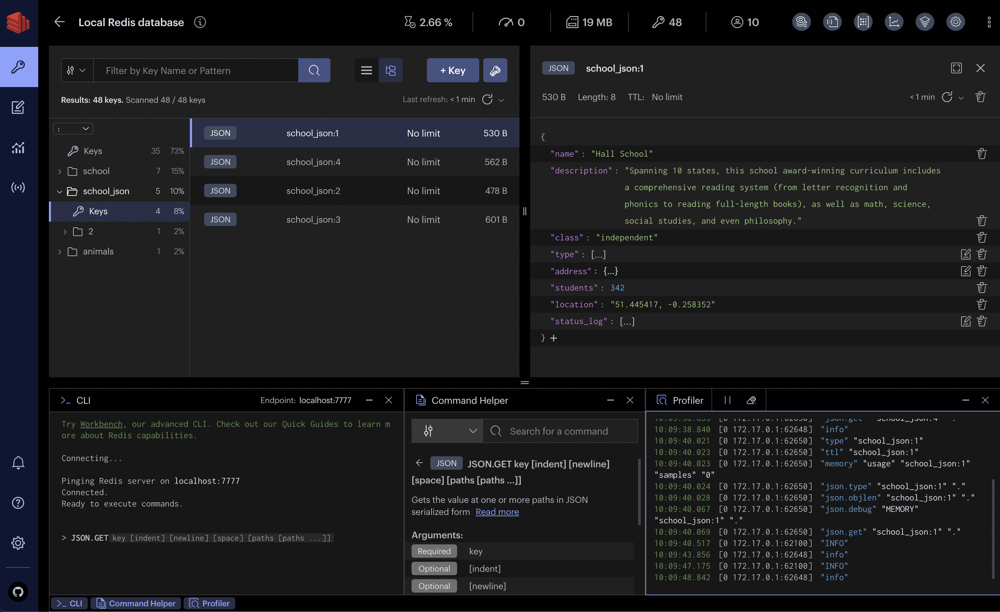
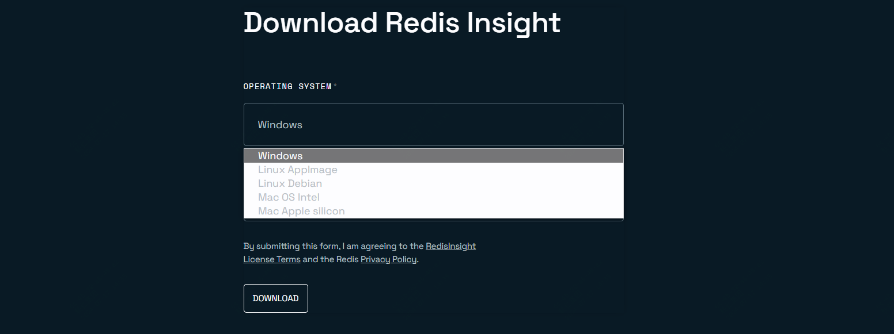

redis官方可视化工具推荐，RedisInsight

如果你的日常工作中有接触到redis，那么这款redis可视化工具，可以作为你备用选择。

相较于以往用到的一些redis工具，它的功能更多，效果更佳

>项目地址：https://github.com/RedisInsight/RedisInsight



### 项目简介

RedisInsight是redis官方推出的redis GUI工具

### 如何安装

 

可以直接在官网下载安装包，支持windows、mac及linux 环境。



也可以直接在docker中安装

```
docker run -d --name redisinsight -p 5540:5540 redis/redisinsight:latest
```

### 功能特点

- 核心功能是查看数据，支持浏览、过滤、可视化你的redis数据，支持多种格式
- 对于列表、散列、字符串、集合支持
- json数据结构支持
- 有交互式使用教程，可轻松学习如何利用原生JSON数据结构，支持结构化查询和全文搜索，包括用于AI用例的向量相似性搜索
- 分析器-实时分析发送到Redis的每个命令
- SlowLog -基于Slowlog命令分析Redis实例中的慢操作
- 批量操作-根据浏览器或树视图中设置的过滤器批量删除密钥

### star数

 