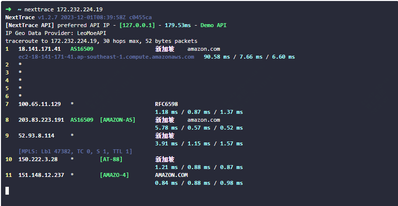
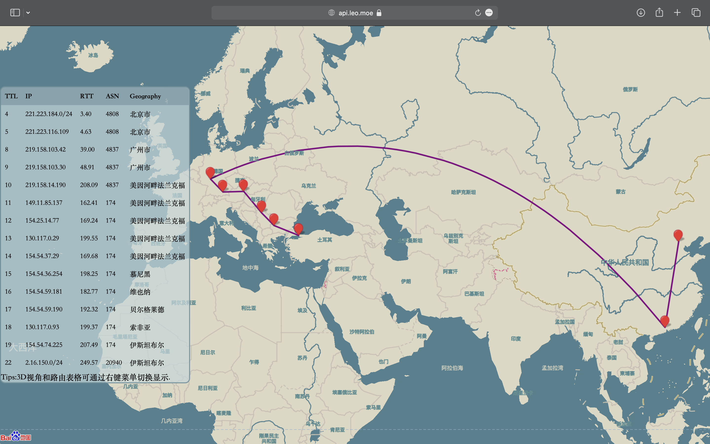

好用的可视化路由追踪神器，真的强大！

如果你日常会用到traceroute之类的工具，那么这个nexttrace项目下的工具一定要了解下。

这是一款Golang 实现的开源的、轻量级的可视化路由追踪CLI工具，效果如下：



>项目地址：https://github.com/nxtrace/NTrace-core

### 项目简介

NextTrace是一个go语言开发的路由追踪工具，相比于常规的工具，它可以将路由追踪到的信息展示为图像，可以更加具象化。



### 如何安装

 

- linux 
一键安装脚本如下：
```
curl nxtrace.org/nt |bash
```

如果是arch linux可以通过aur方式下载：

```
yay -S nexttrace-bin
```
mac环境可以如下方式下载：

```
brew install nexttrace
```
windows可以通过scoop方式下载：
```
scoop bucket add extras && scoop install extras/nexttrace
```
### 功能特点
- IP库更加丰富，展示的I归属更加准确
- 可以生成可视化追踪地图
- 支持多种协议，icmp、tcp、udp
- 支持多语言环境使用
- 支持ipv6环境使用
  
### 如何使用

可以从如下开始，更多具体使用，可以参考官网

```
# IPv4 ICMP Trace
nexttrace 1.0.0.1
# URL
nexttrace http://example.com:8080/index.html?q=1

# Form printing
nexttrace --table 1.0.0.1

# An Output Easy to Parse
nexttrace --raw 1.0.0.1
nexttrace --json 1.0.0.1

# IPv4/IPv6 Resolve Only, and automatically select the first IP when there are multiple IPs
nexttrace --ipv4 g.co
nexttrace --ipv6 g.co

# IPv6 ICMP Trace
nexttrace 2606:4700:4700::1111

# Disable Path Visualization With the -M parameter
nexttrace koreacentral.blob.core.windows.net
# MapTrace URL: https://api.nxtrace.org/tracemap/html/c14e439e-3250-5310-8965-42a1e3545266.html

# Disable MPLS display using the --disable-mpls / -e parameter or the NEXTTRACE_DISABLEMPLS environment variable
nexttrace --disable-mpls example.com
export NEXTTRACE_DISABLEMPLS=1
```
### star增长图

  