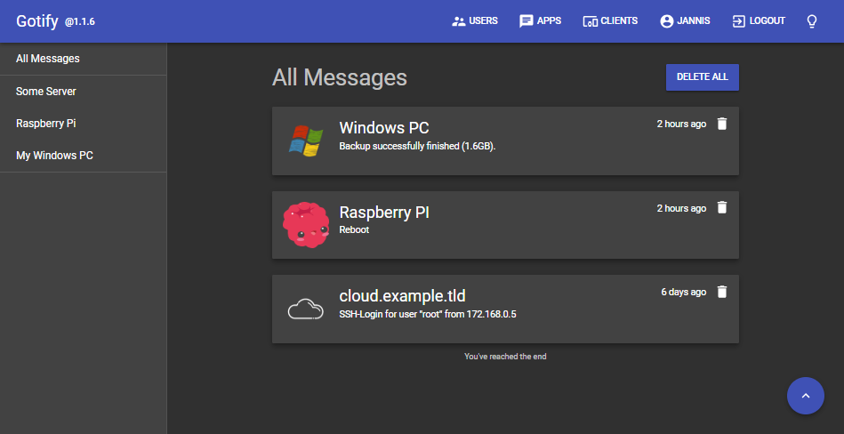
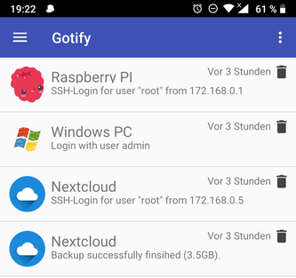
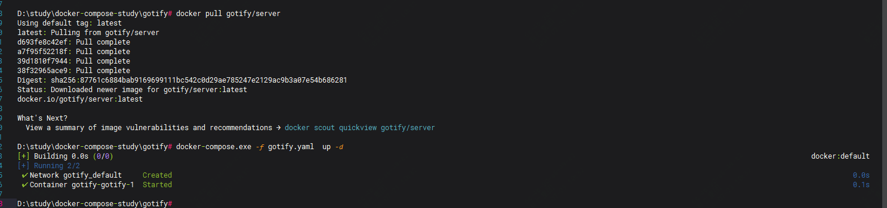
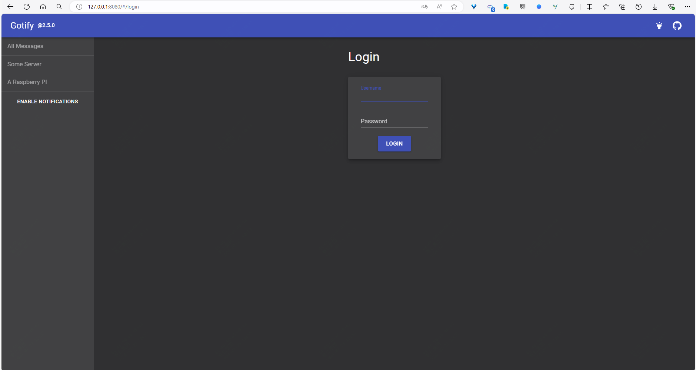
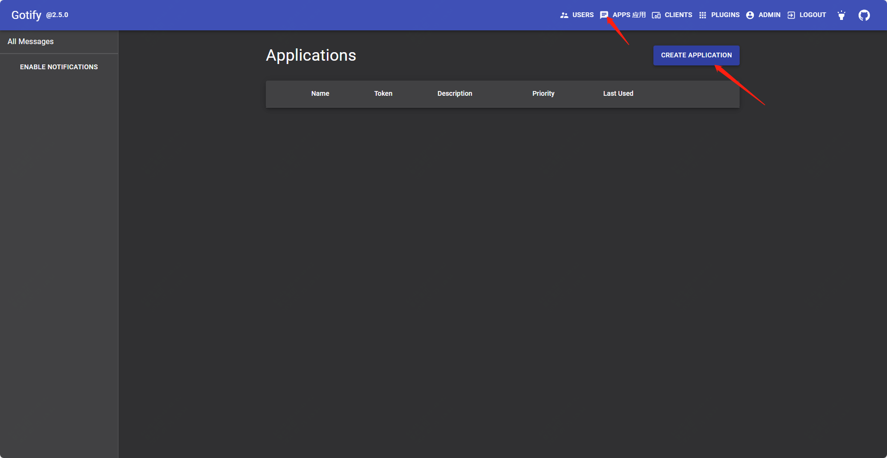
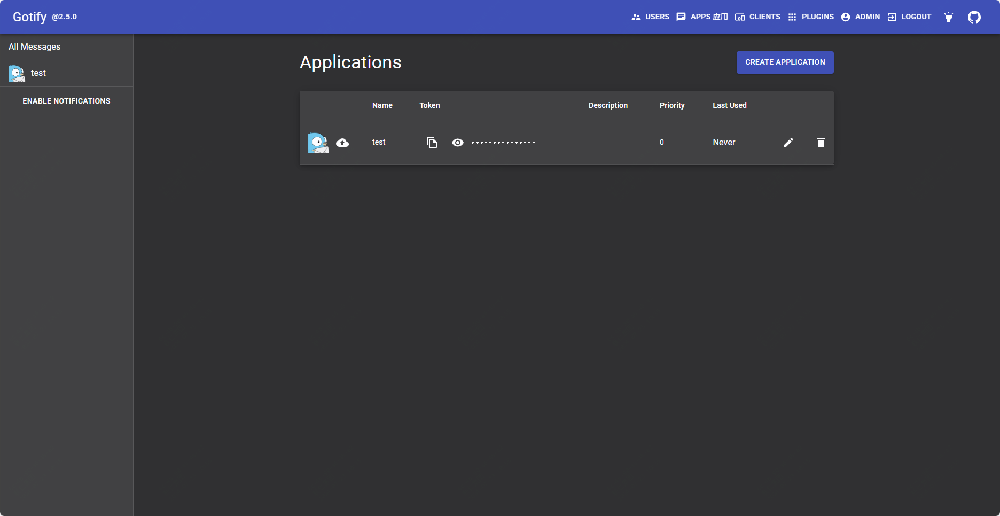
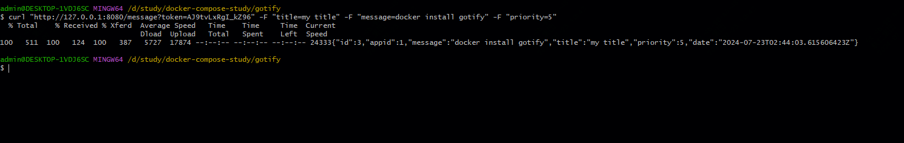
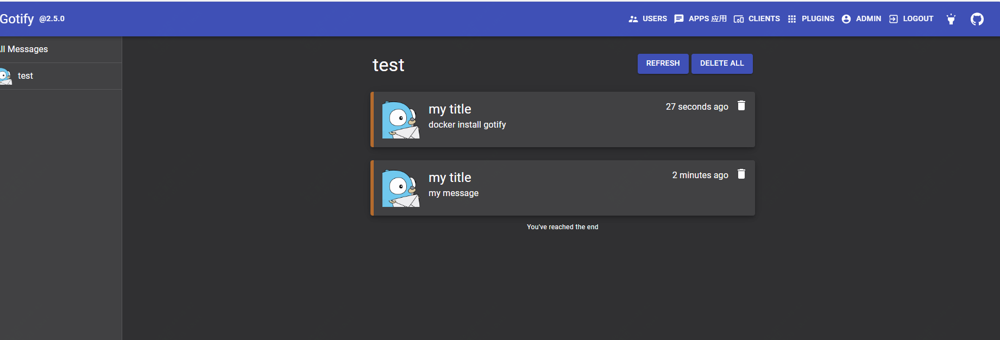

支持手机和电脑，使用docker搭建一个实时的私人消息推送服务器

在日常工作、学习中，你是否需要一个消息推送服务，用于监控一些事件的发生，而在公司当中，也会有一些告警消息的推送。

但有些是需要付费使用的，而且受限于服务提供方。

今天推荐一款实用的，可私有部署的消息推送服务。

>项目地址：https://github.com/gotify/server 


### 项目简介

gotify是一个简单的服务，可以用于消息的实时发送和接收，你可以根据实际需要配置告警，这样在web端口和移动端可实时收到消息。

可以理解为是一个私有的server酱，另外该服务可与之前介绍的uptime kuma结合起来使用。

服务端提供了一个web界面.



移动端目前只有安卓客户端。




### 如何安装

  

 服务端可以直接通过docker-compose方式安装，如下：

 ```
 version: "3"

services:
  gotify:
    image: gotify/server
    ports:
      - 8080:80
    environment:
      - GOTIFY_DEFAULTUSER_PASS=custom
    volumes:
      - "./gotify_data:/app/data"
 ```
这里演示下通过docker-compose方式部署


部署完成后，通过ip+端口访问


第一次登录需要账户密码，可在部署时指定



新建app，复制token，用于消息的发送



移动端自行到应用商城中找gotify下载即可

服务部署完成后，可以使用curl或者http方式推送消息，如下：

```
$ curl "https://push.example.de/message?token=<apptoken>" -F "title=my title" -F "message=my message" -F "priority=5"
$ http -f POST "https://push.example.de/message?token=<apptoken>" title="my title" message="my message" priority="5"
```


上为命令行发送消息，下为在web端口实时接收消息



### 功能特点

- 自托管，任何发送的数据，都会在本地保存
- Gotify 是用 Go 编写的，可以轻松地针对不同平台进行编译。
- gotify是开源及免费的
- 支持docker快速部署
- Gotify 的 API 和用户界面都设计得尽可能简单。

### star增长图

 