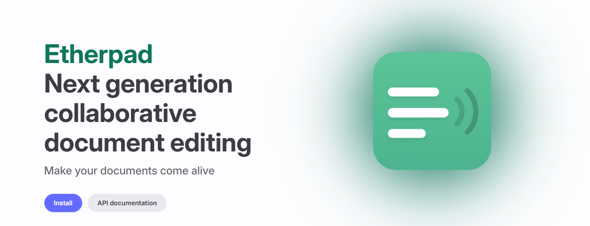
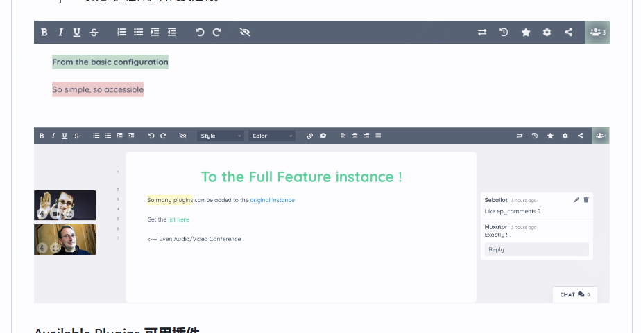

好用的多人协作实时在线文档编辑器，易扩展、易嵌入

在日常工作中，很多时候需要协作完成文档，用到最多的可能是腾讯文档、飞书文档等，这些实际是在云端部署。

如果你想要部署一套完全属于自己的协作编辑软件，那么可以看下今天推荐的这款开源软件。

>项目地址：https://github.com/ether/etherpad-lite 




### etherpad-lite项目简介

etherpad-lite是下一代协作文档编辑软件，它添加了更多的互动的过程，可以让你的文档操作过程更加的舒适和方便。

该软件最多可以支持数千个用户同时操作，而且可以将产生的数据完整的导出，简单讲就是可以完全自己可控的协作编辑器。

而且它支持很多插件，可以扩展一些你想要的功能。


### etherpad-lite功能特点

- ⚡️ 支持实时编辑，在和同事共同完成文档时，可在瞬间完成变更
- 🛠️ 支持扩展，丰富的插件可选择，有具体插件网站，目前更新了239种可选
- 💬 在完成文件编辑的同时，还有聊天功能，可以实时沟通想法
- 📝 支持富文本编辑，支持设置文本格式、添加图像
- 🌐 多语言支持，会以汉语本地化界面和文档
- 📦 安装简单，提供了多种昂安装方式 



### etherpad-lite如何安装

 

如果对docker熟悉，可以直接采用docker-compose方式部署

```
services:
  app:
    user: "0:0"
    image: etherpad/etherpad:latest
    tty: true
    stdin_open: true
    volumes:
      - plugins:/opt/etherpad-lite/src/plugin_packages
      - etherpad-var:/opt/etherpad-lite/var
    depends_on:
      - postgres
    environment:
      NODE_ENV: production
      ADMIN_PASSWORD: ${DOCKER_COMPOSE_APP_ADMIN_PASSWORD:-admin}
      DB_CHARSET: ${DOCKER_COMPOSE_APP_DB_CHARSET:-utf8mb4}
      DB_HOST: postgres
      DB_NAME: ${DOCKER_COMPOSE_POSTGRES_DATABASE:-etherpad}
      DB_PASS: ${DOCKER_COMPOSE_POSTGRES_PASSWORD:-admin}
      DB_PORT: ${DOCKER_COMPOSE_POSTGRES_PORT:-5432}
      DB_TYPE: "postgres"
      DB_USER: ${DOCKER_COMPOSE_POSTGRES_USER:-admin}
      # For now, the env var DEFAULT_PAD_TEXT cannot be unset or empty; it seems to be mandatory in the latest version of etherpad
      DEFAULT_PAD_TEXT: ${DOCKER_COMPOSE_APP_DEFAULT_PAD_TEXT:- }
      DISABLE_IP_LOGGING: ${DOCKER_COMPOSE_APP_DISABLE_IP_LOGGING:-false}
      SOFFICE: ${DOCKER_COMPOSE_APP_SOFFICE:-null}
      TRUST_PROXY: ${DOCKER_COMPOSE_APP_TRUST_PROXY:-true}
    restart: always
    ports:
      - "${DOCKER_COMPOSE_APP_PORT_PUBLISHED:-9001}:${DOCKER_COMPOSE_APP_PORT_TARGET:-9001}"

  postgres:
    image: postgres:15-alpine
    environment:
      POSTGRES_DB: ${DOCKER_COMPOSE_POSTGRES_DATABASE:-etherpad}
      POSTGRES_PASSWORD: ${DOCKER_COMPOSE_POSTGRES_PASSWORD:-admin}
      POSTGRES_PORT: ${DOCKER_COMPOSE_POSTGRES_PORT:-5432}
      POSTGRES_USER: ${DOCKER_COMPOSE_POSTGRES_USER:-admin}
      PGDATA: /var/lib/postgresql/data/pgdata
    restart: always
    # Exposing the port is not needed unless you want to access this database instance from the host.
    # Be careful when other postgres docker container are running on the same port
    # ports:
    #   - "5432:5432"
    volumes:
      - postgres_data:/var/lib/postgresql/data/pgdata

volumes:
  postgres_data:
  plugins:
  etherpad-var:
```

非docker部署的话，可以参考：
```
git clone --branch master https://github.com/ether/etherpad-lite.git &&
cd etherpad-lite &&
bin/run.sh
```
githua上还有其它环境如windows的安装方式，有需要可以去查看。


### etherpad-litestar增长图

 