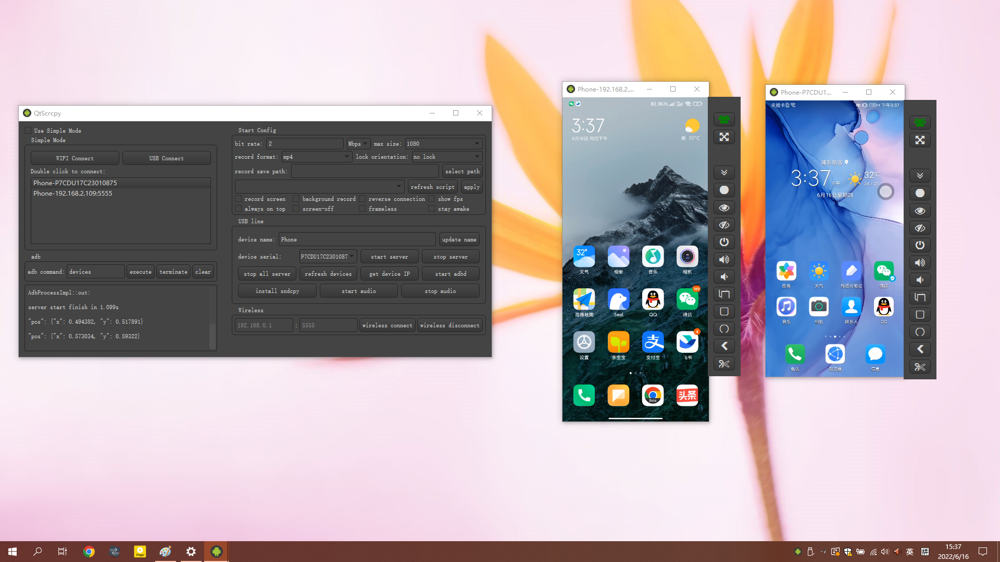
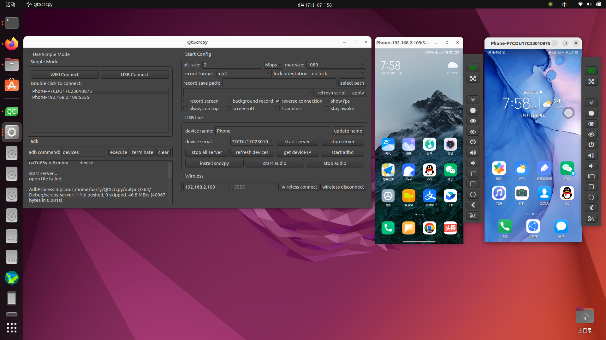
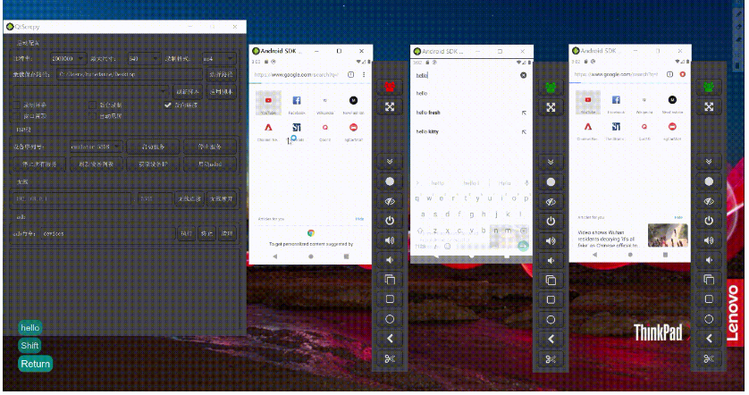
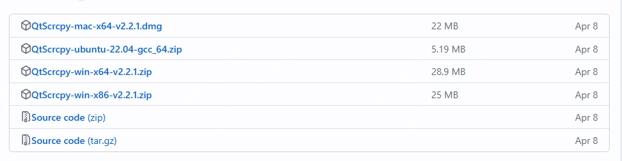

好用的手机投屏到电脑工具推荐，开源、无需root

在日常生活、工作中，我们有时候需要将手机屏幕投屏到电脑上，但一般只能投单个软件，或者需要借助app自带的功能，限制很多。

今天推荐一款开源工具，可以将你的手机整体直接投屏到电脑屏幕上，效果如下：

>项目地址：https://github.com/barry-ran/QtScrcpy

### QtScrcpy项目简介

QtScrcpy是一个支持安卓手机实时投屏并且控制的软件，它可以通过usb或者网络方式来链接，并且不需要root权限

跨平台支持，还可以投屏到mac或者linux桌面上

在实际控制过程中，你还可以通过编辑键盘或者鼠标的映射关系，来调整操作。

该软件还支持群控，可以批量控制多台手机终端。

### QtScrcpy如何安装

 

关于如何安装，可以直接到github 开源的releases中去下载，不同环境的包都准备好了。

如果你想要自己学习，或者说想要自己编译，也可以去自行了解下。

在具体使用过程中，如果通过无线方式连接的话，需要确保手机和pc在同一局域网下。

- 在 Android 设备上的开发者选项中启用 USB 调试
- 通过USB将Android设备连接到电脑
- 点击更新设备，你会看到设备号更新了
- 点击获取设备IP
- 点击启动adbd
- 点击无线连接
- 再次点击更新设备，就会发现另一台有IP地址的设备。选择该设备。
-  点击启动服务

### QtScrcpy功能特点
- 实时显示Android设备屏幕
- Android设备的实时鼠标和键盘控制
- 屏幕录制
- 截图为png
- 安装apk：将apk拖放到视频窗口进行安装
- 将文件拖到视频窗口即可将文件发送到Android设备
- 可以在计算机和设备之间双向同步剪贴板
- 将设备扬声器声音同步到计算机

### QtScrcpy star数

 