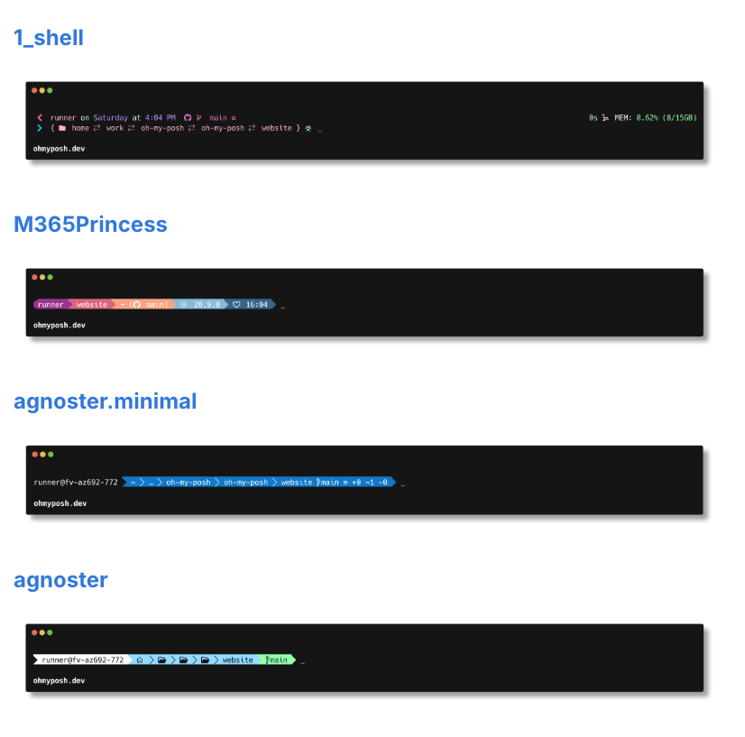
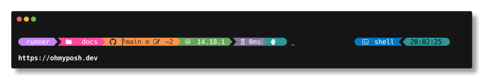
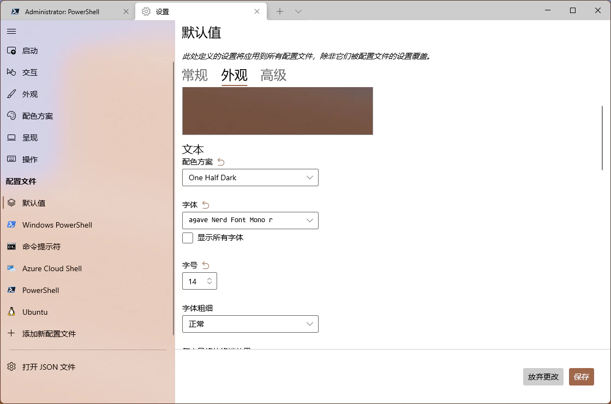

好用的、开源、酷炫终端工具推荐

如果你的日常工作中会经常接触到终端环境，也就是命令行环境，那么这个工具绝对可以让你日常枯燥的操作更有趣味性。

oh-my-posh，是一个适用于任何shell的自定义提示引擎，它能够使用函数或者变量来调整提示字符串。

而且提供了很多酷炫的背景可以选择。



>项目地址：https://github.com/JanDeDobbeleer/oh-my-posh

### oh-my-posh项目简介

oh-my-posh是一个可以调整终端界面的提示符的工具，可以让它看起来更有个性，这部分内容可以展示目前所处的位置，登陆的用户名等信息。

oh-my-posh目前支持win、mac、linux系统的bash、powershell、zsh等环境

如下为某个主题：



### oh-my-posh如何安装

 

如果是windows用户， 目前可以直接在应用商店中直接安装，而不需要通过命令行操作

命令行也可以通过包管理工具下载

```
winget install JanDeDobbeleer.OhMyPosh -s winget
```
然后你需要去安装一个字体，并且设置终端用你安装的字体，最后还需要确认你的终端环境使用的oh-my-posh

字体文件可以到nerd fonts中下载你喜欢的



如果是linux或者mac环境的话，可以通过命令行的方式去安装。

具体安装步骤，可以参考如下：

>ohmyposh.dev/docs/installation/linux


### oh-my-posh功能特点

- 与 Shell 和平台无关
- 易于配置
官网给出了很多配置示例，可以直接去参考修改

- 最可配置的提示实用程序
- 快速地
- 二次提示
- 正确提示
- 瞬态提示

### oh-my-poshstar增长图

 