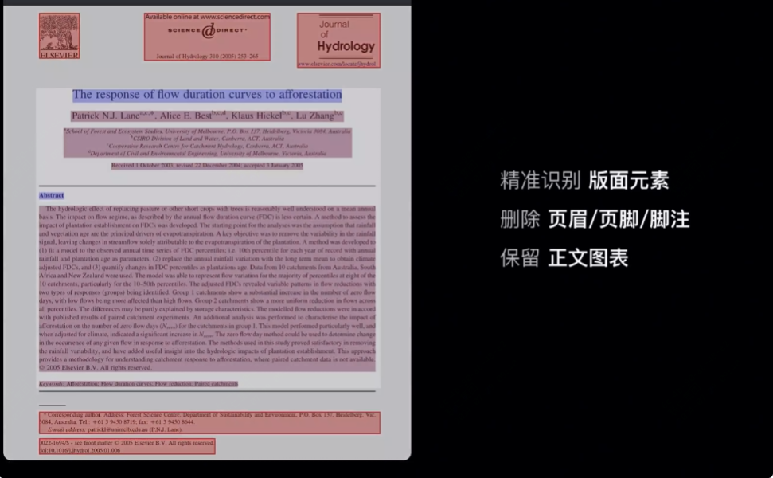
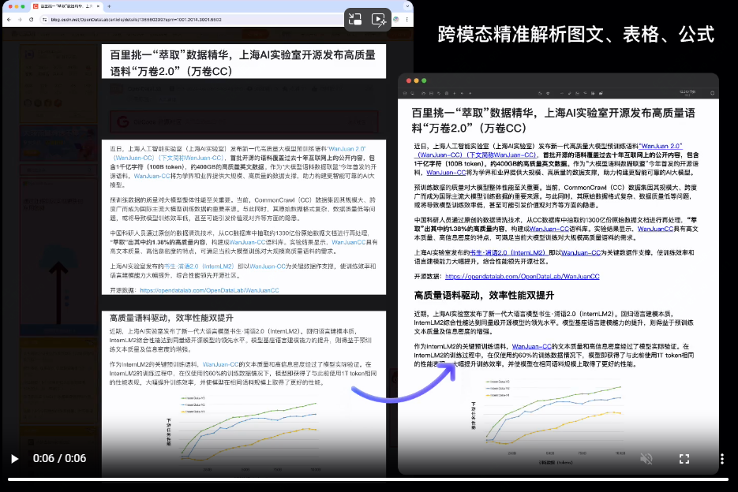

强大、免费、高频次使用的开源工具推荐

在日常工作或者学习中，pdf格式的文件是不可避免会遇到的，而网站更是每天都会访问的。

今天推荐的这款开源工具就是用来提取pdf文件内容、提取网页和电子书。

效果如下：





>项目地址：https://github.com/opendatalab/MinerU

### MinerU项目简介

MinerU是一个免费开源的可以高质量完整提取pdf或者网页内容的工具。

主要有两个功能Magic-PDF用于提取pdf，Magic-DOC用于提取网页和电子书

### MinerU如何使用

 

如果需要本地化部署的话，对于完全没有基础的朋友，还是有些难度的，需要装一些依赖。

如果是有基础的话，参考官方给出的文档还是可以的。

这里简单介绍下Magic-PDF的不熟，需要提前安装python环境，需要3.9版本

然后可以通过pip安装

```
pip install magic-pdf[full-cpu]
magic-pdf --version
```

该工具还需要配置模型，具体下载地址可见github。

使用

```
magic-pdf pdf-command --pdf "pdf_path" --inside_model true
```

### MinerU功能特点

- 该工具支持将文档解析完成后存储到S3中
- 支持删除文档中的页眉、页脚等
- 可以保留原文档的结构和格式，包括一些标题等
- 如果是乱码的pdf也可以支持自动识别和转换
- 如果你本地有GPU环境，也可以配置加快转换
- 跨平台支持。

### star增长图

 