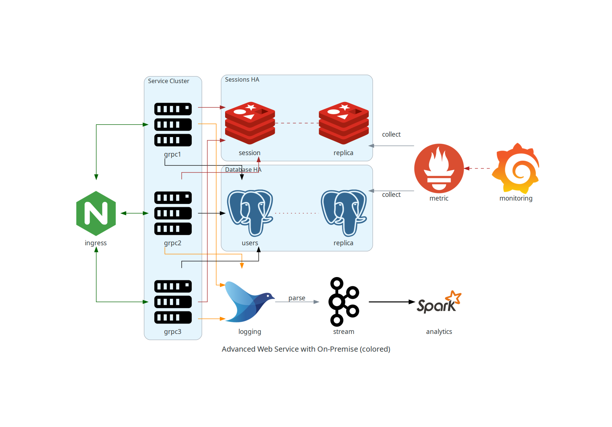
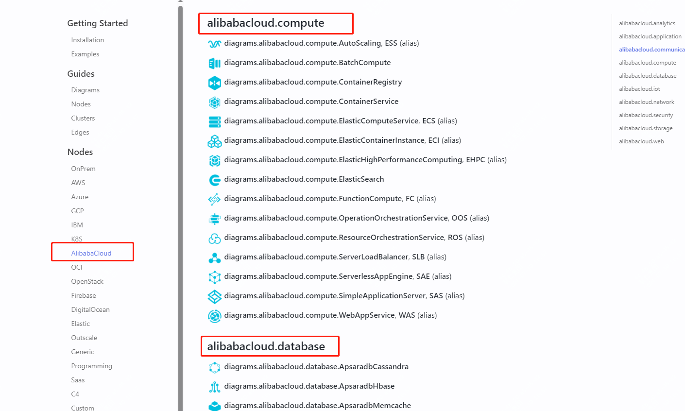
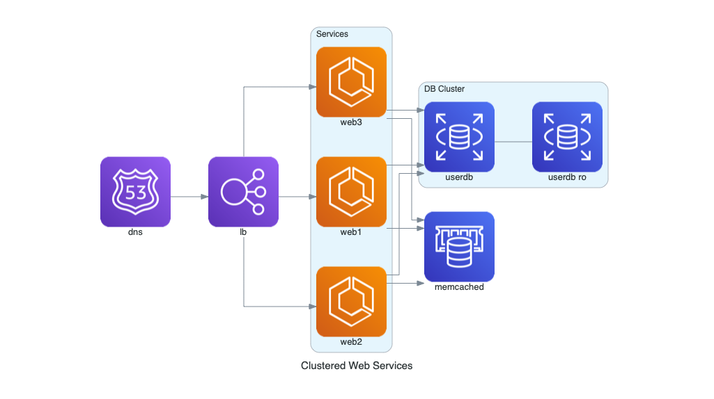

推荐一款开源神器，很好用!

在目前云环境大趋势下，如何更快捷的画出云系统架构图，是还在用vision，还是用drawio？

今天推荐一个开源工具，它就是用来化云系统架构的，而且是通过代码的方式。

目前该工具已经集成了k8s、AWS、阿里云等供应商，如下为示例：



>项目地址：https://github.com/mingrammer/diagrams 

如果你们用到的是阿里云，那么可以直接引用它自带的一些图标：



### diagrams 项目简介

云环境下通过python代码来画架构图，该工具是为了在没有任何设计工具的情况下构建新的云系统架构原型。还可以描述或可视化现有的系统架构。

这是一个python的模块，所以在开始之前你需要先安装python环境。

目前需要python3.7或者以上版本

### 如何安装

 


因为是python模块，所以你需要pip安装即可
l'l
```
# using pip (pip3)
$ pip install diagrams

# using pipenv
$ pipenv install diagrams

# using poetry
$ poetry add diagrams
```

然后就可以开始画了，代码也很简单，如下为一个示例：

```
from diagrams import Cluster, Diagram
from diagrams.aws.compute import ECS
from diagrams.aws.database import ElastiCache, RDS
from diagrams.aws.network import ELB
from diagrams.aws.network import Route53

with Diagram("Clustered Web Services", show=False):
    dns = Route53("dns")
    lb = ELB("lb")

    with Cluster("Services"):
        svc_group = [ECS("web1"),
                     ECS("web2"),
                     ECS("web3")]

    with Cluster("DB Cluster"):
        db_primary = RDS("userdb")
        db_primary - [RDS("userdb ro")]

    memcached = ElastiCache("memcached")

    dns >> lb >> svc_group
    svc_group >> db_primary
    svc_group >> memcached
```

结果为：



### 功能特点

1. **代码绘图**：Diagrams 允许你使用 Python 代码绘制云系统架构图。
2. **原型设计**：它特别适用于在没有设计工具的情况下进行新系统架构的原型设计。
3. **现有架构可视化**：你也可以用它来描述或可视化现有的系统架构。
4. **版本控制**：通过代码绘图，你可以在任何版本控制系统中跟踪架构图的变化。
5. **多云支持**：支持主要的云服务提供商，包括 AWS、Azure、GCP、Kubernetes、阿里云、Oracle 云等。
6. **本地和 SaaS 支持**：支持本地节点、SaaS 以及主要的编程框架和语言。

这个项目非常适合需要频繁更新和维护系统架构图的开发者和架构师。


### star增长图

 