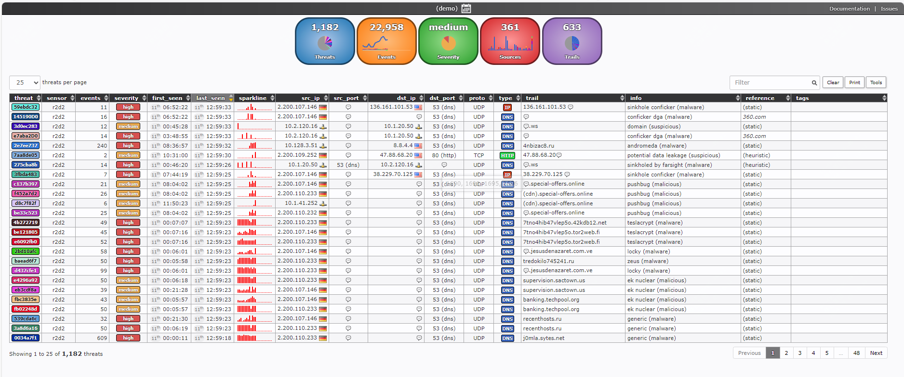
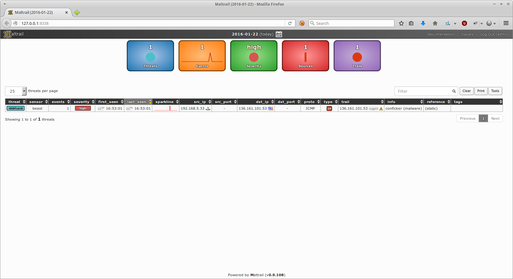
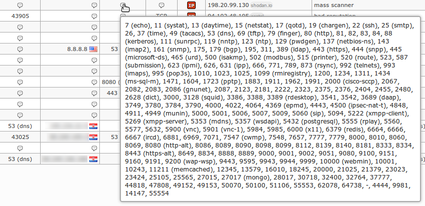

开源、免费、强大的 恶意流量检测系统，真香！

如果你是运维或者网工，那么这款免费开源的工具你一定要尝试下

如果你司没有类似的流量检测工具，那么下半年的kpi完全可以靠这个工具来完成

话不多说，开始今天的工具介绍

>项目地址：https://github.com/stamparm/maltrail



## maltrail项目简介

maltrail是一个恶意流量检测系统。

它的原理是通过一些公开的黑名单，以及各类AV报告中的信息，包括不限于url、ip、user-agent信息等去判断请求是否恶意。

除了对于已有的能够做出判断外，还可以开启自启发模式，去防范一些未知的异常。


从这个架构图中可以看出，该检测工具是在流量进入后，经过了传感器的判断，然后会将异常传送到服务端，这些内容将会记录在本地。

而在github中，作者也介绍了一些实际的案例，后面也会具体介绍

## maltrail如何安装

我们先来看下这个系统如何部署？

它是基于python的，所以需要环境提前部署python环境，需要python2.7或者3版本。

另外需要确保服务器上至少有1G内存可以使用

如果你是ubuntu或者debian系，直接执行如下即可：


```
sudo apt-get install git python3 python3-dev python3-pip python-is-python3 libpcap-dev build-essential procps schedtool
sudo pip3 install pcapy-ng
git clone --depth 1 https://github.com/stamparm/maltrail.git
cd maltrail
sudo python3 sensor.py
```

当然了，也可以直接采用docker方式部署

```
    #!/bin/bash
    export MALTRAIL_LOCAL=$(realpath ~/.local/share/maltrail)
    mkdir -p $MALTRAIL_LOCAL
    cd $MALTRAIL_LOCAL
    wget https://raw.githubusercontent.com/stamparm/maltrail/master/docker/Dockerfile
    wget https://raw.githubusercontent.com/stamparm/maltrail/master/maltrail.conf
    sudo su
    apt -qq -y install coreutils net-tools docker.io
    for dev in $(ifconfig | grep mtu | grep -Eo '^\w+'); do ifconfig $dev promisc; done
    mkdir -p /var/log/maltrail/
    docker build -t maltrail . && \
    docker run -d --name maltrail-docker --privileged -p 8337:8337/udp -p 8338:8338 -v /var/log/maltrail/:/var/log/maltrail/ -v $(pwd)/maltrail.conf:/opt/maltrail/maltrail.conf:ro maltrail
```

在github中，作者也提供了一些用于检测方式，具体可以到项目页去查看

部署完成后，可以直接访问8338端口



## maltrail功能特点

- 利用公开的黑名单等来识别恶意流量
- 支持通过高级自发机制来发现未知威胁
- 支持包括不限于域名、url、IP等检测方式
- 可以有实时的监控和详细报告功能


## maltrail的github star数

 


## 真实案例介绍

### 大规模扫描

这类问题应该是日常遇到比较多的。

该系统可以检测到大量来自不同IP地址的扫描活动，这些扫描通常是攻击者在寻找网络中的漏洞或开放端口。Maltrail 能够识别并记录这些扫描活动，帮助管理员采取防御措施。



### 匿名攻击者

为了发现隐藏在Tor匿名网络背后的潜在攻击者，Maltrail 利用公开的 Tor 出口节点列表。

在下面的屏幕截图中，看到潜在攻击者一直在利用 Tor 网络以可疑方式访问我们组织范围内的 Web 目标（通过 HTTP）（10 分钟内总共 171 个连接请求）


作者还提供了其它诸如服务攻击者、恶意软件、可疑域名查询、可疑的直接文件下载等案例，感兴趣可以去项目主页查看

