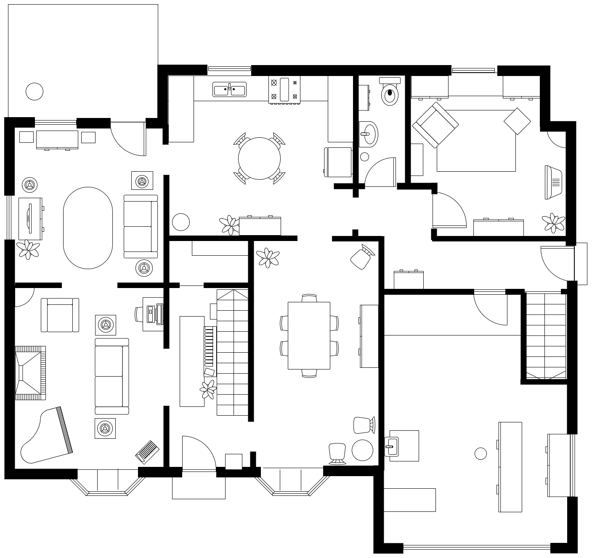

宝藏开源画图工具推荐！

今天推荐的这款工具是一个画图软件，很强，而且免费开源

你可以在本地化部署，也可以直接网页打开，还支持通过如vscode方式以插件形式打开

它还提供了大量的免费素材可以直接使用

下面这张图就是用该工具完成的，更多具体介绍如下文：


>项目地址：https://github.com/jgraph/drawio

## drawio项目简介

draw.io是一个图表绘制的编辑器。

但它是开源免费的，而且支持功能众多，部分在文中有介绍，更具体的可自行体验！

## drawio如何安装

 

 如果你想要本地化安装，可以直接在release中找对应的包，跨平台支持

 

该项目也支持docker快速部署，直接执行如下即可

```
docker run -it --rm --name="draw" -p 8080:8080 -p 8443:8443 jgraph/drawio
```
启动后访问如下地址

>localhost:8080/?offline=1&https=0

也支持docker-compsoe方式部署，具体文件可以到github上查看

更多的故障排除、操作说明、示例图表以及一些模板可以直接到官网去查看

## drawio功能特点

- 数据安全，你完全可以本地私有化部署，保证你的数据都在本地
- 支持将数据保存在云端，而且还可以依据此项来往成协作共享
- 支持大量免费图表，在更多图形中可以选择，如下：


- 可以与第三方软件继承，如熟悉的jira可以直接调用drawio，也可以与office、notion等集成
  
- 上手简单，可以快速完成你所需要的图表，而且支持导入、导出
- 支持图表众多，如（平面图、组织结构图、流程、网络基础设施、信息图表、思维导图、故事图、时间表、UML图、看板、实体关系模型和鱼骨图等等）




## drawio的github star数

 

 目前该项目收获了大量的star，可见在开源社区的活跃程度！

 快速尝试下吧！