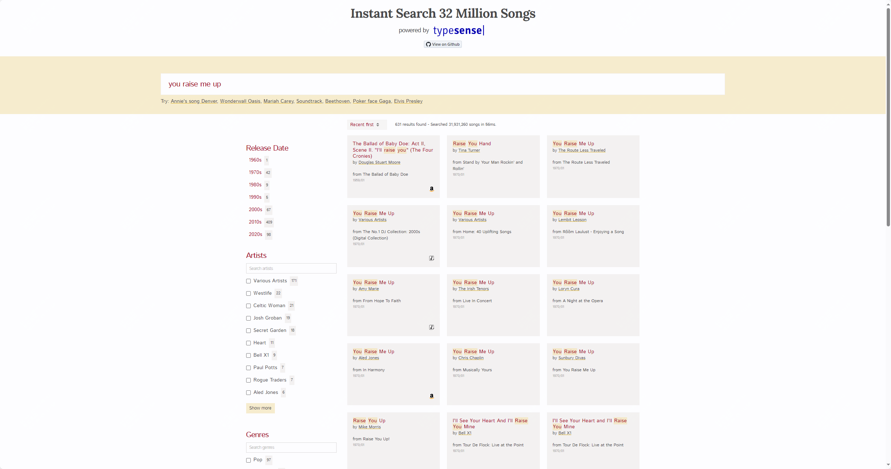
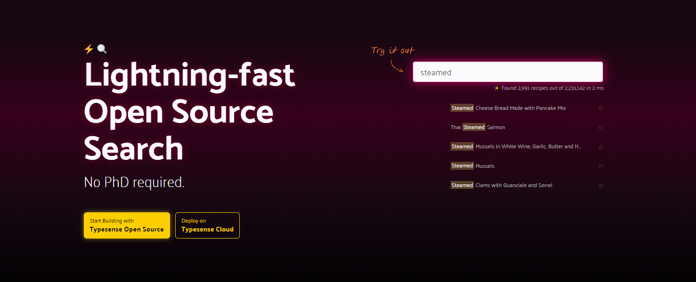
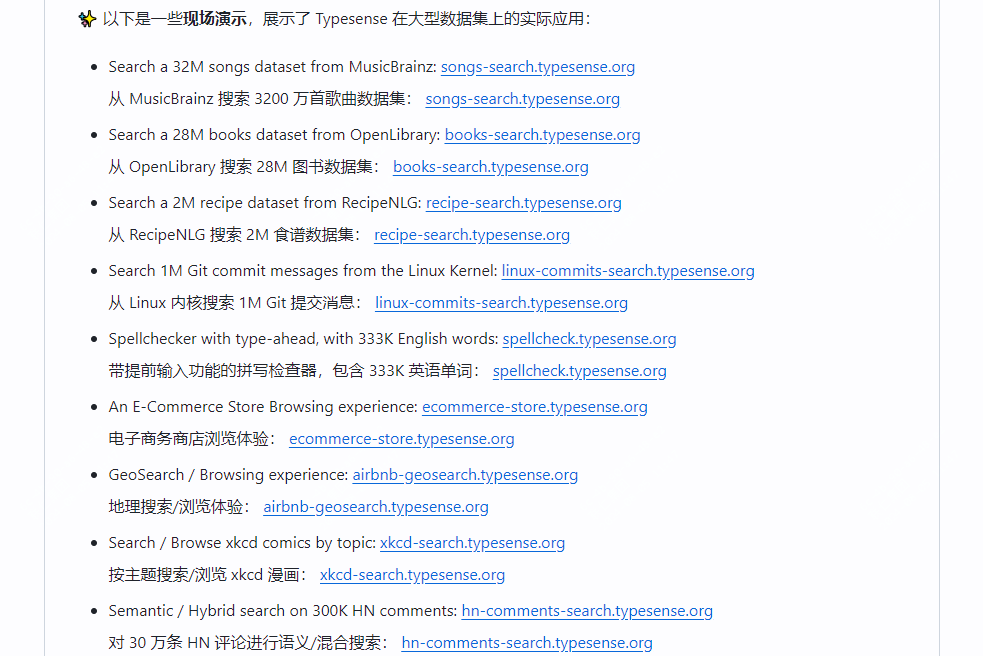

快如闪电！免费、开源、好用的开源软件推荐

今天推荐的这款软件是一个搜索引擎-Typesense

如果你了解 Algolia ，那么你可以理解为Typesense是它的免费开源版本

如果你了解elasticsearch，那么你可以可以理解为它比es更快、更容易上手。

如果上述你都没有接触过，那么这样介绍你可能更容易懂。

Typesense是一个可以快速查找、并且容错力强的搜索引擎，它的可以让用户有更加舒适的搜索体验！

比如，github上给出的最新的一个例子，在一个拥有3200万条记录的音乐网站在50ms内完成搜索



>项目地址：https://github.com/typesense/typesense

## typesense项目简介

typesense是一个 快速、容错、在内存中模糊搜索引擎，它可以让你的搜索更加便捷和舒服！



## typesense如何快速使用

你可以使用docker来完成最快速的部署，方式如下：

```
docker run -p 8108:8108 -v/tmp/data:/data typesense/typesense:26.0 --data-dir /data --api-key=Hu52dwsas2AdxdE
```
为了快速测试，你可以通过shell（还支持python、js、php、ruby等） curl去导入一部分部分数据，如下：

```
curl "http://localhost:8108/collections" \
        -X POST \
        -H "X-TYPESENSE-API-KEY: xyz" \
        -d '{
              "name": "books",
              "fields": [
                {"name": "title", "type": "string" },
                {"name": "author", "type": "string" },
                {"name": "ratings", "type": "int32" }
              ],
              "default_sorting_field": "ratings"
            }'

curl "http://localhost:8108/collections/books/documents/import" \
        -X POST \
        -H "X-TYPESENSE-API-KEY: xyz" \
        -d '
          {"title":"Book 1","author":"Author1","ratings":24}
          {"title":"Book 2","author":"Author2","ratings":31}
          {"title":"Book 3","author":"Author3","ratings":30}'
```

然后就可以使用curl去查询了

```
curl "http://localhost:8108/collections/books/documents/search?query_by=title,author&q=boo" \
        -H "X-TYPESENSE-API-KEY: xyz"
```

github提供一些demo，可以去体验:



## typesense的功能特点

- 在日常搜索过程中，打错字很常见，该软件可以优雅的处理你的错误输入
- 使用上手简单，无需复杂配置
- 速度是它最大优势，采用c++开发，搜索延迟低
- 支持分组，将相似的结果分组在一起以提供更多的选择
- 支持联合搜索，在单个请求中可以跨多个集合完成搜索
- 支持按照经纬度进行地图搜索
- 提供了很多现有框架的集成如（wordpress、docsearch、firebase等）
- 等等

## star数

 

 目前该项目获得了19.6kstar，快去尝试下吧

