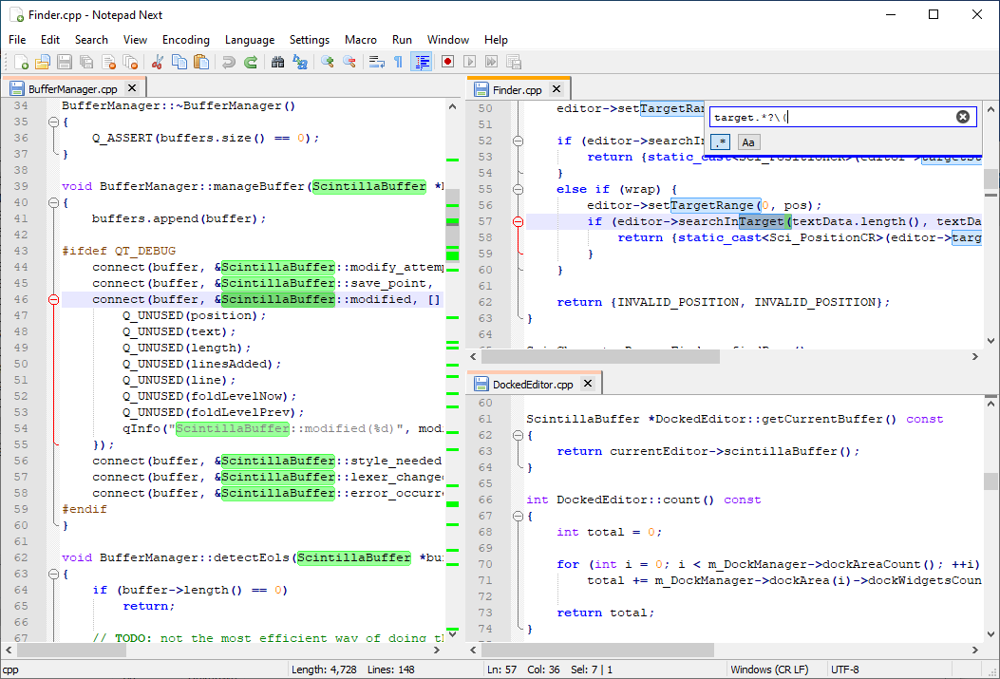

放弃notepad++，改用NotepadNext

说起来notepad++是用过最多的一款软件之一

但这款软件作者的一些观点，属实有些垃圾，所以果断放弃了

今天推荐一款更加好用，同样是免费开源的软件NotepadNext

>项目地址：https://github.com/dail8859/NotepadNext

## NotepadNext项目简介

NotepadNext是一款参考了notepad++但是又做了一些改进。

最大的改变在于该软件是跨平台支持的，而且安装包很小，所以性能消耗也小



## NotepadNext如何安装

 

可以看到该工具的下载量还是很多的，安装也比较简单的

直接在github releases中下载对应的安装包即可。


当然了，它也支持通过包管理器去安装。

windows环境你可以使用winget安装

```
winget install dail8859.NotepadNext
```
mac环境可以通过brew方式安装
```
brew tap dail8859/notepadnext
brew install --no-quarantine notepadnext
```

## NotepadNext功能特点

它有很多的快捷方式，部分可以参考如下：

```
新建文件：Ctrl+N
打开文件：Ctrl+O
保存文件：Ctrl+S
另存为：Ctrl+Alt+S
保存所有文件：Ctrl+Shift+S
关闭当前文件：Ctrl+W
关闭所有文件：Ctrl+Shift+W
打印：Ctrl+P
全选：Ctrl+A
复制：Ctrl+C
粘贴：Ctrl+V
```

关于一些具体的功能，如果之前有使用过notepad++的，那上手还是简单的

界面基本一致，部分功能也一致

支持语法的识别，可以高亮显示，相比于windows自带的文本编辑，还是很强大的

之前我看有同事直接是用这个软件作为日常工作笔记记录的，效果也还不错，而且都是本地化存储数据，也不会有泄露的问题

这款软件也支持多文件，多视窗编辑，占用内存小，性能强！

类似的软件，还有一些其它选择，如notepad--、notepad3等，后面也会具体介绍下。

## NotepadNext的star数

 

 目前该项目star已经到了8.8k，记得最开始用的时候，还不到5kstar，可以想象到该工具还是有一定的市场认可的