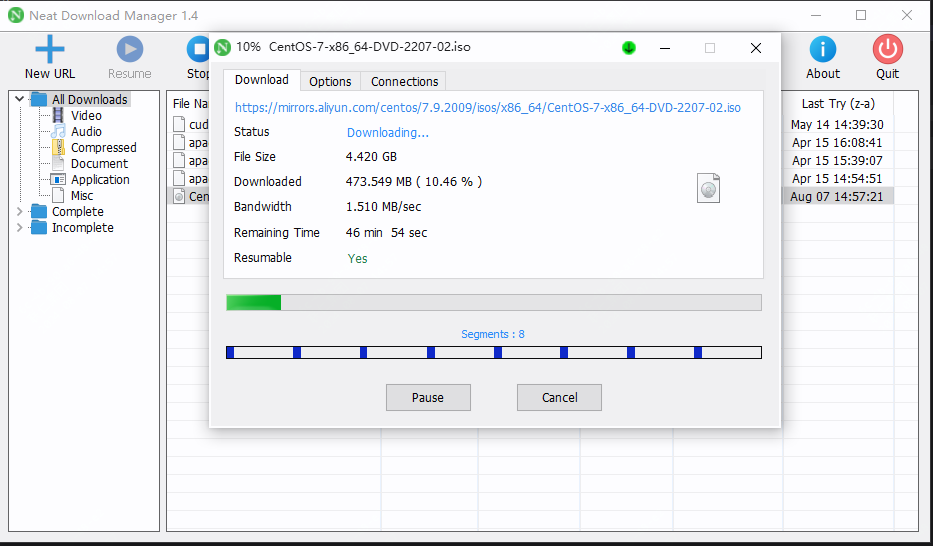
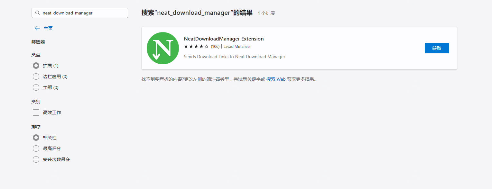
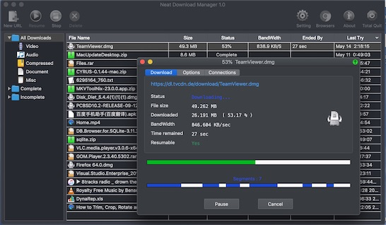

免费、高速，地表最强下载神器NDM

看到标题后，有朋友可能会评论了：“我选择IDM”，但IDM收费啊！

今天推荐一款IDM平替下载神器，支持下载加速，支持mac和win环境，同样支持浏览器集成

而且支持多线程下载和断点续传，值得一试 

## 工具简介

工具名neat，意思简单且智能，它是一个下载管理器，可以最大可能的提高下载带宽，当然取决于你自己本身的带宽

跨平台支持，它的设计很简单，是用c++写的，所以整体大小只有几M

## 如何安装

如下地址下载安装包即可：

> https://www.neatdownloadmanager.com/index.php/en/ 

如果是安装浏览器扩展的话，可以直接到商店去搜索即可

## 功能特点

- 为啥快呢？作者说了他们用到了优化的动态分割算法，不明觉厉
- 直观表现就是你的带宽有多大，下载速度就能有多快
- 支持大部分协议如http、https、ftp，支持http代理及sock代理
- 支持http身份的认证
- 能够暂停和恢复你的下载任务，如果有奔溃的下载也可继续
- 支持浏览器扩展，可以快速跳转下载，能够自动捕获下载链接及网站上的视频、音频
- 等等
  

相比于其他可选下载器来讲，它更加轻量化，而且免费跨平台也是它的亮点。

