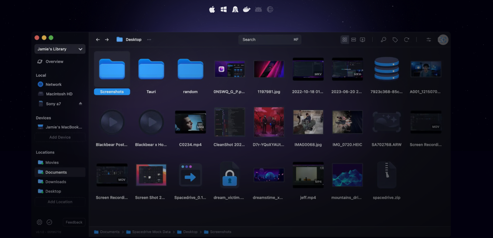
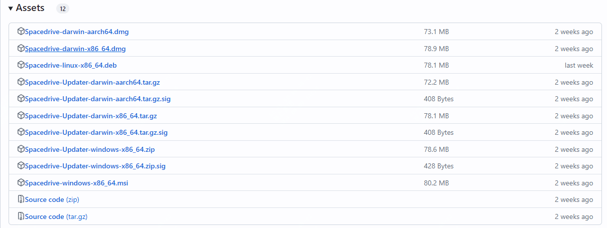

颜值极高！还很强大的一款开源免费工具推荐

来自未来的文件浏览器，你能想象到的是什么样子的？

如何去管理个人越来越多的数据，本地磁盘、云存储、移动硬盘等的数据

今天推荐的这款开源工具，或者可以给你眼前一亮的感觉，下面是一个直观的界面图：



>项目地址：https://github.com/spacedriveapp/spacedrive

## spacedrive项目简介

spacedrive的宗旨是一个工具，容纳你所有的文件，它由rust写的，是一个虚拟的分布式文件系统。

将所有设备中的文件放到一个软件中去管理。

如果你的文件目前是杂乱无章的，可用!

如果你喜欢收集各类音视频、各类图片，又舍不得删除，可用！

如果你是自媒体工作者，平时有着大量的素材需要分门别类，可用！

该工具目前支持mac、windows、docker、linux，后面还会推出ios及安卓版本！

## spacedrive如何安装

 

该工具目前能看到的下载量已经达到了327K的惊人数值，而且随着功能的开发及迭代，应该会有更好的体验和支持。

如果想要快速体验，可以先通过docker部署体验下

```
docker pull ghcr.io/spacedriveapp/spacedrive/server
```
如果想要其它系统的安装包，可以直接到项目的releases下面去获取。



## spacedrive目前github的star数

 

 该项目目前获得了接近30k star！
