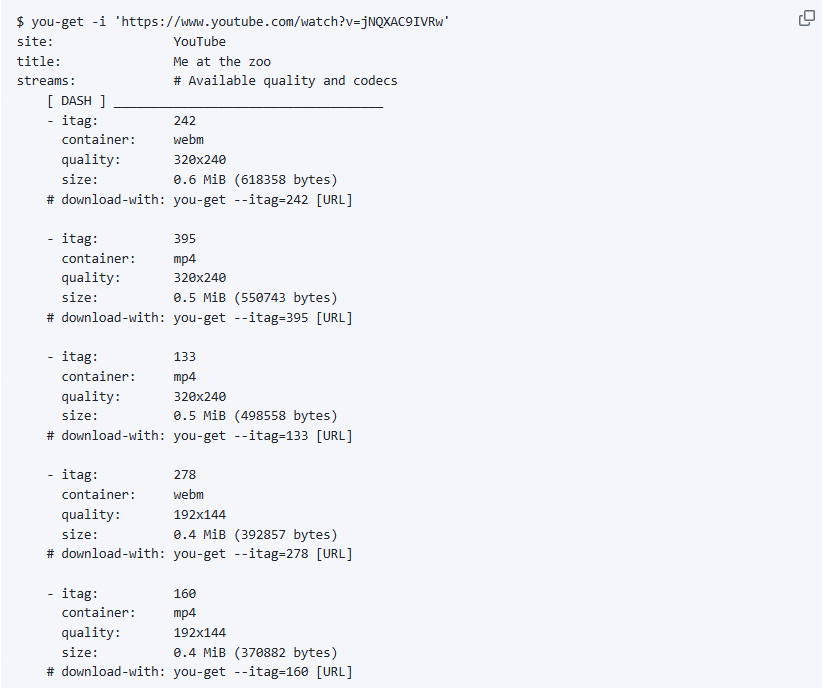

推荐一款超火的终端视频下载神器，目前github star 5万！

好用的工具有很多，方便、简单、快捷的神器级工具确可遇不可求

今天推荐的这款工具就是在一个偶然情况下发现的

支持视频种类国内外多达上百种，国内的各类视频网站支持也接近50种。

可以说是功能最全，使用率最高的一款下载工具了，它就是you-get，没错你想要，就去拿!

最最关键的是，它是开源的，你可以用来免费用，还可以直接去翻代码学习！

>项目地址：https://github.com/soimort/you-get


## you-get项目简介

you-get是一个命令行下载程序，它可以从web下载媒体内容包括视频、音频、图像。

## you-get如何安装

 

目前该工具的下载量也是很高的，已经有383k了。

这款工具是python写的，所以需要提前配置python环境，然后直接使用pip安装就可以了

```
$ pip install you-get
```

如果是mac用户的话，可以直接使用brew安装

```
$ brew install you-get
```

在下载之前，你可以查看支持哪些格式，通过 -i 选项，如下：



然后你可以指定你想要格式

```
you-get --itag=18 视频链接
```

## you-get功能特点

- 开源免费，开箱即用，支持大部分视频站点，部分可以下载音频或图片
- 支持多种格式的视频下载
- 可以直接流媒体播放，也就是边下边看
- 该工具其实可以下载任何非html内容，比如你有一个图片的路径，可以直接下载

## 目前 github star数

 

 目前star数直逼5万，在几个月前，还只有一半，快试用起来吧！