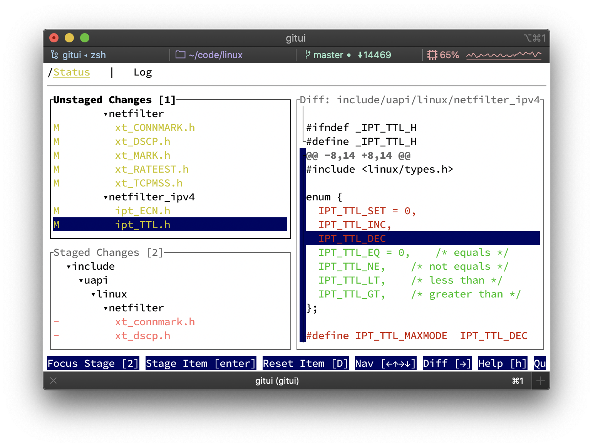

推荐一款实用工具，rust写的极速软件

git应该是开发人员每天肯定会接触到的，如何使用的更舒适，每个开发或许都有自己的经验

今天推荐的这款工具，可以让你有一个新的选择，先来看下效果：


>项目地址：https://github.com/extrawurst/gitui

## gitui项目简介

gitui是一个用rust写的超快的终端管理界面。

它可以让你的git gui有更舒适的体验，而且仍旧是在终端中使用。

日常开发人员的大部分工作都是在git中完成的，这款工具的开发者正是基于这个出发点，写了这款工具

## gitui如何安装

 

目前该工具已经被下载过163k，看来很多程序员已经在使用了。

它的安装下载也很简单，通过各类包管理器下载即可

windows
```
winget install gitui
#或者
scoop install gitui
#或者
choco install gitui
```
如果有anaconda环境，可以使用conda
```
conda install -c conda-forge gitui
```
mac用户

```
brew install gitui
```
作者也提供了二进制包，可以直接到github releases去下载


## gitui功能特点

- 使用简单，都是通过键盘操作和控制的
- 使用过程中，可以根据上下文来判断下一步如何操作，不需要记住大量快捷键
- 常规功能支持：Inspect, commit, amend changes、Stage, unstage, revert and reset files, hunks and lines
- 支持分支列表管理(创建、重命名、删除、签出、远程)
- 浏览/搜索提交日志，差异提交的更改
- 用于流体控制的异步 git API



作者还与类似的工具，做了性能测试，如下：


## github star数

 

 目前该项目获得了18k star