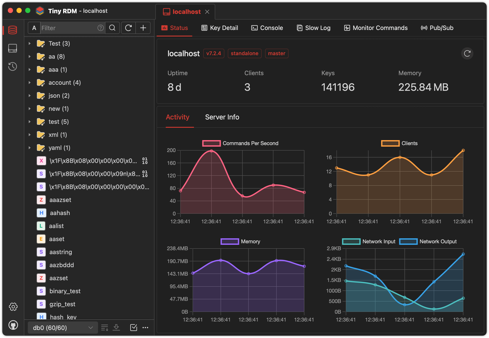
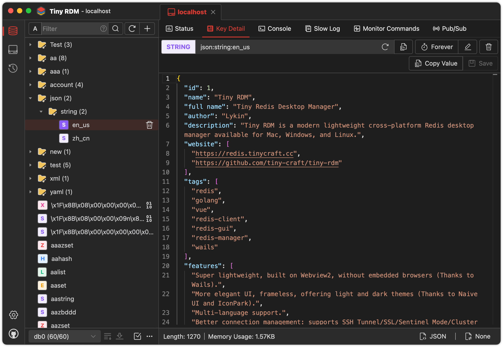

开源、轻量、跨平台工具推荐，更酷炫的redis桌面管理客户端

如果你还在使用最古早的那款redis客户端，那么我建议你看下今天这篇推荐文章

话不多说，先上图看下：

>项目地址：https://github.com/tiny-craft/tiny-rdm

## tiny-rdm项目简介

tiny-rdm是一款更酷炫，更适合当下使用的一款redis客户端

它跨平台支持linux、windows、mac

## 如何安装

 

目前该工具已经被安装下载多大70k，同类型软件中，应该是不错的，而且这款工具时间并不久。

安装部署也很简单，直接去github的releases中下载对应环境的安装包即可。

具体路径如下：

>gthub.com/tiny-craft/tiny-rdm/releases

## 功能特点

- 连接方式多样，你可以通过ssh隧道、ssl、哨兵模式、集群模式、http代理、socks5代理等方式链接redis
- 对于redis中数据操作简单，支持对列表、哈希、字符串、集等CRUD的支持
- 支持多种数据的查看格式
- 如果你更熟悉命令行模式，该工具也支持命令行
- 还有个不错的功能就是对于命令的实时监控，遇到问题还会有满日志可以查看
- 常规的数据导入导出也是支持的，如果你的连接方式是配置文件形式，也支持导入
- 如果你要用到scan，它支持分段加载，可以轻松的加载大量数据
- 你的一些历史命令也可以记录作为审计
- 等等

## star数

 

 短短时间这款工具的stat已经来到了7.9k，如果你感兴趣那么可以去尝试下。