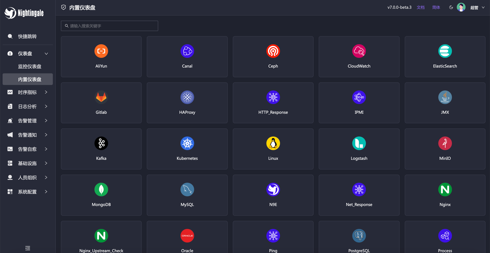
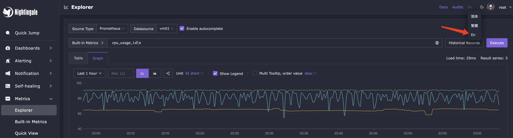
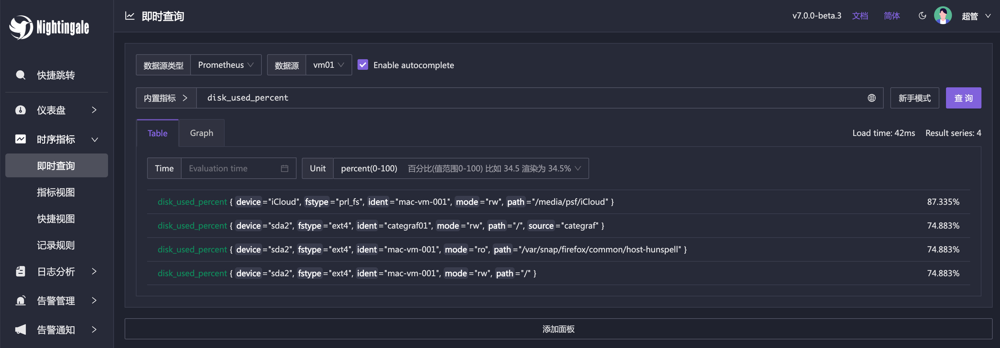
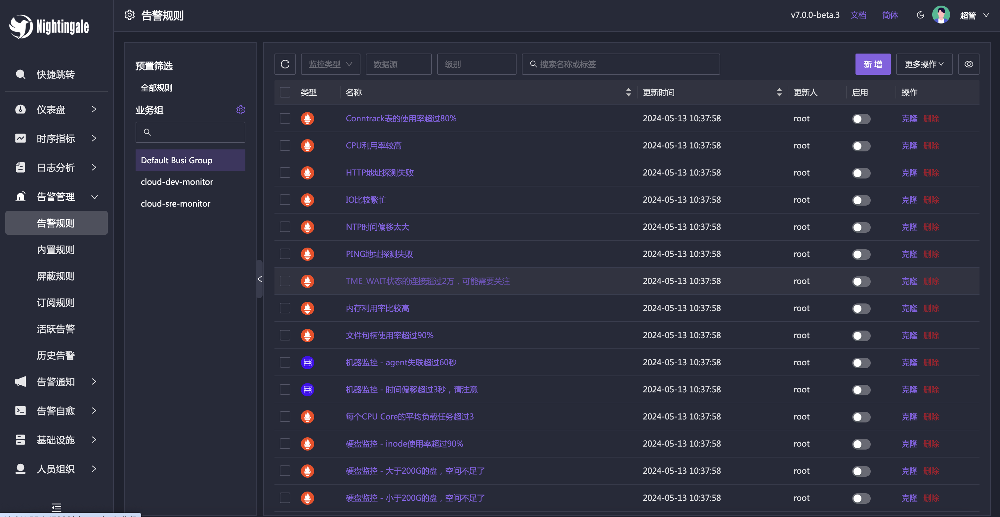
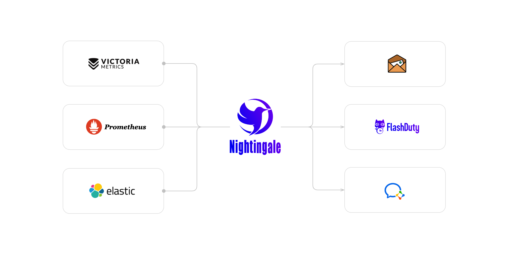

9.4K Star最强监控软件！打造自己的可观测监控系统

其实在这款监控软件刚出来的时候就已经在使用了，当时还只是调研

后来换公司后，因为需要重新搭建监控系统，就完全转向nightingale了

最早使用过zabbix，然后很长一段时间用的是prometheus+alertmanager，后面有结合使用过一段时间

然后现在的话，基本都是用nightingale实现了，因为基本你需要的都已经实现了，当然了一直用的是开源免费版本

>项目地址：https://github.com/ccfos/nightingale 

## nightingale项目简介

nightingale的定位是云原生的观测分析工具。

集数据收集、数据可视化、告警等于一体，相较于之间用多个开源组件来搭建配置，确实很省心也很便捷。

而且它的迭代很快，用过v5版本，最新的已经是v7版本了，支持的功能也很全

## 如何安装

下载量和docker的拉取也很高，感兴趣可以去尝试下。

 

 

具体安装步骤，直接去访问官网即可：

>flashcat.cloud

## 功能特点

支持多语言切换，支持英文、简体中文，也可以切换主题

如果你熟悉promtheus，它也提供了类似的界面

对于告警项，你可以用提供一些基础模版，也可以根据自己的需要去调整

如果你已经是prometheus的用户，那么可以直接将现有的数据接入进来

## 目前github-star数

 