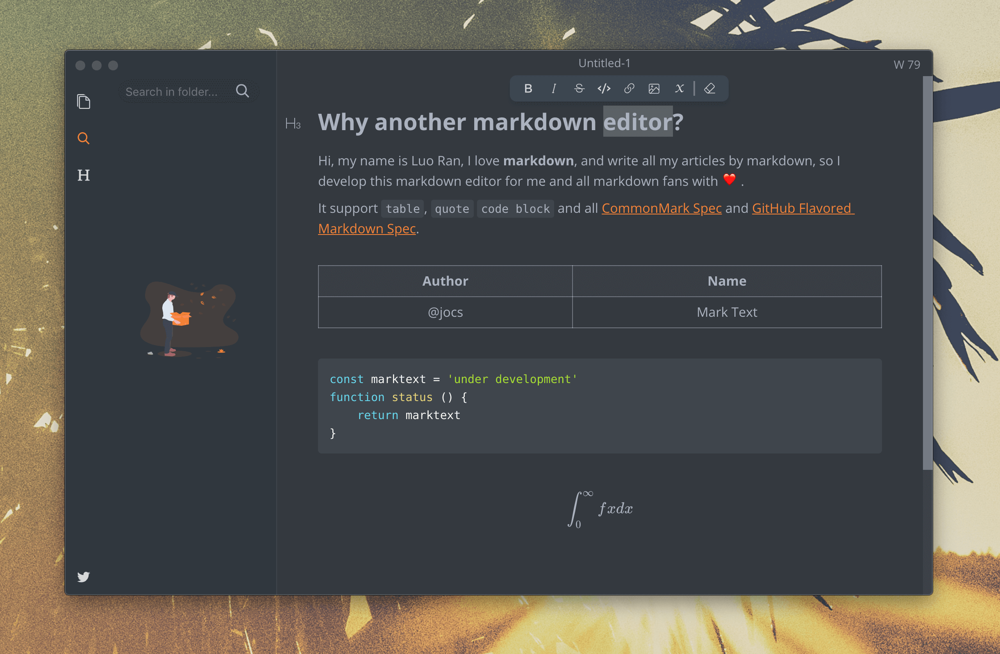
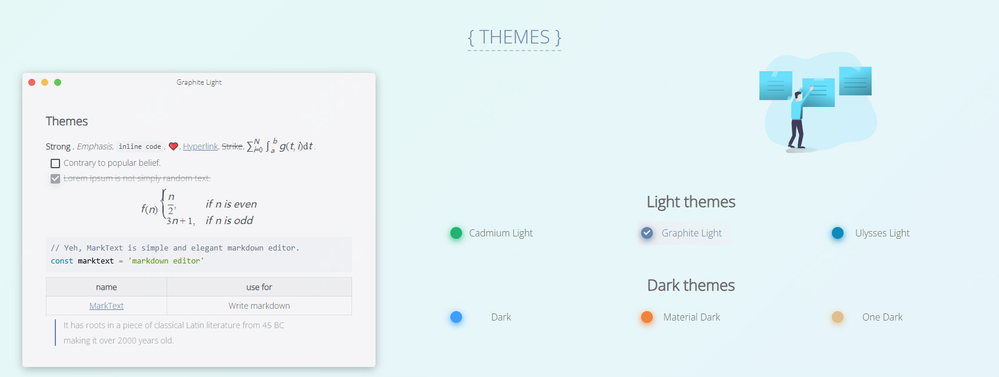

46k star!!typora的免费开源替代，酷炫又实用

github上star数4w+，下载量更是高达百万，这样一款你的值得一试！

其实自从typora收费之后，一直在找一款不错的markdown的替代品，有很长一段时间都是用vscode作为替代。

但最近发现了这款开源免费的工具--marktext



>项目地址：https://github.com/marktext/marktext

## marktext项目简介

marktext是一款跨平台支持的markdown编辑器，它的特点在于简单而优雅，而且专注于速度和可用性。

支持mac、windows、linux，作者也宣称该软件会永远免费及开源。

目前还在不断迭代更新当中，我们也会指出关注和期待。

## marktext如何安装

可以看到目前该软件的一个下载量

 

安装最简单的办法就是去github的releases中获取对应系统的安装包。

也可访问官网，地址如下：

>https://www.marktext.cc/

当然也支持通过包管理器安装

windows系统可以如下命令：

```
choco install marktext
#或者
winget install marktext
```
mac用户的话，使用brew即可

```
brew install --cask mark-text
```
而对于linux用户的来讲的话，还是要看是什么发行版了

```
详细建议去查看官方文档
https://github.com/marktext/marktext/blob/develop/docs/LINUX.md
```


## marktext的功能特点

- 常规功能支持项
  - 表格：支持GFM风格的表格，
  - 图像：支持流程图、序列图、甘特图、vega图
  - 内联表格：支持 CommonMark 和 GitHub 风格的 Markdown 规范
  - 数学公式支持
  - 代码块：支持GFM码围栏，通过prismjs高亮显示。
- 支持不同的颜色主题
  

每个你已经习惯的Markdown 编辑器，都有自己特点或优点，有些具有其他编辑器所没有的功能。

其实很难满足每个 Markdown 用户的需求，但作者希望 MarkText 能够尽可能地满足每个 markdown 用户。

尽管最新的 MarkText 仍然不完美，但作者将尽他们所能使其达到最佳状态。


## github star数

 

 目前该项目获得了46k star，而且还在不断持续上涨当中

 如果你正好需要一款markdown编辑器，那么markrtext是一个不错的选择

 如上，希望有所帮助！