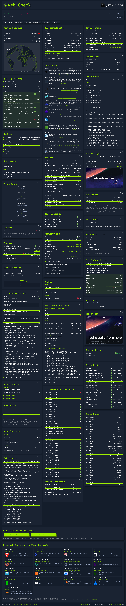
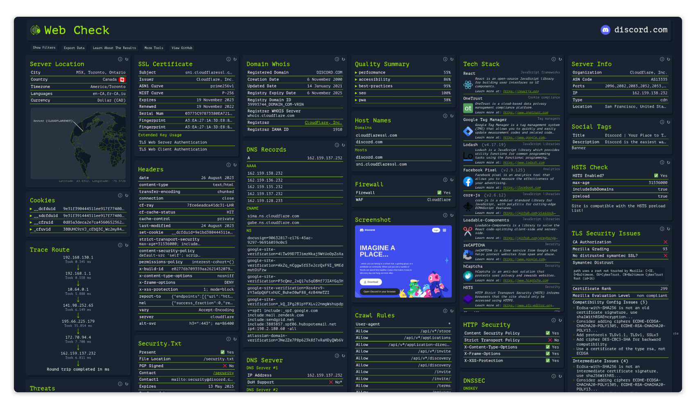
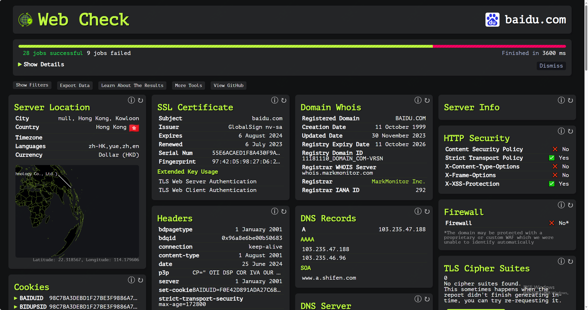
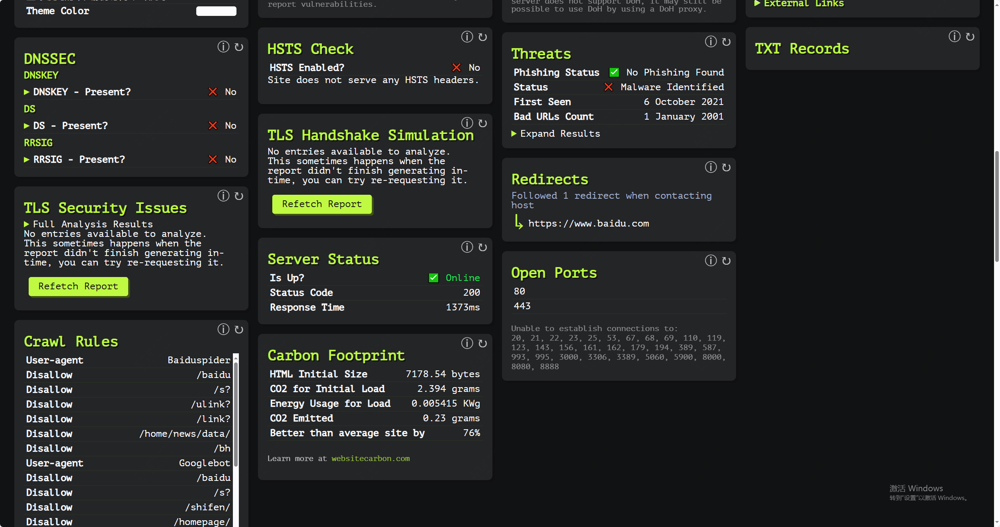

github 20.2k star，超强web-check工具

**Web-Check** 是一个开源的 **OSINT**（开源情报）工具，专门用于分析网站。它提供了一个全面的仪表板，可以展示网站的各种信息，包括 **IP 信息**、**SSL 链**、**DNS 记录**、**cookie**、**头信息**、**域名信息**、**搜索爬行规则**、**页面地图**、**服务器位置**、**重定向记录**、**开放端口**、**路由跟踪**、**DNS 安全扩展**、**网站性能**、**追踪器**、**关联主机名**、**碳足迹**等。

该工具的目标是帮助用户理解、优化和保护他们的网站。它还可以揭示潜在的攻击向量，分析服务器架构，查看安全配置，并了解网站使用的技术。Web-Check 支持多种部署选项，包括 **Netlify**、**Vercel** 和 **Docker**，使得在不同环境中部署变得简单快捷。

开发者 **Alicia Sykes**（GitHub 用户名：Lissy93）是这个项目的维护者，她还贡献了其他多个开源项目，例如 **Dashy** 和 **Personal Security Checklist**²。Web-Check 的源代码也在 **CodeBerg** 上有镜像。

.

开源地址：https://github.com/Lissy93/web-check

体验地址：https://web-check.xyz/