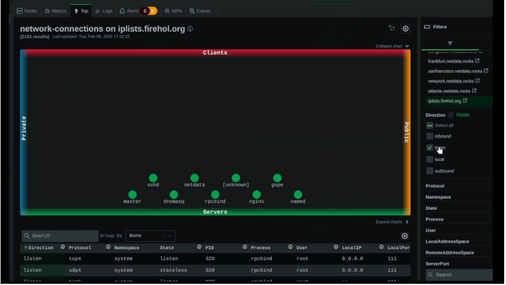
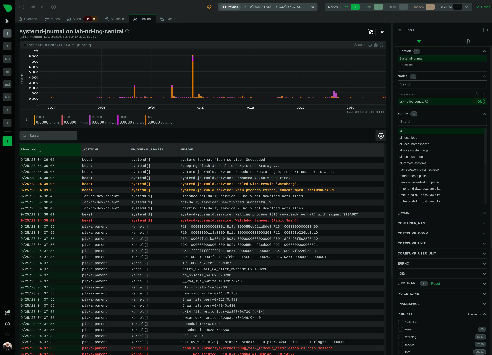
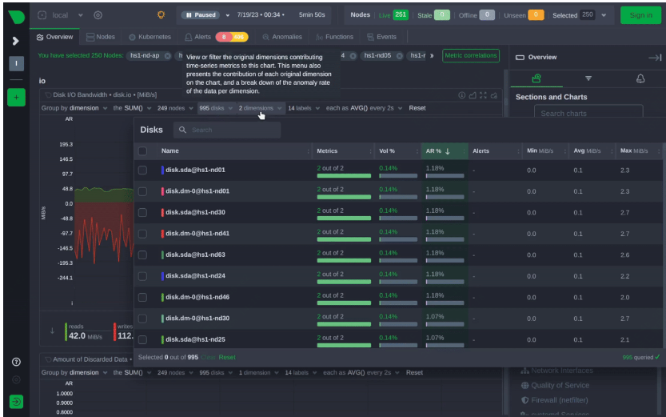

酷炫、强大、高级的监控工具推荐！460万下载安装量

今天要推荐的这款开源工具厉害了，监控项全，界面酷炫，数据实时

如果说promtheus或者zabbix还需要一些配置才能使用的话

这款工具就是一个即插式的监控软件，它开箱即用。

部分效果如下：

>项目地址：https://github.com/netdata/netdata

## netdata项目简介

netdata是一整套监控的解决方案，它可以监控服务器、容器、进程，并且数据保证准确性及实时性。

netdata它提供了一个完整的指标dashboard，并且有agent及父节点，用于汇集数据及展示。

可以轻松管理上千台物理服务器，只要你有足够的存储空间，那么数据可以一致留存。

## netdata如何部署

 

支持你能想到的任何方式的安装（linux(debian系、红帽系、等)、docker安装、mac支持、支持k8s部署）

默认情况下，你启动后会开启19999端口，然后就可以看到仪表盘了，配置基本不用动，但如果你要配置汇聚节点的话，还是需要简单调整下配置的。

## netdata功能特点

- 支持最多800中监控指标，包括不陷于（操作系统、容器、虚拟机、应用程序、系统日志）
- 实时、低延迟、高分辨率，简单讲就是对数据处理及时
- 部分可扩展AI功能，可以结合过去指标对行为做出监测
- 强大的仪表盘，省去了在grafana 的二次配置，并且数据量丰富，支持过滤，查询方式简答
- 支持数百中预警方式
- 维护成本低
- 关于性能使用情况，github上有与prometheus的一个对比 （在相同的工作负载下，Netdata 使用的CPU 减少了 35% ， RAM 减少了 49% ，带宽减少了 12% ，磁盘 I/O 减少了 98% ，并且在高分辨率指标存储上磁盘空间效率提高了 75% ，同时提供一年多的时间在相同磁盘占用空间上的总体保留时间 Prometheus 提供 7 天的保留时间。）

## star数

 

 目前该项目获得了70k的star，快去尝试下吧！

 如下为demo地址：

 >