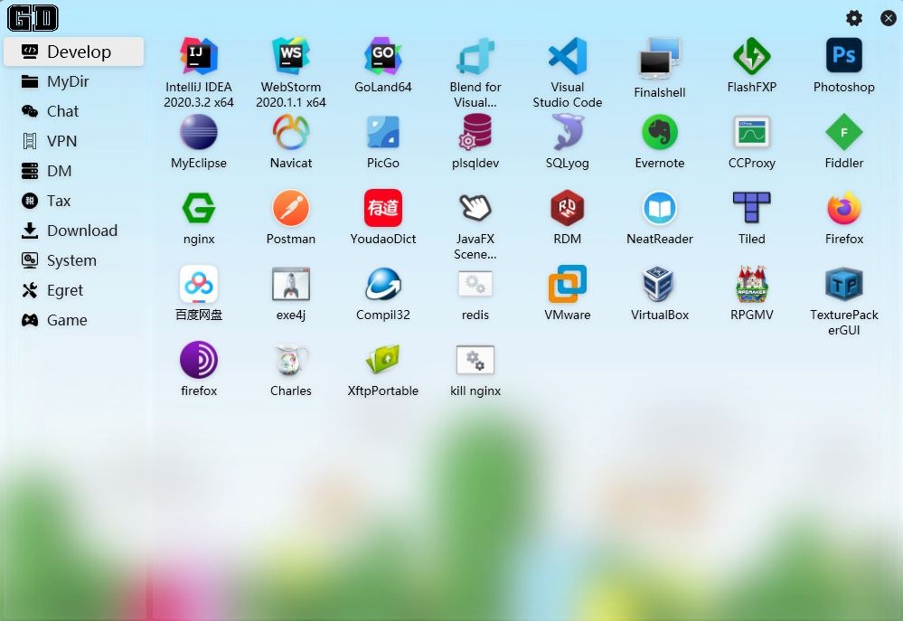
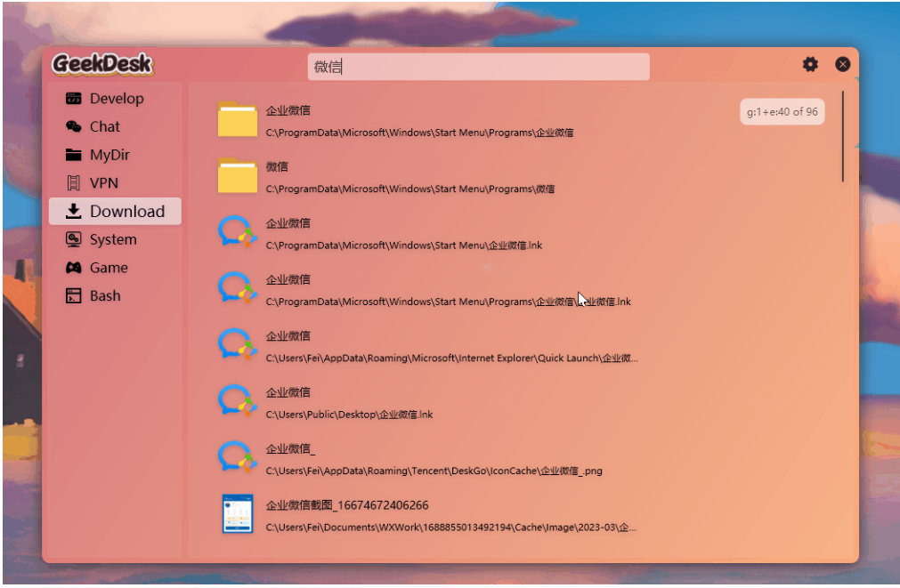
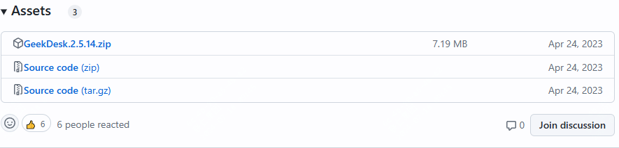
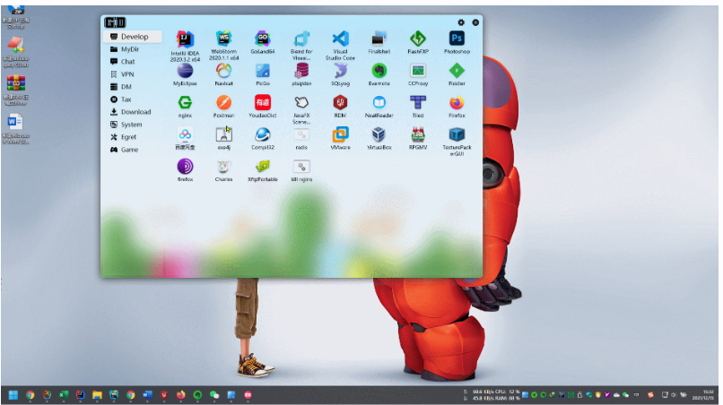
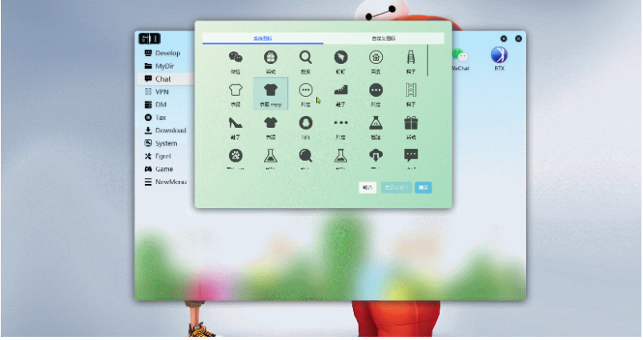

美观、好用的桌面快速启动管理器

不知道你的桌面是怎么样的？

是不是整屏都放满了图标，每次要找都要费很大劲，今天呢，推荐一款效率工具，可以让你快速管理你的桌面应用。

>项目地址：https://github.com/BookerLiu/GeekDesk

### 项目简介

GeekDesk是一个小巧实用，而且支持定制化的，桌面管理工具，而且是完全开源免费的。

而且在最新版本中集成了everything，可以快速搜索到你需要的应用。

### 如何安装

 

可以看到目前的安装下载量已经有14k，算是一个不错的小项目了。

如果觉着不错，想要下载试用下的话，可以直接到releases中下载。

使用方式也很简单，只要把你需要的文件或者程序拖入就可以，然后按照你自己的需求去分类即可

### 功能特点

这里介绍下这款桌面管理工具的其它具体功能

- 支持全局的快捷键，可以让你快速打开该管理工具，可以根据你的习惯设置按键
- 内部自己带的壁纸可以替换为你想要的壁纸
- 如果你喜欢毛玻璃的感觉，也可以替换为毛玻璃效果
- 如果说你对现有的图标不满意，想要调整为自己喜欢的，那也可以调整

- 支持定义一些待办事项
  

### star增长图

 

 目前该项目的star已经有1.8k。