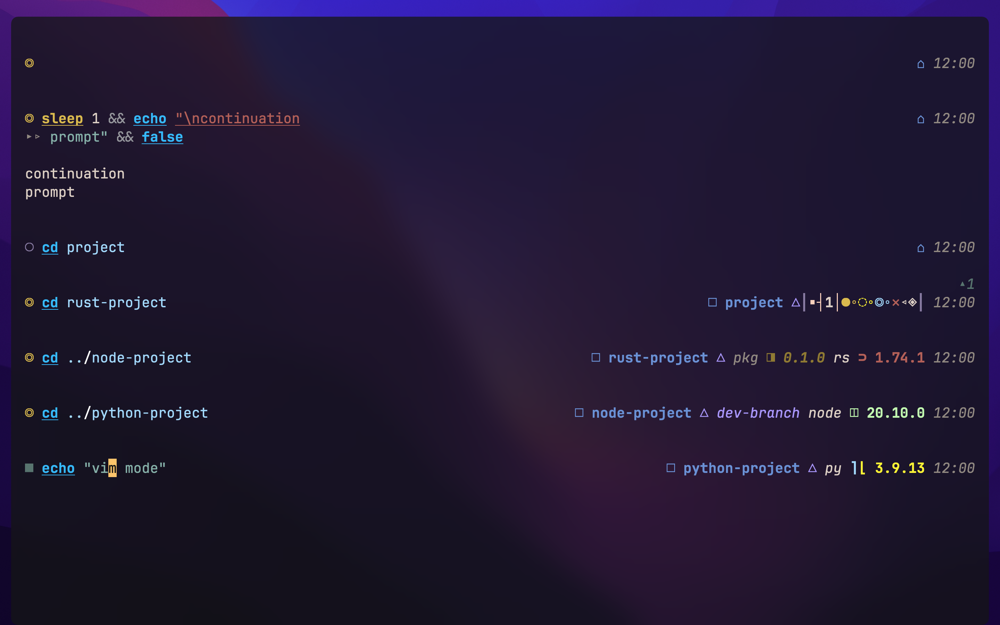
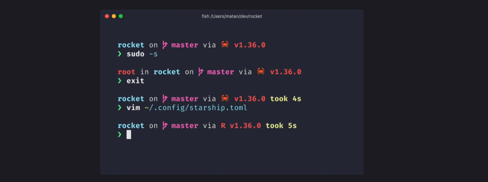
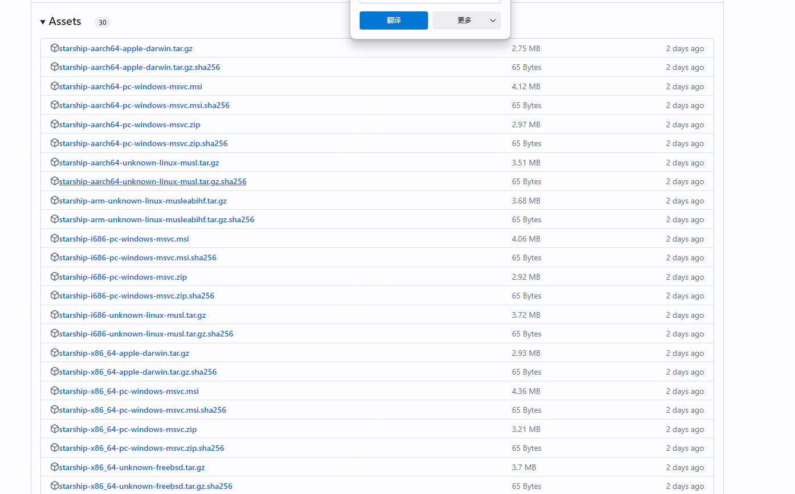

颜值极高！适合多终端使用的命令行工具

话不多说，现来看几个效果图：




今天推荐的这个项目是一个适合于任何的shell，并且很小的、速度极快的

>项目地址：https://github.com/starship/starship

### starship项目简介

starship是一个轻量、迅速、客制化的高颜值终端！



### 如何安装

 

在安装之前，你需要去安装字体文件，可以直接到nerdfonts网站去下载你需要的字体文件

我们以windows来介绍，其它如(mac\linux\android)等可以到官网去查看

步骤1：安装starship

可以在releases中下载msi安装包，也可以使用scoop等包管理器安装



步骤2：设置你的shell环境

windows下的话，如果是cmd环境

你需要使用clink(v1.2.30+) 使用 Cmd。在此路径下创建一个文件%LocalAppData%\clink\starship.lua包含以下内容：

```
load(io.popen('starship init cmd'):read("*a"))()
```

如果是powershell的话，如下操作：

将以下内容添加到 PowerShell 配置的末尾（通过运行找到它$PROFILE）

```
Invoke-Expression (&starship init powershell)
```

步骤3：配置 Starship

启动一个新的 shell 实例，应该可以看到漂亮的新 shell 提示符。

### 功能特点

- 快速地：很快 是真的快！ 🚀，采用了rust语言开发

- 可定制：配置提示的各个方面，官网有很多给出的案例，可以直接参考

- 普遍的：适用于任何 shell、任何操作系统。

- 功能丰富：支持所有您喜欢的工具。

- 简单的：安装快速 几分钟内即可开始使用。

### star数

 