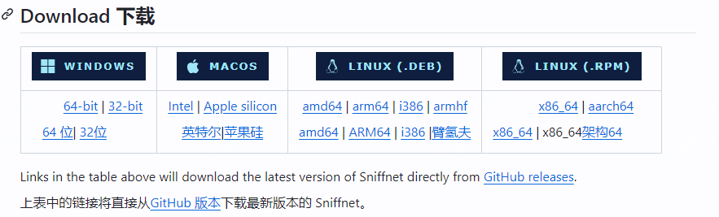
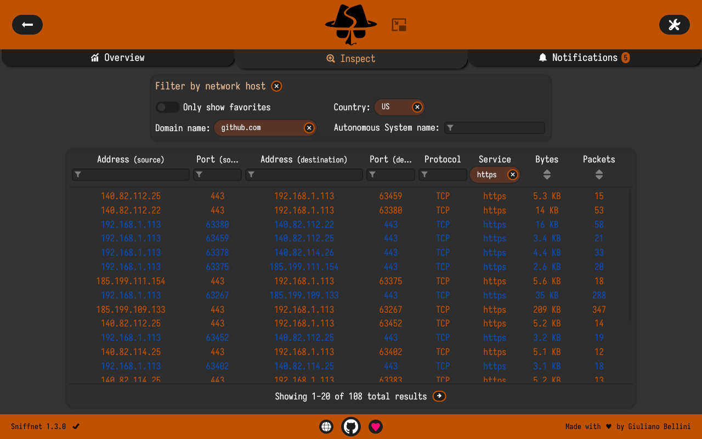

开源、实用、酷炫的免费工具推荐

关于你平时的互联网流量会有关注嘛？

今天推荐一款开源工具，是一个可以快速监控你的互联网流量，并且可以生成图表，导出文件。

简单效果如下：

>项目地址：https://github.com/GyulyVGC/sniffnet

### sniffnet项目简介

sniffnet是一个完全米免费开源的互联网流量监控程序。

它是跨平台支持的，目前支持多语言。

### sniffnet如何部署安装

 

支持多平台，windows、mac、linux等都有对应的安装包可以获取

一些其它linux发行版，官网也提供了安装方式。

目前该软件的下载量在github上显示有9w次点击。

### sniffnet功能特点

- 可以选择电脑或者服务器上某张网卡进行流量检测
- 可以查看互联网流量的总体统计数据

- 可以识别6000 多个上层服务、协议、木马和蠕虫
- 应用程序员可以小化为一个很小的监控页面

更多具体的内容，可以到官方wiki中去查看

### sniffnet的star增长图

 

 目前该项目已经获得了16k star！

 ## 其它问题

 - Sniffnet 每秒可以处理多少个数据包？
 - 
   Sniffnet 每秒可以处理的数据包的精确数量取决于您所使用的硬件和操作系统。

  在普通机器上，Sniffnet 应该能够流畅地每秒读取并显示超过 100k 的数据包。

- Sniffnet是否支持数据包捕获文件的导入和导出？ 

从 1.3.0 版本开始，Sniffnet 支持导出PCAP 文件。

- Sniffnet 支持 ICMP 流量吗？

Sniffnet 支持 ICMP 流量。

- Sniffnet 可以用作防火墙吗？

Sniffnet 目前不允许您阻止网络流量。