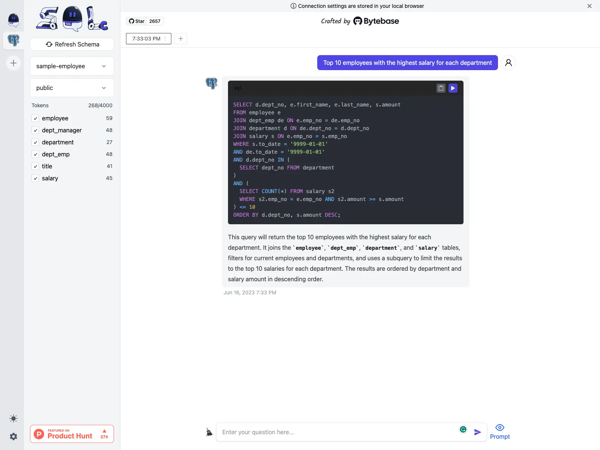
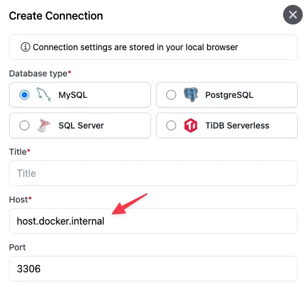

好用、好玩的SQL开源工具推荐，牛逼plus！

不管你是开发、运维还是业务，日常工作中肯定是要和sql打交道的，甚至频率还不会低。

但有时候对sql语法可能没那么熟悉，要去问人，或者耗费大量时间去查，去试。

今天推荐的这款工具就厉害了，她可以让你处理sql像是聊天一样简单，并且可以快速获得你所需要的sql。

话不多说，开始今天的项目介绍。

>项目地址：https://github.com/sqlchat/sqlchat 


## sqlchat项目简介

sqlchat是一个基于聊天的SQL客户端，你可以用自然语言实现增删改查。



## sqlchat如何安装

目前该工具是支持docker部署，可以直接如下命令安装，然后去访问3000端口即可，如果有其它端口要求，可以根据需求去调整

```
docker run --name sqlchat --platform linux/amd64 --env NEXTAUTH_SECRET="$(openssl rand -hex 5)" --env OPENAI_API_KEY=<<YOUR OPENAI KEY>> -p 3000:3000 --hostname localhost sqlchat/sqlchat
```

在启动之后，需要一些简单的配置，如配置数据库连接方式

目前支持的数据库类型有（mysql、postgresql、sql-server、tidb）



上述只是一个最简化的应用，如果你还想要实现更多的功能，可以参考官方文档去调整配置等

官方也提供了一个demo环境，可以去体验下：

demo地址：sqlchat.ai

## sqlchat功能特点

- 对于不熟悉sql语法的朋友来讲，省去了很多环节，可以更多时间聚焦于其他事情
- 跨语言支持，可以配置chatai对话
- 支持大部分常用数据库，而且还在持续开发中

## sqlchat的star数

 

 ## 其它

 在这部分想聊下作者开发这个工具的原因。

 前面也有提到过部分，根据作者的介绍，核心原因是因为随着chatgpt的普及，我们进入到了一个工具2.0时代

 生成式的发展将会带来更多的颠覆，而sql这个小众领域，同样是存在着很多的可能性。

 基于聊天的sql工具，我会持续关注，希望它的功能效果更棒。
 