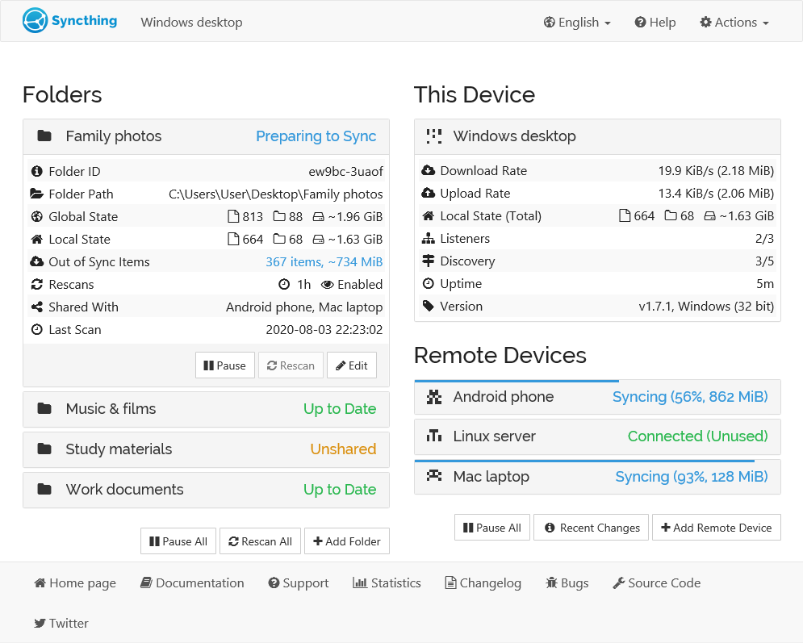
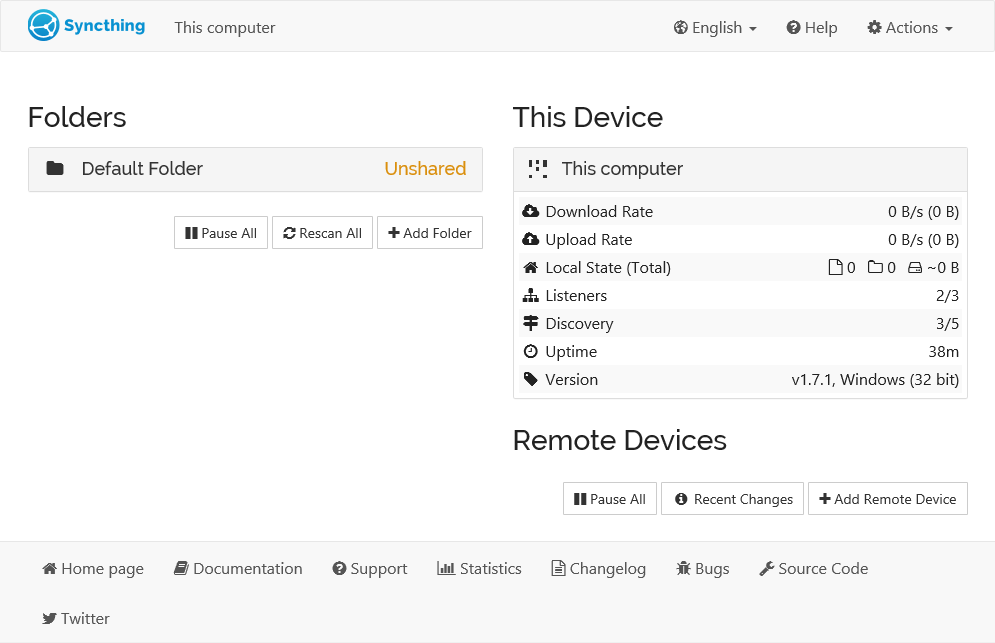
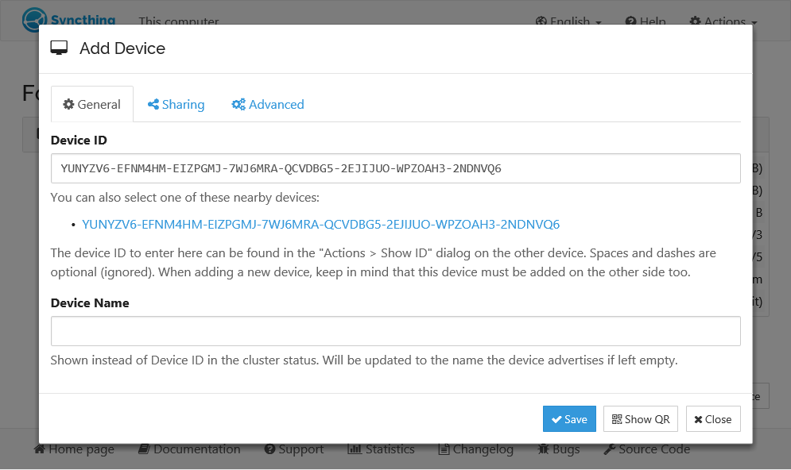
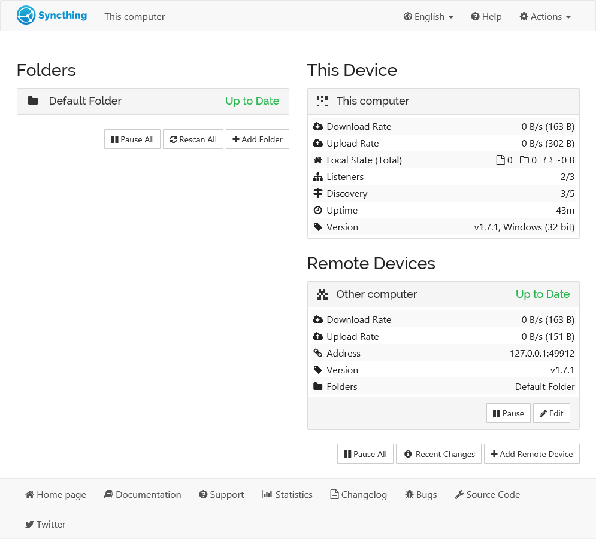

免费、简单、强大的开源工具推荐

在如今数据量爆炸增长的时代，每个人都会有很多的数据，包括不限于照片、视频等

如何做好备份，注定是一个越来越被关注到的问题。

当然已经有很多第三方或者云厂商都提供了相关的解决方案，但数据的隐私，昂贵的服务费，很多用户都会望而却步。

今天推荐的这款工具就是一个用来解决文件同步的开源产品。



>项目地址：https://github.com/syncthing/syncthing

## syncthing项目简介

syncthing是一个用go语言写的文件同步工具。

它最核心的保障点在于文件不会丢失，而且文件是可以在你局域网内的设备之间同步，避免了从云端再绕一步的问题。

如果是增量数据，还可以根据需求配置一定的同步任务，保证数据的自动同步。

如果你是nas用户，那么这个工具就更得安装使用了，它可以docker快速部署，使用简单， 也支持中文。

## syncthing如何安装

从该软件的安装量也可以看的出来，该工具的火热程度。

 


它是跨平台支持的，包括windows、mac、linux、android等都有对应的终端程序可以安装，在releases中也有对应的二进制包可以获取。


如果你习惯使用docker部署，这里简单介绍下docker如何启动

如下是docker直接启动，官网也提供了docker-compose方式启动
```
$ docker pull syncthing/syncthing
$ docker run -p 8384:8384 -p 22000:22000/tcp -p 22000:22000/udp -p 21027:21027/udp \
    -v /wherever/st-sync:/var/syncthing \
    --hostname=my-syncthing \
    syncthing/syncthing:latest
```
启动之后可以访问本地的8384端口访问web页面，如下：



左侧是要同步的文件夹，右侧为设备列表，你需要通过添加设备来新增同步机



新增设备后，可以看到已经加入进来了



然后你就可以通过共享目录来同步所需文件了。

官网还提供了不同终端的自动化同步任务解决方案，以及一些第三方的工具集，具体可以到官方文档参考


## syncthingstar数

 

 目前该项目已经在github中拿到了6w+star