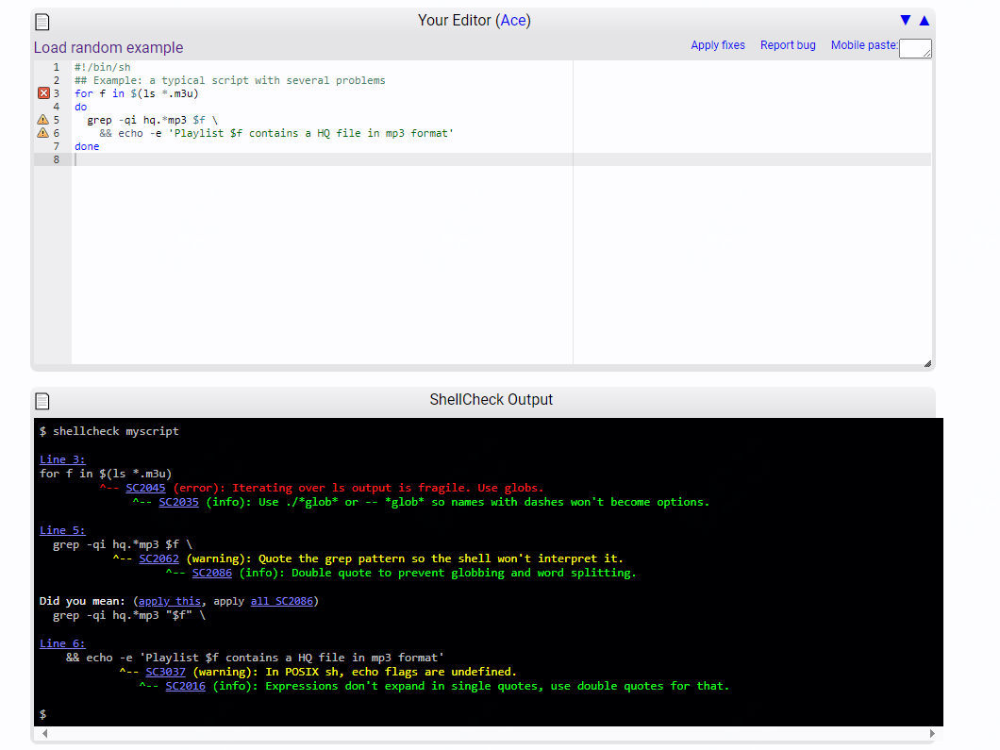
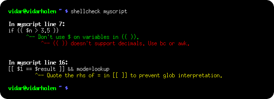

简洁、高效、开源，程序员必备小工具推荐

在日常工作中，不管是程序员或者是其它岗位，不可避免的会接触到shell脚本

但对于不熟悉语法的朋友，遇到问题解决起来需要一定的时间。

今天推荐一个高效的shell脚本分析工具，它可以快速分析你脚本中的异常

>项目地址：https://github.com/koalaman/shellcheck

## shellcheck项目简介

shellcheck是一个shell脚本检查器，你可以直接检测某个脚本的异常出，该工具会直接给出问题点

还会给出具体的调整建议，如果对该错误不是特别理解，还可以跳转查看详细解释，下为示例：



## shellcheck如何安装

 

 可以看到该工具目前的下载量还是很惊人的！

在介绍如何安装的同时，也介绍下该工具如何使用？

它可以直接部署为一个网站，作者也提供了demo

除此之外，它还可以在终端直接调用，也可以在编辑器里面使用(如vim、emacs、sublime、vscode等）

如何安装？

在linux系统中，如果是debian系列，可以如下：

```
sudo apt install shellcheck
```
如果是基于epel的发行版，则适用yum即可
```
sudo yum -y install epel-release
sudo yum install ShellCheck
```
mac系统可以使用brew安装

```
brew install shellcheck
```

windows也可以使用包管理器下载，如下：

```
winget install --id koalaman.shellcheck
```

如果无法使用包管理器下载，作者也提供了二进制包可以直接使用，可以到github中查看

终端使用效果如下：



## shellcheck功能特点

- 支持错误种类丰富，包括不限于错误引用，条件判断、错误的命令
- 另外给出了大量的对于初学者的一些常见错误语法
- 虽然格式要求没有那么多，但是会给出一些warn的提示


## shellcheck目前star数

 

 该项目目前有36k star，还是很有吸引力的，有需求的可以去关注下。

 该工具可以在网页中部署使用，所以作者也提供了一个demo环境，地址如下：

 > https://www.shellcheck.net/