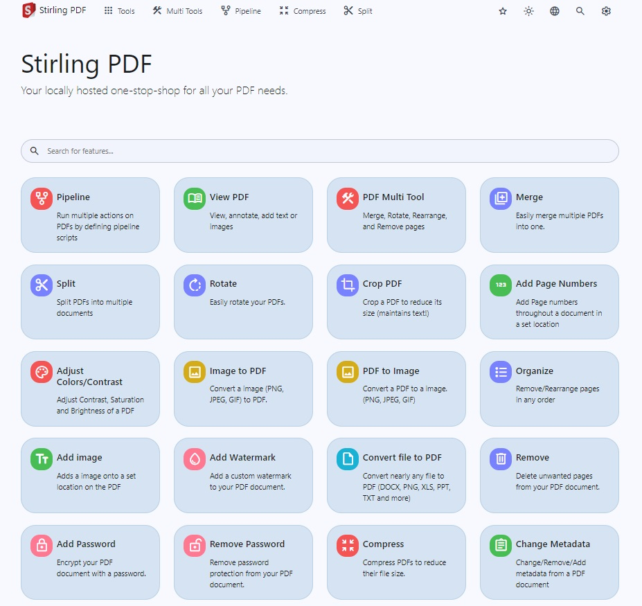
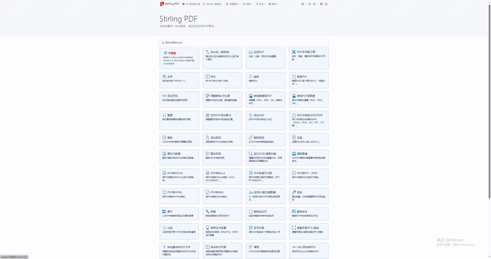
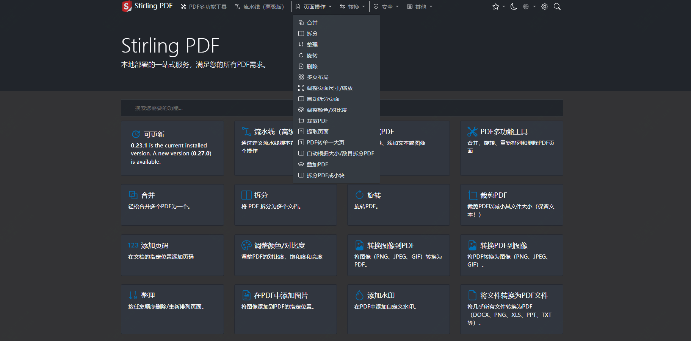
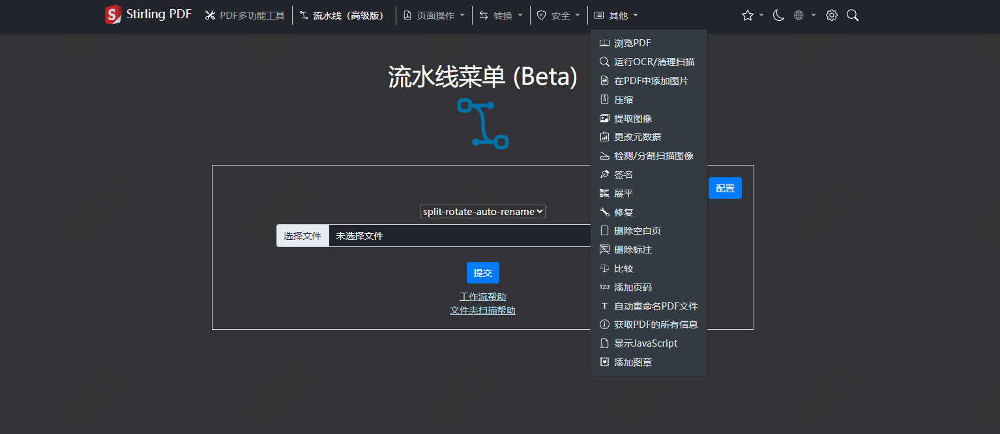

有了这款开源免费的工具，还要啥付费会员？

在日常工作或者学习中，pdf格式应该是基础比较多的，而关于pdf操作一些软件需要开会员

但今天推荐的这款开源工具是一款基于web的pdf操作工具

安装部署很简单，功能很多、很多

>项目地址：https://github.com/Stirling-Tools/Stirling-PDF 



它同时支持很多语言，包括简体中文



## Stirling-PDF项目简介

Stirling-PDF是一个强大的，可以本地托管的，基于web的pdf操作工具。

它可以对pdf文件进行任何操作，包括不限于拆分、合并、转换、重组、添加图像、旋转、压缩

## Stirling-PDF如何安装

 

 可以看到该工具已经有167k的下载量，而docker镜像的拉取量更是到了5.7M

 想要本地部署，最简单的方式就是通过docker方式，甚至可以你要用的时候启动，不用的时候，可以临时关闭

 docker启动

 ```
 docker run -d \
  -p 8080:8080 \
  -v ./trainingData:/usr/share/tessdata \
  -v ./extraConfigs:/configs \
  -v ./logs:/logs \
  -e DOCKER_ENABLE_SECURITY=false \
  -e INSTALL_BOOK_AND_ADVANCED_HTML_OPS=false \
  -e LANGS=en_GB \
  --name stirling-pdf \
  frooodle/s-pdf:latest

  Can also add these for customisation but are not required

  -v /location/of/customFiles:/customFiles \
 ```
官方也提供了docker-compose方式启动

该工具在实际使用过程中产生的文件仅存在于客户端，当任务结束后，用户上传的文件都会从服务中删除。

## Stirling-PDF功能特点

- 支持暗黑模式，如下：

- 可以并行处理文件和下载
- 用于与外部脚本集成的 API
- 支持大量的转换操作
- 比较 2 个 PDF 并显示文本中的差异。
- 获取 PDF 上的所有信息以查看或导出为 JSON。
- 还可以开启认证，如果是公司内部使用，可以直接配置接入
- 另外还支持数据库的备份和导入

其它功能：



## star数

 

 目前该项目已经获得了37kstar，快去尝试下吧！