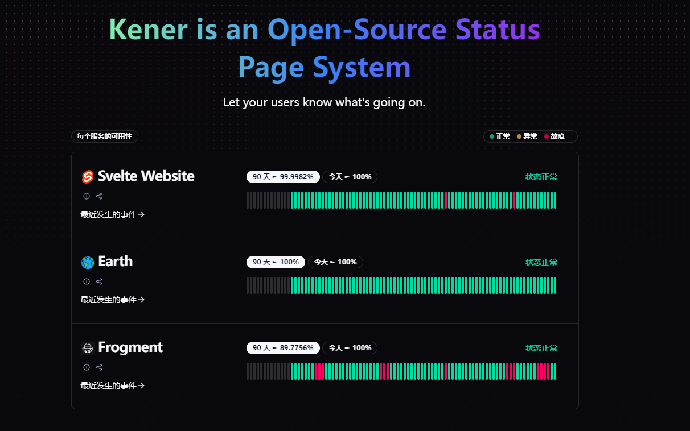
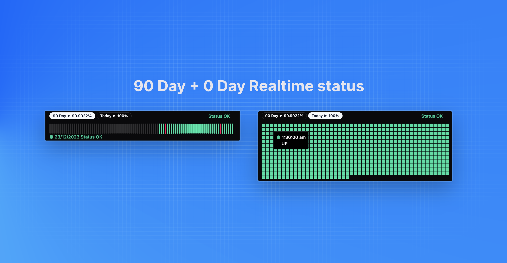

酷炫又实用！用了这款工具，在公司横着走

关于服务的可用性，服务状态的监控，每个公司都有自己的监控手段

今天推荐一款免费开源的工具，让你对服务的监控更加简洁，对于事件的管理更加高效

>项目地址：https://github.com/rajnandan1/kener

效果如下：



## Kener项目简介

Kener是一个node.js开发的服务页面状态监控工具。

它的宗旨在于简化监控，高效处理事件。

它提供了一个酷炫的监控页面，可以一目了然的看到监控实时状态，可以跟踪服务的中断的事件及过程。

而且提供了与github issues的集成，也可以通过api在公司的事件平台中自动创建事件

## 如何安装

可以直接采用docker方式部署

```
docker run -d -v /path/on/host/config:/config -p 3000:3000 -e "GH_TOKEN=1234" rajnandan1/kener
```


## 功能特点

### 监控和跟踪
- 支持实时监控，使用轮询方式对http链接进行监控
- 可以配置定时任务，轮询监控
- 支持yaml格式配置文件
- 可以构建复杂api监控
### 事件管理

- 使用 Github Issues 创建事件 - 富文本
- 使用 API 创建事件

## 部分截图




## star数

 