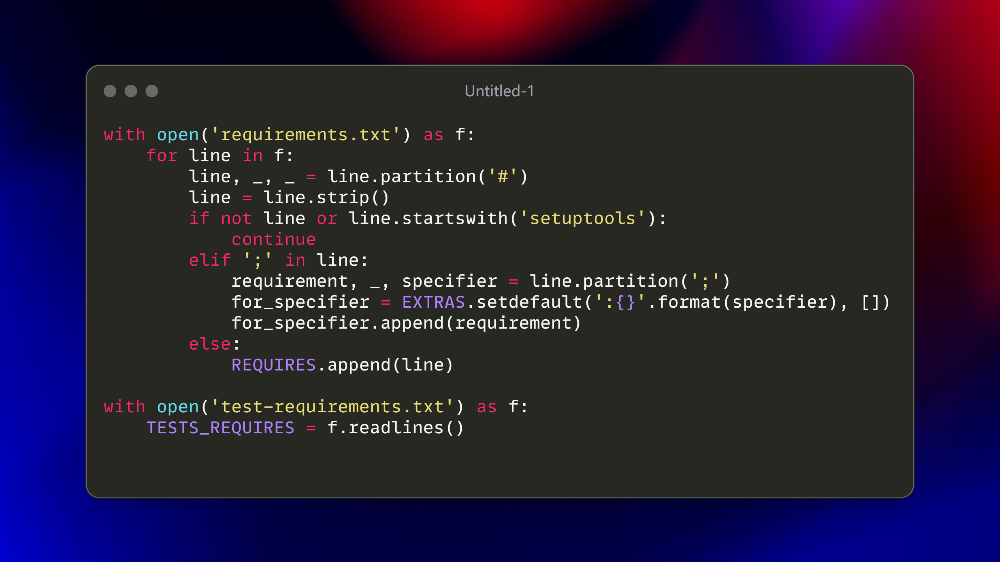
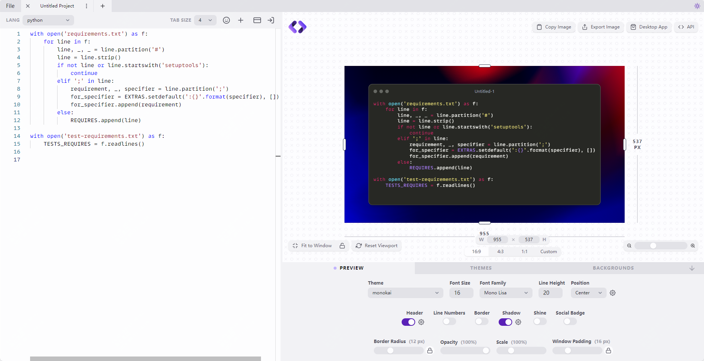

卧槽！代码界的修图软件，让你的屎山代码瞬间变得高大上

大家好，关注我，每天都能收到开源精选

今天推荐一个前端小项目，日常写文章或者工作当中，时不时会有代码分享的需求

如何让你的分享更加高大上，那么可以看下这个项目-Showcode

>项目地址：https://github.com/stevebauman/showcode 

效果如下：



## Showcode项目简介

Showcode是一个前端项目，可以根据需求调整配置，让你的代码片段分享更加精美。

它还提供了api调用方式，可以快速生成分享内容。

## 如何安装

你可以直接访问作者提供的一个web页面，地址如下：

>https://showcode.app/ 



也可以自己本地化部署，步骤如下，启动后访问本地的3000端口即可

```
#克隆 git 存储库
npm install & & npm run dev
```


## 功能特点

1. **美观的代码图片**：Showcode 可以将代码转换成高质量的图片，适用于分享和展示。
2. **多种语言支持**：该项目支持多种编程语言，包括 JavaScript、PHP、Vue 等。
3. **API 接口**：Showcode 提供 API 接口，方便开发者在自己的应用中集成该功能。
4. **桌面应用**：除了在线版本，Showcode 还提供桌面应用，方便离线使用。
5. **本地安装**：用户可以通过克隆 GitHub 仓库并运行本地服务器来使用 Showcode。

## 日常工作中的应用
1. **代码分享**：在团队协作中，使用 Showcode 可以将代码片段转换成图片，嵌入到文档或聊天工具中，提升沟通效率。
2. **技术博客**：技术博主可以使用 Showcode 将代码转换成图片，嵌入到博客文章中，使文章更加美观和易读。
3. **演示文档**：在制作技术演示文档时，使用 Showcode 可以创建高质量的代码图片，提升文档的专业性。
4. **社交媒体**：开发者可以将代码图片分享到社交媒体平台，展示自己的代码风采，吸引更多关注。
5. **代码审查**：在代码审查过程中，使用 Showcode 可以将关键代码片段转换成图片，方便审查人员快速理解和反馈。

## star数

 