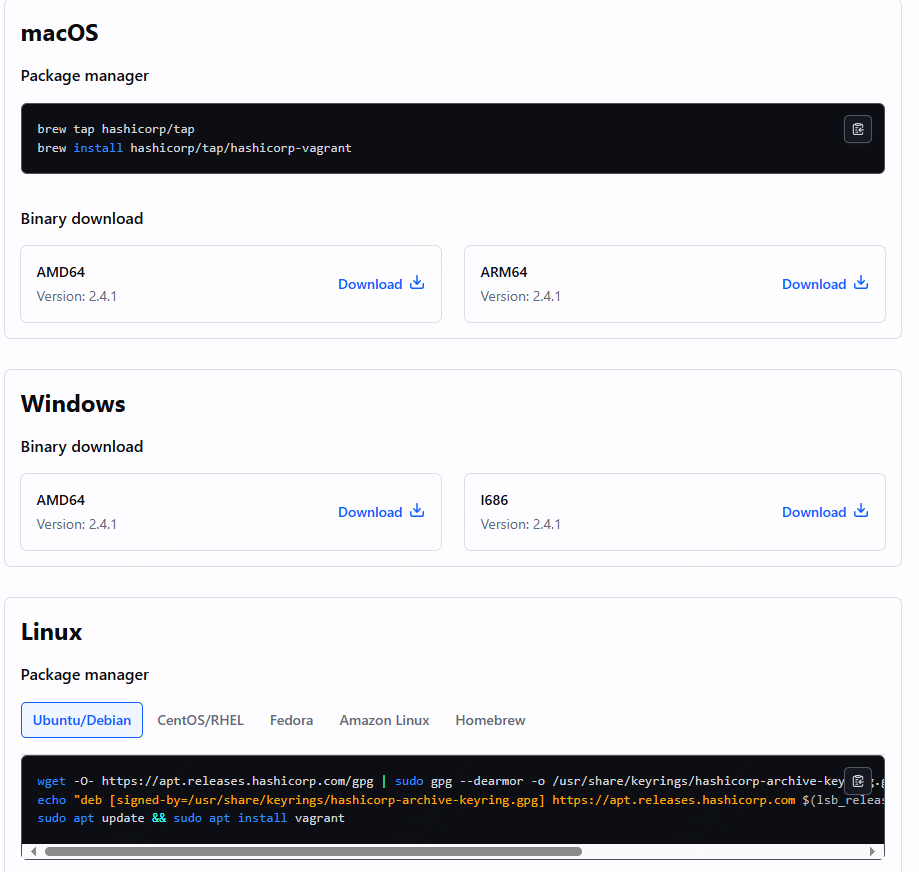
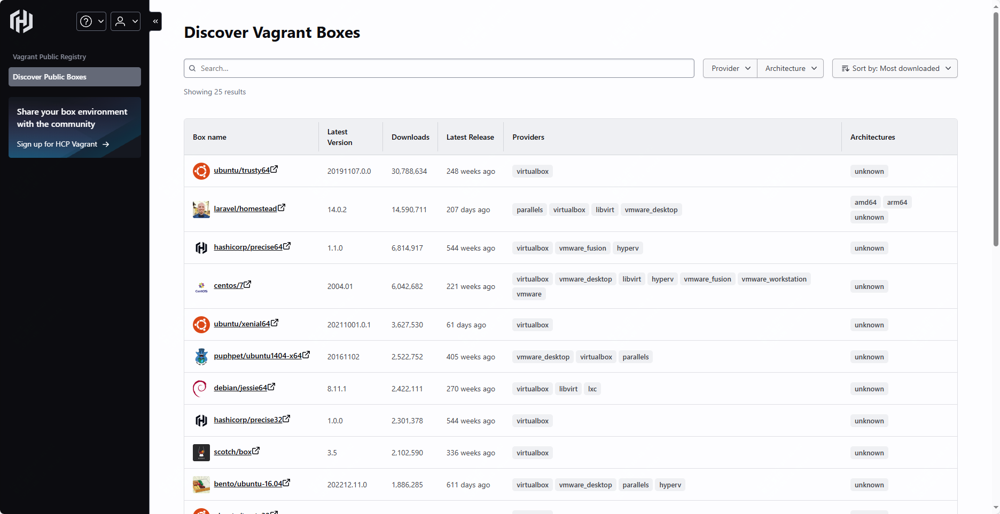

免费、开源！创建虚拟机环境最简单、最快的方式

在了解这个工具之前，都是在用vmware来创建虚拟机环境，需要挂盘、创建虚拟机等等一步步点击操作，比较耗时

今天推荐的这款工具，最大的特点在于可以快速创建虚拟环境

对于开发人员非常友好，可以根据框架和配置格式来创建和管理完整的可移植开发环境

这样一套完整的开发环境，可以在windows、linux、mac之间移植


>项目地址：https://github.com/hashicorp/vagrant

## vagrant项目简介

介绍vagrant之前，先来简单介绍下这家公司hashicorp，它们是专门做免费增值软件的公司，现在比较火的consul就是它们公司的。

vagrant是一款用于构建及配置虚拟开发环境的软件，采用Ruby编写，主要以命令行方式运行。

最开始只支持与virtualbox结合使用，在新的版本中可以与vmvare结合使用

## 如何使用

 

在使用之前，需要先安装virtualbox，另外如果你是windows环境，已经开启了hyper-v，需要关闭

然后安装vagrant二进制命令，直接去官网下载即可



下面是该工具的一个具体使用过程：

假设你已经安装了Vagrant和VirtualBox（或者虚拟化平台）：

### 1. 创建项目目录
首先，创建一个项目目录，并进入该目录：
```bash
mkdir my-vagrant-project
cd my-vagrant-project
```

### 2. 初始化Vagrant环境
在项目目录中初始化Vagrant环境，这会生成一个默认的`Vagrantfile`配置文件：
```bash
vagrant init
```

### 3. 修改Vagrantfile

在vagrant环境中，镜像是以box的形式出现的，可以理解为是一个基础镜像，你也可以根据实际需要构建自己的box

编辑生成的`Vagrantfile`文件，配置你要使用的虚拟机盒子（box）。例如，使用Ubuntu 20.04的官方box：
```ruby
Vagrant.configure("2") do |config|
  config.vm.box = "ubuntu/focal64"
end
```

### 4. 启动虚拟机
在项目目录中启动虚拟机：
```bash
vagrant up
```
Vagrant会自动下载所需的box（如果本地不存在），并启动虚拟机。



### 5. 连接到虚拟机
虚拟机启动后，可以通过SSH连接到虚拟机：
```bash
vagrant ssh
```

### 6. 停止虚拟机
完成操作后，可以通过以下命令停止虚拟机：
```bash
vagrant halt
```

### 7. 销毁虚拟机（可选）
如果不再需要虚拟机，可以销毁它，以释放资源：
```bash
vagrant destroy
```

### 结果
假设你执行了以上步骤，启动了虚拟机，系统可能会给出如下结果：

```bash
Bringing machine 'default' up with 'virtualbox' provider...
==> default: Importing base box 'ubuntu/focal64'...
==> default: Matching MAC address for NAT networking...
==> default: Checking if box 'ubuntu/focal64' version '20230829.0.0' is up to date...
==> default: Setting the name of the VM: my-vagrant-project_default_1692000132032_12345
==> default: Clearing any previously set network interfaces...
==> default: Preparing network interfaces based on configuration...
    default: Adapter 1: nat
==> default: Forwarding ports...
    default: 22 (guest) => 2222 (host) (adapter 1)
==> default: Booting VM...
==> default: Waiting for machine to boot. This may take a few minutes...
    default: SSH address: 127.0.0.1:2222
    default: SSH username: vagrant
    default: SSH auth method: private key
==> default: Machine booted and ready!
==> default: Checking for guest additions in VM...
==> default: Mounting shared folders...
    default: /vagrant => /path/to/your/project/my-vagrant-project
```

这表明Vagrant成功启动了虚拟机，并且你可以通过`vagrant ssh`命令连接到虚拟机。

## vagrant功能特点

- 环境一致，Vagrant可以确保开发人员在本地运行的环境与生产环境尽可能一致，避免出现：“本地正常啊”这样的情况
- 简化虚拟机环境，命令行去完成一切操作，无需手动繁琐配置
- 跨平台支持
- 可移植性
- 支持自动化配置
- 丰富的生态，包括大量的box库，还有一些插件


## vagrant目前的github的star数

 

 目前该项目在github上有26k star