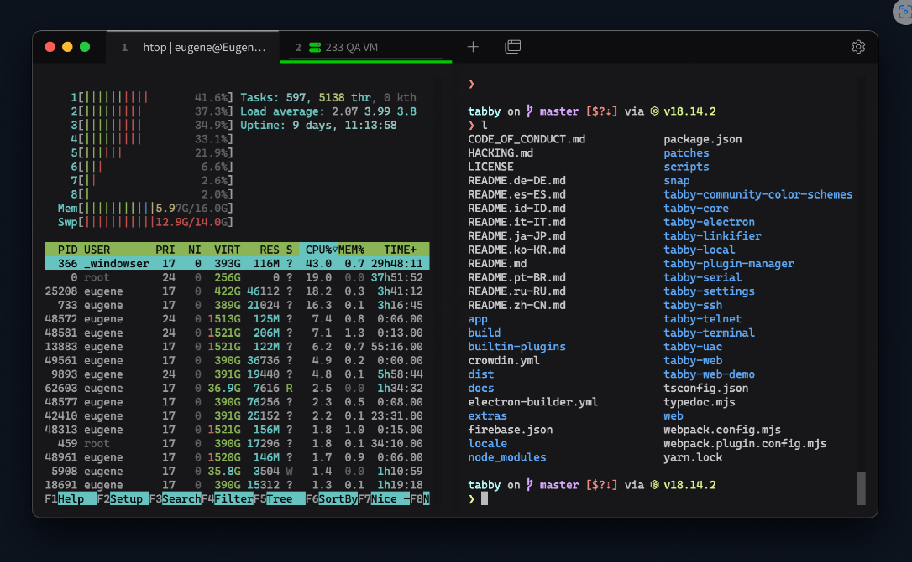
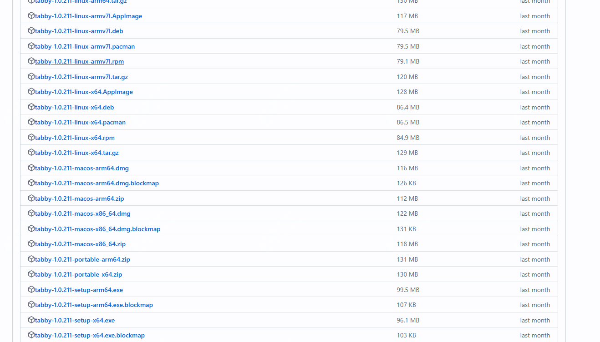
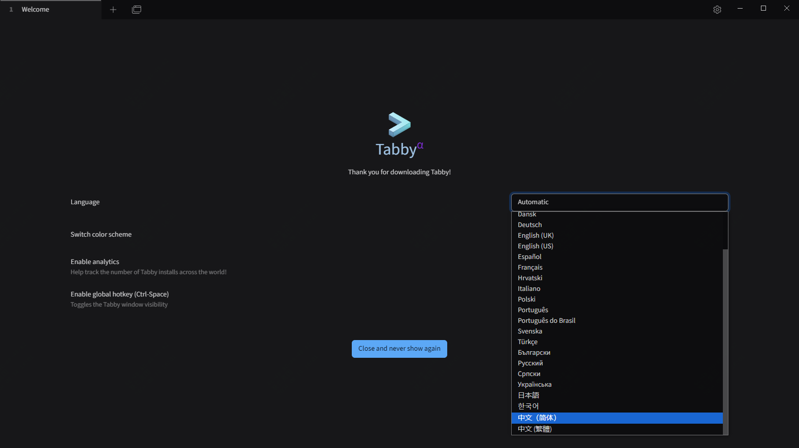
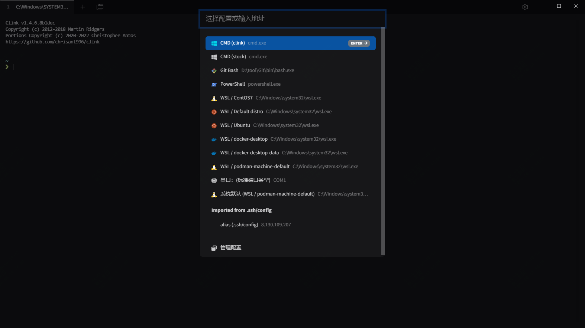
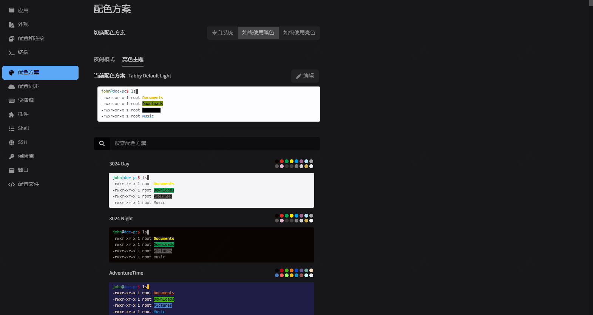
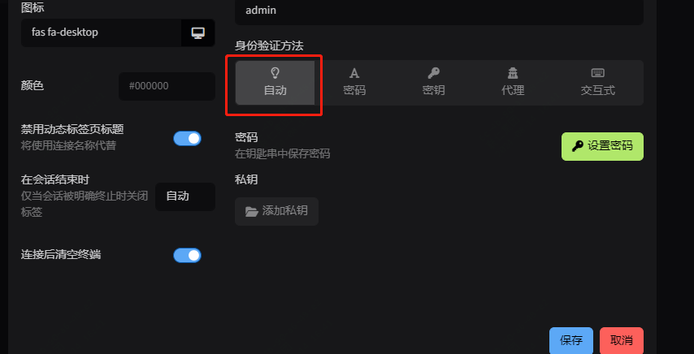

再见了 Xshell、iTerm2、FinalShell，mobaxterm，又一款高颜值的终端工具推荐

上周介绍了[Windterm(点击可跳转)](https://mp.weixin.qq.com/s?__biz=MzkyMzYzMzIyMA==&mid=2247484974&idx=2&sn=a1954886b1fe64eb342a48d144ffadf6&chksm=c1e35505f694dc13ed618ef4fcf0798c6ec7b12c36ca07be5d1cdc34e3b822b1ae446ec5809c&token=551264409&lang=zh_CN#rd),引起了大家的讨论

有说卡顿的，也有用的不错的，也有推荐别的工具的

今天这篇文章就给大家带来另外一款终端工具介绍---tabby

同样是开源免费的

如果说Windterm有一些高雅的功能，解决了一些痛点，功能多而杂，但没有继续迭代更新了

tabby则虽精简，实则强大，对于一些常用功能持续深耕中，所以称之为--更现代的终端工具

来个图看下

>项目地址：https://github.com/Eugeny/tabby

## tabby项目简介

Tabby（以前称为 Terminus）是一个高度可配置的终端模拟器、SSH 和串行客户端，适用于 Windows 10、macOS 和 Linux。

如果要给tabby一个定位的话，我认为是简洁却不简单。

tabby的终端界面真的很简洁，占据了99%的区域为终端，其它按键只有一些配置。

## tabby如何安装

 

 可以看到这个工具目前的下载量是很惊人的，达到了14M之多。

 跨平台支持，安装包直接到github的releases去下载即可。

 

安装完毕，打开可以选择简体中文

然后就可以愉快的玩耍了，它支持一些插件，可以根据需要安装

另外也有一些配色可以选择

如果说你是jumpserver或者是堡垒机需要二次验证的，在配置里需要选择

## tabby的功能特点

这里介绍下tabby的一些功能，常规的就不介绍了

- 丰富的快捷键支持，可以在windows中获得shell的体验，支持tab补全
- 可以记住你的标签页及拆分窗格
- 支持串口连接，支持X11 和端口转发
- 支持代理转发 - 包括 Pageant 和 Windows 原生 OpenSSH 代理
- 资源管理器菜单集成，如果你本地启动了wsl可以自动识别到
- 如果感兴趣，可以使用CSS自定义的主题
- 可以直接与你本地的winscp集成
- 同时多窗格输入
- 支持右键单击、粘贴和在选择时复制
- 等等

## github star数

 

目前该项目获得了58k star，在同类项目中，应该是最火的了