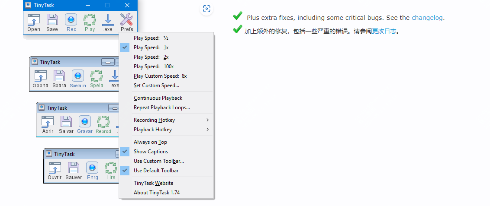

简单、快捷、免费，适合所有人的自动化小工具，仅有36kB！

日常工作中，总会存在一些重复性的内容

同为打工人，今天推荐一个很小、很小的工具，但它能做到的却是很多。

tinytask一个c语言写的自动化工具，它可以录制你的鼠标及键盘操作，然后重复执行。

下面这个例子是一个复制excel中数据，然后粘贴到记事本中。

## 工具简介

TinyTask 是一款极简主义的 PC 自动化应用程序，您可以使用它来记录和重复操作。顾名思义，它小得令人难以置信（只有 36KB！）、超紧凑且 100% 便携。

无需编写脚本 - 只需按录制，然后执行！还可以编译为exe程序，方便下次使用

这款工具只有36kB，但其中有一半是图标、工具栏的大小，这个工具真正大小仅仅有16KB

## 如何安装

直接到官网去下载即可

>官网：https://www.tinytask.net/download.html

## 一些用户的评价

TinyTask 是一个整洁、小巧的记录器，可以自动执行 PC 上的任何过程或操作序列。它不仅可以记录和保存宏，还可以编译它们，将录制的宏转换为可执行程序。只有 36KB 的 TinyTask 确实非常小

TinyTask 以最小的自动化软件而闻名，其大小仅为 36KB。对于这种文件大小，会期望一个非常简单的应用程序，可能只有两个功能，例如录制和播放，但功能远不止于此。

我用来自动化测试，它们是可移植的、免费的、可以编译到 exe 

## tinytask可以用在哪些场景

1. **批量处理重复任务**：例如在 Excel 中执行相同的操作、处理大量文件等。
2. **快速填写表单**：例如在网页上填写表格、提交表单等。
3. **自动化测试**：在软件开发中自动执行测试用例。
4. **游戏辅助**：在游戏中自动执行重复性操作，如刷怪、采集资源等。
5. **日常办公**：自动化日常办公任务，如打开特定文件、发送邮件等。

