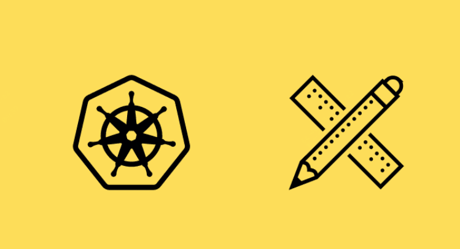

【运维干货分享】kubernetes的10个最佳实践(设计与设置)

在这篇文章中，我们将介绍在设置 Kubernetes 集群时必须考虑的高级 kubernetes 集群最佳实践。

## 1. Kubernetes 网络（云、混合或本地）：

Kubernetes 网络的设计方式必须能够适应未来的集群和应用程序需求。

Kubernetes 网络组织常犯的一个错误是使用不属于组织网络的 CIDR 范围。将来，当他们希望集群位于混合网络中时，最终会进行迁移。

在最终确定网络设计之前，最好与组织的网络团队进行讨论。这样，即使您不是混合网络的一部分，也可以划分和保留 IP 范围。

每个云提供商都为 Node 和 Pod 网络提供了多种选择。

例如，Google Kubernetes Engine 提供多集群服务、具有来自同一 VPC 的可路由 Pod IP 的 VPC 原生集群，以及对等 VPC。

AWS EKS 为 VPC 原生和基于辅助范围的 Pod 网络提供选项。

但是，如果您不想公开 pod IP，则可能需要在集群中使用类似 IP 伪装代理之类的东西，以便传出流量始终将节点 IP 作为源标识。

此外，入口和出口流量设计是必不可少的。您可能需要从集群应用连接 API 网关、本地系统、代理服务器和第三方 API。

您的设计应包含所有访问要求，以便在实现过程中不会遇到任何访问限制。

## 2. Kubernetes 安全性、合规性和基准

以下是通用的 Kubernetes 安全最佳实践。

- 1. 根据组织的策略了解合规性要求和安全基准。如果您正在使用托管服务，请确保它符合组织的合规性策略。

- 2. 可以查看 Kubernetes 的 CIS 基准测试。此外，Aquasec 还有一个名为 Kube-bench 的实用程序，用于检查针对 kubernetes 集群的 CIS 基准测试。

- 3. 是否会有任何 PCI/PII 数据应用程序？如果是，则根据组织策略在访问和存储方面隔离这些应用。
- 4. 实现 Pod 安全性（禁用容器 root 访问、特权访问、只读文件系统等）。
- 5. 安全地访问容器注册表。
- 6. 实施网络策略以控制 Pod 到 Pod 的流量，并根据访问要求隔离应用。
- 7. 精心设计的 CI/CD 管道，确保集群中仅部署已批准的容器映像。应对容器进行漏洞扫描，如果镜像扫描无法满足安全要求，则 CI 过程将无法通过。
- 8. 在开始实施之前，与组织的安全专家进行讨论，并就设计和工具进行签字。
## 3. Kubernetes 集群访问

设计和记录 kubernetes 集群的访问方式非常重要。

以下是关键注意事项。

- 1. 限制手动集群管理员访问。相反，只能通过自动化允许 cluster-admin 访问。
- 2. 实施 RBAC 的授权，并将其与组织的 IAM 集成。
- 3. 允许通过具有有限权限的服务帐户访问 kubernetes API。
- 4. 使用 CNCF 工具（如 Open Policy Agent 或 Kyverno）实施基于策略的访问，以实现细粒度的访问控制
- 5. 考虑 openID connect 的选项
- 6. 有良好的审计机制，用于检查角色并删除未使用的用户、角色、服务帐户等。
- 7. 设计访问级别，以便可以将职责移交给使用群集的其他团队。这将为每个人节省时间，而且可以更专注于工程标准，而不是处理重复的任务。

## 4. Kubernetes 高可用性和扩展性

高可用性是 Kubernetes 集群中的另一个关键因素。

在这里，需要考虑不同可用区中的工作节点可用性。

此外，请考虑 Pod 拓扑分布约束，以将 Pod 分布在不同的可用性区域中。

当我们谈论扩展时，它不仅仅是实例或 Pod 的自动扩展。

这是关于可以在不中断任何服务的情况下如何优雅地缩小和扩大应用程序。

根据需要在 Kubernetes 上托管的应用类型，您可以设计部署，以便在缩减和修补活动期间优雅地逐出 Pod。

此外，请考虑在生产前进行混沌工程实验，以检查集群和应用的稳定性。

## 5. Kubernetes 入口

Ingress 是 Kubernetes 集群的重要组成部分。有很多方法可以设置 kubernetes 入口。

此外，还有不同类型的入口控制器。

可以尝试适合组织的合规性策略和扩展要求的最佳选项。

几个考虑因素，

- 为平台工具提供单独的入口控制器。
- 入口端点的 SSL 管理。
- 不要尝试通过同一入口路由所有应用程序。如果您的应用程序与日俱增，它们最终可能会出现在一个大的配置文件中，从而产生问题。
  
## 6. Kubernetes 备份和恢复策略

无论是托管服务还是自定义 kubernetes 实现，备份集群都是必不可少的。

当我们说备份时，它主要是备份 etcd。

你应该有一个非常好的设计来自动化 kubernetes 集群及其相关组件的备份。

此外，还需要一种用于还原集群的设计。

还可以选择以 JSON 格式转储现有对象。您可以使用 dump 来还原相同或不同集群中的对象。

## 7. Kubernetes 节点和容器镜像修补和生命周期管理

修补是一个重复的过程。

当涉及到 kubernetes 时，有节点和容器补丁。

请确保在 CI/CD 管道中实施 DevSecOps 原则。

以下是一些最佳实践，

- 与容器扫描工具集成的自动化管道，用于按月计划修补容器映像。
- 一个自动化管道，可在不停机的情况下执行节点修补。
- 用于管理容器映像生命周期的自动化管道。您不希望在注册表中保留这么多已过时的版本。

## 8. Kubernetes 集群升级

通常，您可以通过两种方式进行集群升级

- 升级现有群集（就地升级）
- 创建新集群并将应用迁移到新集群。

需要一个非常好的自动化管道设计来执行集群升级。

在升级过程中，可能会更改网络、DNS 和其他组件。这完全取决于设计和组织政策。

## 9. Kubernetes 集群容量和存储

集群容量是一个非常重要的讨论话题。

需要确定需要运行的集群数量。

一些组织更喜欢运行多个集群，以减少爆炸半径并便于维护。而另一些人则更喜欢具有大量工作节点的大型集群或具有巨大实例容量的较少节点数。

可以根据自己的需求和管理集群的团队规模来决定集群容量。

接下来是存储部分。

规划您希望如何将卷附加到容器。遵循 Kubernetes 上的所有标准存储安全实践。

当涉及到云时，有开箱即用的支持来配置存储，

如果您计划运行有状态集，那么设计存储以获得高吞吐量和最大可用性非常重要。

此外，有状态集备份和还原也很重要。

## 10. Kubernetes 日志和监控

大多数组织都会有一个集中的日志和监控系统，他们更喜欢将 Kubernetes 与这些系统集成。

以下是一些日志记录和监视最佳实践。

- 了解将生成多少日志数据的估计值。
- 考虑到巨大的数据量，将 Kubernetes 日志摄取到日志系统中的机制。
- 缩放、日志记录和监视群集中部署的组件。
- 根据组织的政策保留数据。
- 定义并记录要监视的 KPI。

## 结论

这些是一些 kubernetes 设计最佳实践，在设置 kubernetes 集群时经常被遗漏。

在实施 Kubernetes 时遗漏这些方面可能会导致整个集群中的问题，并可能对业务造成妥协。

这不仅仅是使用自动化创建 Kubernetes 集群，您还需要考虑 Kubernetes 集群生命周期管理，并相应地规划自动化工作。

理想情况下，解决方案/技术架构师在设计集群架构时应将所有提到的项目（可能有很多，但值得考虑）保留为清单，以确保它们在 IaaC 开发期间实施。

>翻译自：devopscube.com/key-considerations-kubernetes-cluster-design-setup/