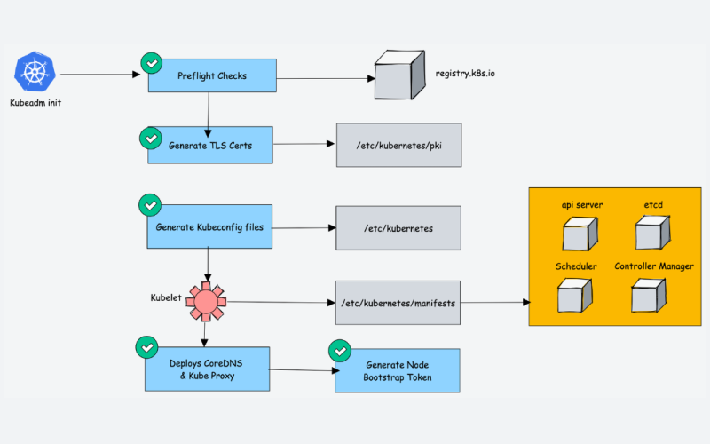
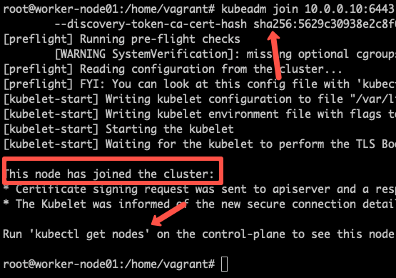
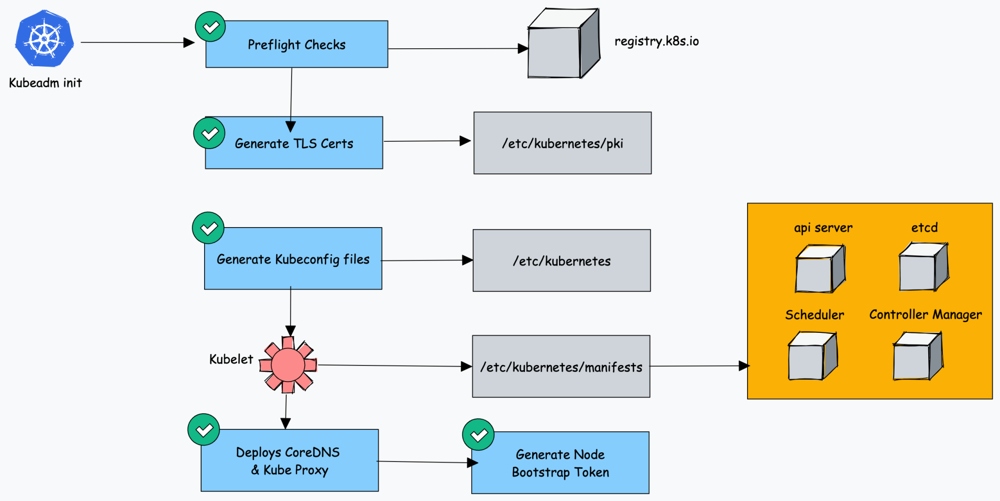

【运维干货分享】如何通过kubeadm安装kubernetes

>本文只提供思路，因为网络问题，文中部分镜像或者包需要调整

在这篇博文中，我介绍了使用 Kubeadm 设置具有一个主节点和两个工作节点的 kubernetes 集群的分步指南。



Kubeadm 是一个出色的工具，可以在更短的时间内设置一个有效的 kubernetes 集群。它在设置所有 kubernetes 集群组件方面完成了所有繁重的工作。此外，它还遵循 kubernetes 集群的所有配置最佳实践。


## 什么是 Kubeadm？

Kubeadm 是一个无需复杂配置即可设置最小可行 Kubernetes 集群的工具。此外，Kubeadm 通过运行一系列预检查来简化整个过程，以确保服务器具有运行 Kubernetes 所需的所有必要组件和配置。

它由官方 Kubernetes 社区开发和维护。还有其他选项，如 minikube、kind 等，它们很容易设置。如果正在 Kubernetes 上部署和测试应用程序，这些都是具有最低硬件要求的不错选择。

但是，如果您想使用集群组件或作为集群管理一部分的测试工具，Kubeadm 是最佳选择。此外，您还可以在工作站上本地创建类似生产的集群，以便进行开发和测试。

## Kubeadm 设置先决条件

以下是设置 Kubeadm Kubernetes 集群的先决条件。

- 至少两个 Ubuntu 节点 [一个主节点和一个工作节点]。您可以根据需要拥有更多工作器节点。
- 主节点应至少具有 2 个 vCPU 和 2GB RAM。
- 对于工作节点，建议至少使用 1 个 vCPU 和 2 GB RAM。
- 10.X.X.X/X 网络范围，具有主节点和工作节点的静态 IP。我们将使用 192.x.x.x 系列作为 Calico 网络插件将使用的 pod 网络范围。确保节点 IP 范围和 Pod IP 范围不重叠。

注意：如果要在代理后面的企业网络中设置集群，请确保设置代理变量并有权访问容器仓库和 docker hub。或者与您的网络管理员联系，将 registry.k8s.io 列入白名单，以拉取所需的图像。

## Kubeadm 端口要求

请参考下图，并确保控制平面（主节点）和工作节点允许所有端口。如果您正在设置 kubeadm 集群云服务器，请确保在防火墙配置中允许这些端口。


如果您使用的是基于 vagrant的 Ubuntu VM，则默认情况下，防火墙将被禁用。因此，您无需进行任何防火墙配置。

如果您在工作站上使用基于 Vagrant 的 VM，则可以在需要时启动和停止集群。通过拥有本地 Kubeadm 集群，您可以尝试使用所有集群配置，并学习对集群中的不同组件进行故障排除。


## Vagrantfile、Kubeadm 脚本和清单

此外，本指南中用于主节点和工作节点配置的所有命令都托管在 GitHub 中。您可以克隆存储库以供参考。

git clone https://github.com/techiescamp/kubeadm-scripts

本指南旨在让您理解 Kubeadm 设置所需的每个配置。如果不想逐个运行命令，可以直接运行脚本文件。

如果你使用 Vagrant 来设置 Kubernetes 集群，你可以使用我的 Vagrantfile。它启动 3 个 VM。一个不言自明的基本流浪者档案。如果您是 Vagrant 的新手，请查看 Vagrant 教程。

如果您是 Terraform 和 AWS 用户，则可以使用 Terraform 文件夹下的 Terraform 脚本来启动 ec2 实例。


## 使用 Kubeadm 设置 Kubernetes 集群
以下是设置基于 kubeadm 的 Kubernetes 集群所涉及的高级步骤。

- 在所有节点上安装容器运行时 - 我们将使用 cri-o。
- 在所有节点上安装 Kubeadm、Kubelet 和 kubectl。
- 在主节点上启动 Kubeadm 控制平面配置。
- 使用令牌保存节点加入命令。
- 安装 Calico 网络插件（操作员）。
- 使用 join 命令将工作节点加入主节点（控制平面）。
- 验证所有集群组件和节点。
- 安装 Kubernetes Metrics Server
- 部署示例应用并验证应用

本指南中给出的所有步骤都参考了官方 Kubernetes 文档和相关的 GitHub 项目页面。

如果您想详细了解每个集群组件，请参阅全面的 Kubernetes 架构。

现在让我们开始设置。

### 第 1 步：在所有节点上启用 iptables 桥接流量

在 IPtables 的所有节点上执行以下命令，以查看桥接的流量。在这里，我们正在调整一些内核参数并使用 sysctl 设置它们。

```
cat <<EOF | sudo tee /etc/modules-load.d/k8s.conf
overlay
br_netfilter
EOF

sudo modprobe overlay
sudo modprobe br_netfilter

# sysctl params required by setup, params persist across reboots
cat <<EOF | sudo tee /etc/sysctl.d/k8s.conf
net.bridge.bridge-nf-call-iptables  = 1
net.bridge.bridge-nf-call-ip6tables = 1
net.ipv4.ip_forward                 = 1
EOF

# Apply sysctl params without reboot
sudo sysctl --system
```

### 第 2 步：在所有节点上禁用交换

要使 kubeadm 正常工作，您需要使用以下命令在所有节点上禁用交换。
```
sudo swapoff -a
(crontab -l 2>/dev/null; echo "@reboot /sbin/swapoff -a") | crontab - || true
```

该条目将确保在系统重新启动时交换处于关闭状态。fstab

您还可以使用 kubeadm 参数来控制交换错误，我们将在后半部分介绍它。--ignore-preflight-errors Swap

注意：从 1.28 开始，kubeadm 支持在 kubeadm 集群中使用 swap。

### 第 3 步：在所有节点上安装 CRI-O 运行时

注意： 如果 containerd，我们改用 cri-o，因为在 Kubernetes 认证考试中，cri-o 被用作考试集群中的容器运行时。

Kubernetes 集群的基本要求是容器运行时。您可以拥有以下任何一个容器运行时。

- CRI-O型
- containerd
- Docker 引擎（使用 cri-dockerd）

我们将使用 CRI-O 而不是 Docker 进行此设置，因为 Kubernetes 已弃用 Docker 引擎

在所有节点上执行以下命令，以安装所需的依赖项和最新版本的 CRIO。

```
sudo apt-get update -y
sudo apt-get install -y software-properties-common curl apt-transport-https ca-certificates

curl -fsSL https://pkgs.k8s.io/addons:/cri-o:/prerelease:/main/deb/Release.key |
    gpg --dearmor -o /etc/apt/keyrings/cri-o-apt-keyring.gpg
echo "deb [signed-by=/etc/apt/keyrings/cri-o-apt-keyring.gpg] https://pkgs.k8s.io/addons:/cri-o:/prerelease:/main/deb/ /" |
    tee /etc/apt/sources.list.d/cri-o.list

sudo apt-get update -y
sudo apt-get install -y cri-o

sudo systemctl daemon-reload
sudo systemctl enable crio --now
sudo systemctl start crio.service

```

安装 crictl。
```
VERSION="v1.28.0"
wget https://github.com/kubernetes-sigs/cri-tools/releases/download/$VERSION/crictl-$VERSION-linux-amd64.tar.gz
sudo tar zxvf crictl-$VERSION-linux-amd64.tar.gz -C /usr/local/bin
rm -f crictl-$VERSION-linux-amd64.tar.gz
```

crictl 是一个 CLI 实用程序，用于与容器运行时创建的容器进行交互。

当您使用 Docker 以外的容器运行时时，您可以使用 crictl 实用程序来调试节点上的容器。此外，它在需要调试容器的 CKS 认证中也很有用。

### 第 4 步：在所有节点上安装 Kubeadm & Kubelet & Kubectl

在所有节点上下载 Kubernetes APT 存储库的 GPG 密钥。
```
KUBERNETES_VERSION=1.29

sudo mkdir -p /etc/apt/keyrings
curl -fsSL https://pkgs.k8s.io/core:/stable:/v$KUBERNETES_VERSION/deb/Release.key | sudo gpg --dearmor -o /etc/apt/keyrings/kubernetes-apt-keyring.gpg
echo "deb [signed-by=/etc/apt/keyrings/kubernetes-apt-keyring.gpg] https://pkgs.k8s.io/core:/stable:/v$KUBERNETES_VERSION/deb/ /" | sudo tee /etc/apt/sources.list.d/kubernetes.list
```
更新 apt 仓库
```
sudo apt-get update -y
```

注意：如果您正在准备 Kubernetes 认证，请安装特定版本的 kubernetes。例如，CKA、CKAD 和 CKS 考试的当前 Kubernetes 版本是 Kubernetes 版本 1.29

您可以使用以下命令来查找最新版本。安装 1.29 中的第一个版本，以便您可以练习集群升级任务。
```
apt-cache madison kubeadm | tac
```

指定版本，如下所示。这里我使用1.29.0-1.1
```
sudo apt-get install -y kubelet=1.29.0-1.1 kubectl=1.29.0-1.1 kubeadm=1.29.0-1.1
```

或者，若要从存储库安装最新版本，请使用以下命令，而不指定任何版本。
```
sudo apt-get install -y kubelet kubeadm kubectl
```
向包添加保留以防止升级。
```
sudo apt-mark hold kubelet kubeadm kubectl
```
现在，我们已经拥有了使用 kubeadm 配置 Kubernetes 组件所需的所有实用程序和工具。

将节点 IP 添加到 。KUBELET_EXTRA_ARGS
```
sudo apt-get install -y jq
local_ip="$(ip --json addr show eth0 | jq -r '.[0].addr_info[] | select(.family == "inet") | .local')"
cat > /etc/default/kubelet << EOF
KUBELET_EXTRA_ARGS=--node-ip=$local_ip
EOF
```
### 第 5 步：在主节点上初始化 Kubeadm 以设置控制平面

在这里，您需要考虑两种选择。

具有私有 IP 的主节点：如果您的节点只有私有 IP 地址，则将通过主节点的私有 IP 访问 API 服务器。
具有公共 IP 的主节点： 如果您在云平台上设置 Kubeadm 集群，并且需要通过主节点服务器的公共 IP 访问主 Api 服务器。
只有 Kubeadm 初始化命令对于公共 IP 和私有 IP 有所不同。

仅在主节点上执行本节中的命令。

如果您使用私有 IP 作为主节点，

设置以下环境变量。替换为主节点的 IP。10.0.0.10

IPADDR="10.0.0.10"
NODENAME=$(hostname -s)
POD_CIDR="192.168.0.0/16"
如果要使用主节点的公有 IP，

设置以下环境变量。IPADDR 变量将使用 curl 调用自动设置为服务器的公共 IP。您也可以将其替换为公共 IP 地址ifconfig.me

IPADDR=$(curl ifconfig.me && echo "")
NODENAME=$(hostname -s)
POD_CIDR="192.168.0.0/16"
现在，使用 kubeadm 命令初始化主节点控制平面配置。

对于基于私有 IP 地址的设置，请使用以下 init 命令。
```
sudo kubeadm init --apiserver-advertise-address=$IPADDR  --apiserver-cert-extra-sans=$IPADDR  --pod-network-cidr=$POD_CIDR --node-name $NODENAME --ignore-preflight-errors Swap
```
--ignore-preflight-errors Swap实际上不是必需的，因为我们最初禁用了交换。

对于基于公共 IP 地址的设置，请使用以下 init 命令。

在这里，我们使用 parameter 作为 API 服务器端点。 --apiserver-advertise-address--control-plane-endpoint
```
sudo kubeadm init --control-plane-endpoint=$IPADDR  --apiserver-cert-extra-sans=$IPADDR  --pod-network-cidr=$POD_CIDR --node-name $NODENAME --ignore-preflight-errors Swap
```
所有其他步骤都与使用私有 IP 配置主节点相同。

在成功的 kubeadm 初始化后，您应该获得一个输出，其中包含 kubeconfig 文件位置和带有令牌的 join 命令，如下所示。复制该内容并将其保存到文件中。我们将需要它来将工作节点连接到主节点。


使用输出中的以下命令创建 in master，以便您可以使用它与集群 API 进行交互。kubeconfig kubectl

```
mkdir -p $HOME/.kube
sudo cp -i /etc/kubernetes/admin.conf $HOME/.kube/config
sudo chown $(id -u):$(id -g) $HOME/.kube/config
```
现在，通过执行以下 kubectl 命令来验证 kubeconfig，以列出命名空间中的所有 pod。
```
kubectl get po -n kube-system
```
您应看到以下输出。您将看到两个 Coredns Pod 处于挂起状态。这是预期的行为。一旦我们安装了网络插件，它将处于运行状态。


```
kubectl get --raw='/readyz?verbose'
```
您可以使用以下命令获取集群信息。
```
kubectl cluster-info 
```
默认情况下，不会在主节点上安排应用。如果要使用主节点来调度应用程序，请污染主节点。
```
kubectl taint nodes --all node-role.kubernetes.io/control-plane-

```

注意：您也可以在初始化集群时将 kubeadm 配置作为文件传递。请参阅带有配置文件的 Kubeadm Init

### 步骤 6：将工作节点加入 Kubernetes 主节点

我们还在工作节点上设置了 cri-o、kubelet 和 kubeadm 实用程序。

现在，让我们在设置主节点时，使用您在输出中获得的 Kubeadm join 命令将工作节点连接到主节点。

如果您错过了复制 join 命令，请在主节点中执行以下命令，以使用 join 命令重新创建令牌。
```
kubeadm token create --print-join-command
```
下面是该命令的外观。如果您以普通用户身份运行，请使用。此命令对节点执行 TLS 引导。sudo
```
sudo kubeadm join 10.128.0.37:6443 --token j4eice.33vgvgyf5cxw4u8i \
    --discovery-token-ca-cert-hash sha256:37f94469b58bcc8f26a4aa44441fb17196a585b37288f85e22475b00c36f1c61
```
成功执行后，您将看到输出显示“此节点已加入集群”。



kubeadm 节点连接输出。
现在，从主节点执行 kubectl 命令，以检查节点是否已添加到主节点。

kubectl get nodes
输出示例，
```
root@controlplane:~# kubectl get nodes

NAME           STATUS   ROLES           AGE     VERSION
controlplane   Ready    control-plane   8m42s   v1.29.0
node01         Ready    worker          2m6s    v1.29.0
```
在上面的命令中，ROLE 用于工作节点。您可以使用以下命令向工作器节点添加标签。替换为要标记的工作节点的主机名。<none>worker-node01
```
kubectl label node node01  node-role.kubernetes.io/worker=worker
```
您可以使用相同的 join 命令进一步添加更多节点。

### 第 7 步：安装 Calico Network Plugin 用于 Pod 网络
Kubeadm 不配置任何网络插件。您需要为 kubernetes pod 网络安装您选择的网络插件并启用网络策略。

我正在使用 Calico 网络插件进行此设置。

注意：请确保从配置文件的位置执行 kubectl 命令。从您的工作站主站，连接到 kubernetes API。kubeconfig

执行以下命令，在集群上安装 Calico 网络插件 operator。
```
kubectl apply -f https://docs.projectcalico.org/manifests/calico.yaml
```
几分钟后，如果您检查命名空间中的 pod，您将看到 calico pod 和正在运行的 CoreDNS pod。kube-system
```
kubectl get po -n kube-system
```
Kubeadm calico 和 coreDNS pod 处于运行状态。

### 步骤 8：设置 Kubernetes 指标服务器

Kubeadm 在初始化期间不会安装指标服务器组件。我们必须单独安装它。

为了验证这一点，如果运行 top 命令，将看到错误。Metrics API not available

root@controlplane:~# kubectl top nodes

error: Metrics API not available
要安装指标服务器，请执行以下指标服务器清单文件。它部署指标服务器版本v0.6.2

kubectl apply -f https://raw.githubusercontent.com/techiescamp/kubeadm-scripts/main/manifests/metrics-server.yaml
此清单取自官方指标 server repo。我已将标志添加到容器中，使其在本地设置中工作并单独托管它。否则，您将收到以下错误。--kubelet-insecure-tls

 because it doesn't contain any IP SANs" node=""
部署指标服务器对象后，您需要一分钟才能使用 top 命令查看节点和 pod 指标。

kubectl top nodes
您应该能够查看节点指标，如下所示。

root@controlplane:~# kubectl top nodes

NAME           CPU(cores)   CPU%   MEMORY(bytes)   MEMORY%
controlplane   142m         7%     1317Mi          34%
node01         36m          1%     915Mi           23%
您还可以使用以下命令查看 pod CPU 和内存指标。

kubectl top pod -n kube-system
### 步骤 9：部署示例 Nginx 应用程序
现在我们已经拥有了使集群和应用程序运行的所有组件，让我们部署一个示例 Nginx 应用程序，看看我们是否可以通过 NodePort 访问它

创建 Nginx 部署。直接在命令行上执行以下命令。它将 pod 部署在默认命名空间中。
```
cat <<EOF | kubectl apply -f -
apiVersion: apps/v1
kind: Deployment
metadata:
  name: nginx-deployment
spec:
  selector:
    matchLabels:
      app: nginx
  replicas: 2 
  template:
    metadata:
      labels:
        app: nginx
    spec:
      containers:
      - name: nginx
        image: nginx:latest
        ports:
        - containerPort: 80      
EOF
```

在 NodePort 32000 上公开 Nginx 部署
```
cat <<EOF | kubectl apply -f -
apiVersion: v1
kind: Service
metadata:
  name: nginx-service
spec:
  selector: 
    app: nginx
  type: NodePort  
  ports:
    - port: 80
      targetPort: 80
      nodePort: 32000
EOF
```
使用以下命令检查 pod 状态。
```
kubectl get pods

```
部署完成后，您应该能够在分配的 NodePort 上访问 Nginx 主页。

例如

kubeadm Nnginx 测试部署
### 第 10 步：将 Kubeadm 配置添加到工作站
如果您更喜欢在工作站上使用 kubectl 连接 Kubeadm 集群，您可以将 kubeadm admin.conf 与现有的 kubeconfig 文件合并。

请按照下面给出的步骤进行配置。

步骤1： 从控制平面节点复制 admin.conf 的内容，并将其保存在工作站中名为 kubeadm-config.yaml 的文件中。

步骤2： 备份现有的 kubeconfig。

cp ~/.kube/config ~/.kube/config.bak
步骤3： 将默认配置与 kubeadm-config.yaml 合并，并将其导出到 KUBECONFIG 变量中

export KUBECONFIG=~/.kube/config:/path/to/kubeadm-config.yaml
步骤4：将配置合并到一个文件中

kubectl config view --flatten > ~/.kube/merged_config.yaml
步骤5：用新配置替换旧配置

mv ~/.kube/merged_config.yaml ~/.kube/config
步骤6：列出所有上下文

kubectl config get-contexts -o name
步骤7：将当前上下文设置为 kubeadm 集群。

kubectl config use-context <cluster-name-here>
现在，您应该能够从本地工作站 kubectl 实用程序连接到 Kubeadm 集群。

## 可能的 kubeadm 问题
以下是您在 kubeadm 设置中可能遇到的问题。

Pod 内存和 CPU 不足：主节点至少应具有 2 个 vCPU 和 2 GB 内存。

节点无法连接到主节点：检查节点之间的防火墙，并确保所有节点都可以在所需的 Kubernetes 端口上相互通信。

Calico Pod 重新启动：有时，如果对节点和 Pod 网络使用相同的 IP 范围，则 Calico Pod 可能无法按预期工作。因此，请确保节点和 pod 的 IP 范围不重叠。

重叠的 IP 地址也可能导致在集群上运行的其他应用程序出现问题。

对于其他 Pod 错误，请查看 kubernetes pod 故障排除指南。

如果您的服务器没有至少 2 个 vCPU，您将收到以下错误。

[ERROR NumCPU]: the number of available CPUs 1 is less than the required 2

如果使用带参数的公共 IP，则主节点组件将失败，并显示以下错误。若要更正此错误，请将参数与公共 IP 地址一起使用。 --apiserver-advertise-address--control-plane-endpoint
```
kubelet-check] Initial timeout of 40s passed.


Unfortunately, an error has occurred:
        timed out waiting for the condition

This error is likely caused by:
        - The kubelet is not running
        - The kubelet is unhealthy due to a misconfiguration of the node in some way (required cgroups disabled)

If you are on a systemd-powered system, you can try to troubleshoot the error with the following commands:
        - 'systemctl status kubelet'
        - 'journalctl -xeu kubelet'
```
当您在主节点重置后尝试使用新令牌加入工作节点时，您将在工作节点中收到以下错误。要纠正此错误，请使用命令重置工作器节点。kubeadm reset
```
[ERROR FileAvailable--etc-kubernetes-kubelet.conf]: /etc/kubernetes/kubelet.conf already exists
        [ERROR Port-10250]: Port 10250 is in use
        [ERROR FileAvailable--etc-kubernetes-pki-ca.crt]: /etc/kubernetes/pki/ca.crt already exists
```
## Kubernetes 集群重要配置

以下是您应该了解的重要 Kubernetes 集群配置。

|配置|位置|
|---|---|
|静态 Pod 位置（etcd、api-server、控制器管理器和调度器）	|/etc/kubernetes/manifests
|TLS 证书位置（kubernetes-ca、etcd-ca 和 kubernetes-front-proxy-ca）	|/etc/kubernetes/pki
|admin kubeconfig 文件	|/etc/kubernetes/admin.conf 
|Kubelet 配置	|/var/lib/kubelet/config.yaml


有些配置是 Kubernetes 特性门控的一部分。如果您想使用作为特性门控一部分的功能，您需要在 Kubeadm 初始化期间使用 kubeadm 配置文件启用它们。

## 升级 Kubeadm 集群
使用 Kubeadm，您可以升级相同版本、补丁或新版本的 kubernetes 集群。

如果您一次升级一个节点，Kubeadm 升级不会造成任何停机时间。

要动手实践，请参考我关于 Kubeadm 集群升级的分步指南

### 备份 ETCD 数据
etcd 备份是实际项目和 CKA 认证的关键任务之一。

您可以按照 etcd 备份指南来学习如何执行 etcd 备份和恢复。

## 设置 Prometheus 监控
下一步，您可以尝试在 Kubeadm 集群上设置 Prometheus 监控堆栈。

我已经发布了一份详细的设置指南。请参阅 Kubernetes 上的 prometheus 指南以获取分步指南。堆栈包含 prometheus、警报管理器、kube 状态指标和 Grafana。

## Kubeadm 是如何工作的？
以下是 Kubeadm 设置的工作原理。

当您使用 Kubeadm 初始化 Kubernetes 集群时，它会执行以下操作。

- 当您初始化 kubeadm 时，它首先运行所有预检检查以验证系统状态，然后从 registry.k8s.io 容器注册表中下载所有必需的集群容器镜像。
- 然后，它会生成所需的 TLS 证书，并将它们存储在 /etc/kubernetes/pki 文件夹中。
- 接下来，它在 /etc/kubernetes 文件夹中生成集群组件的所有 kubeconfig 文件。
- 然后，它启动 kubelet 服务，为所有集群组件生成静态 pod 清单，并将其保存在 /etc/kubernetes/manifests 文件夹中。
- 接下来，它从静态 pod 清单启动所有控制平面组件。
- 然后，它安装核心 DNS 和 Kubeproxy 组件
- 最后，它生成节点引导令牌。
- 工作器节点使用此令牌加入控制平面。


如您所见，所有关键集群配置都将显示在 /etc/kubernetes 文件夹下。

## Kubeadm 常见问题
如何在 Kubeadm 中使用自定义 CA 证书？

默认情况下，kubeadm 会创建自己的 CA 证书。但是，如果您希望使用自定义 CA 证书，则应将它们放在 /etc/kubernetes/pki 文件夹中。当 kubeadm 运行时，如果找到现有证书，它将使用它们，并且不会覆盖它们。

## 如何生成Kubeadm Join命令？
您可以使用 command 生成 join 命令。kubeadm token create --print-join-command

结论
在这篇文章中，我们学习了使用 kubeadm 逐步安装 Kubernetes。

作为 DevOps 工程师，了解 Kubernetes 集群组件是件好事。对于使用托管 Kubernetes 服务的公司，我们错过了学习 Kubernetes 的基本构建块。

这种 Kubeadm 设置非常适合学习和使用 kubernetes。

此外，还有许多其他 Kubeadm 配置我没有在本指南中介绍，因为它超出了本指南的范围。请参考 Kubeadm 官方文档。通过在 VM 中设置整个集群，您可以了解所有集群组件配置，并在组件故障时对集群进行故障排除。

此外，使用 Vagrant，您可以创建简单的自动化，以在本地工作站中按需启动和拆除 Kubernetes 集群。查看我的指南，了解如何使用 kubeadm 进行自动化 kubernetes 流浪者设置。