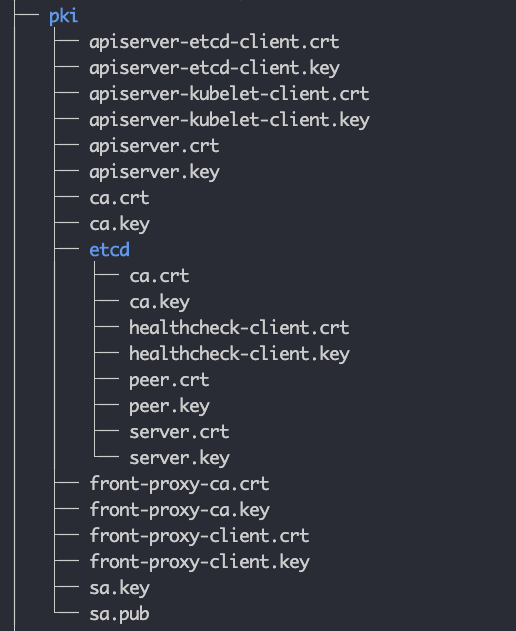
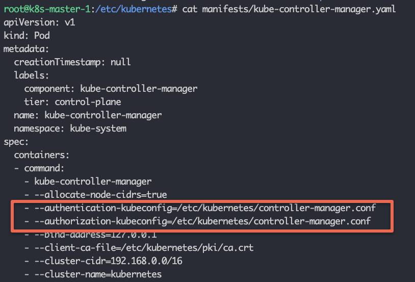
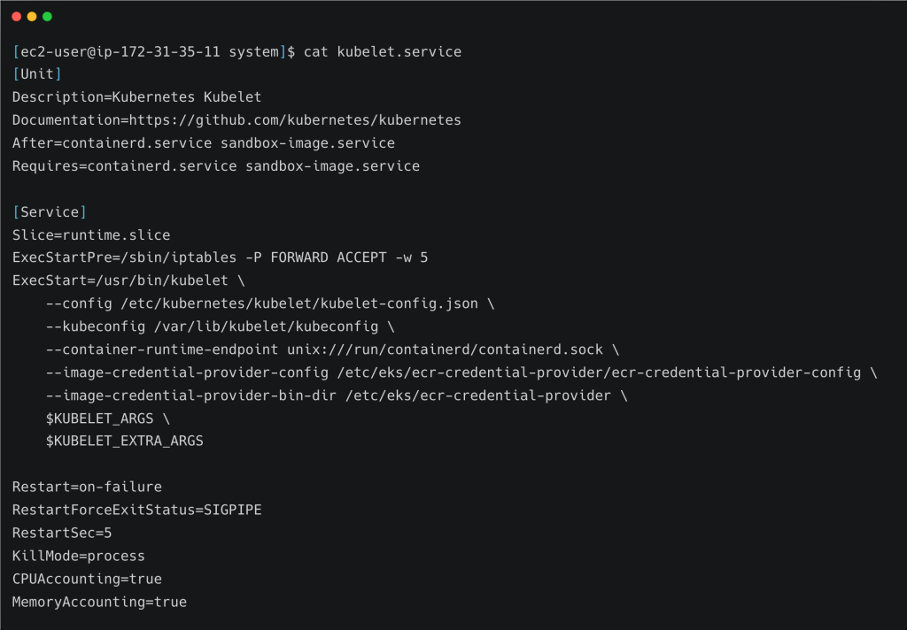

【运维干货分享】kubernetes集群这些配置文件你都了解嘛？


在这篇博客中，我们将了解每个运维工程师或 Kubernetes 管理员都应该了解的重要 Kubernetes 配置。

在文章的最后，我添加了生产实践中的 Kubernetes 集群设置中涉及的配置。

注意：本指南中引用的所有配置位置都基于使用 kubeadm 的默认 Kubernetes 安装。

## Kubernetes 集群配置

无论是在准备 Kubernetes 认证还是计划从事 kubernetes 项目，了解 Kubernetes 集群的关键配置都非常重要。

此外，当涉及到 CKA 认证时，将获得纠正集群中问题的方案。因此，了解集群配置将使您更容易以正确的方式对集群进行故障排除和查找问题。

让我们从与控制平面组件相关的配置开始。

### 静态 Pod 清单

正如我们在 Kubernetes 架构中所讨论的，所有控制平面组件都是由 kubelet 从目录中存在的静态 pod 清单启动的。Kubelet 管理从静态 Pod 清单创建的所有 Pod 的生命周期。/etc/kubernetes/manifests

以下组件是从静态 Pod 清单部署的。

- etcd
- API server
- Kube controller manager 
- Kube scheduler

```
manifests
  ├── etcd.yaml
  ├── kube-apiserver.yaml
  ├── kube-controller-manager.yaml
  └── kube-scheduler.yaml
```

可以从这些 Pod 清单中获取这些组件的所有配置位置。

## API server 的配置

如果你查看 kube-apiserver.yaml，在container规格下，你可以看到指向 TLS 证书的所有参数以及 API 服务器工作和与其他集群组件通信所需的其他参数。

```
apiVersion: v1
kind: Pod
metadata:
  annotations:
    kubeadm.kubernetes.io/kube-apiserver.advertise-address.endpoint: 172.31.42.106:6443
  creationTimestamp: null
  labels:
    component: kube-apiserver
    tier: control-plane
  name: kube-apiserver
  namespace: kube-system
spec:
  containers:
  - command:
    - kube-apiserver
    - --advertise-address=172.31.42.106
    - --allow-privileged=true
    - --authorization-mode=Node,RBAC
    - --client-ca-file=/etc/kubernetes/pki/ca.crt
    - --enable-admission-plugins=NodeRestriction
    - --enable-bootstrap-token-auth=true
    - --etcd-cafile=/etc/kubernetes/pki/etcd/ca.crt
    - --etcd-certfile=/etc/kubernetes/pki/apiserver-etcd-client.crt
    - --etcd-keyfile=/etc/kubernetes/pki/apiserver-etcd-client.key
    - --etcd-servers=https://127.0.0.1:2379
    - --kubelet-client-certificate=/etc/kubernetes/pki/apiserver-kubelet-client.crt
    - --kubelet-client-key=/etc/kubernetes/pki/apiserver-kubelet-client.key
    - --kubelet-preferred-address-types=InternalIP,ExternalIP,Hostname
    - --proxy-client-cert-file=/etc/kubernetes/pki/front-proxy-client.crt
    - --proxy-client-key-file=/etc/kubernetes/pki/front-proxy-client.key
    - --requestheader-allowed-names=front-proxy-client
    - --requestheader-client-ca-file=/etc/kubernetes/pki/front-proxy-ca.crt
    - --requestheader-extra-headers-prefix=X-Remote-Extra-
    - --requestheader-group-headers=X-Remote-Group
    - --requestheader-username-headers=X-Remote-User
    - --secure-port=6443
    - --service-account-issuer=https://kubernetes.default.svc.cluster.local
    - --service-account-key-file=/etc/kubernetes/pki/sa.pub
    - --service-account-signing-key-file=/etc/kubernetes/pki/sa.key
    - --service-cluster-ip-range=10.96.0.0/12
    - --tls-cert-file=/etc/kubernetes/pki/apiserver.crt
    - --tls-private-key-file=/etc/kubernetes/pki/apiserver.key
    image: registry.k8s.io/kube-apiserver:v1.26.3
```

因此，如果要对集群组件配置进行故障排除或验证，首先应查看静态 Pod 清单配置。

### etcd 配置

如果你想和 etcd 组件交互，你可以使用静态 pod YAML 中的详细信息。

例如，如果你想备份 etcd，你需要知道 etcd 服务端点和相关证书，以便对 etcd 进行身份验证并创建备份。

如果打开 etcd.yaml 清单，可以查看所有 etcd 相关的配置，如下所示。


### TLS 证书

在 Kubernetes 中，所有组件都通过 mTLS 相互通信。在 PKI 文件夹下，您将找到所有 TLS 证书和密钥。Kubernetes 控制平面组件使用这些证书进行身份验证并相互通信。

此外，还有一个 etcd 子目录，其中包含特定于 etcd 的证书和私钥。它们用于保护 etcd 节点之间以及 API 服务器和 etcd 节点之间的通信。

下图显示了 PKI 文件夹的文件结构。



静态 Pod 清单引用此文件夹中所需的 TLS 证书和密钥。

当使用 kubeadm 等工具在自托管集群上工作时，这些证书会由该工具自动生成。在托管的 Kubernetes 集群中，云提供商负责满足所有 TLS 要求，因为他们负责管理控制平面组件。

但是，如果要设置自托管群集以供生产使用，则必须向组织的网络或安全团队请求这些证书。他们将生成由组织的内部证书颁发机构签名的这些证书，并将其提供给您。

### kubeconfig文件

任何需要向 API 服务器进行身份验证的组件都需要 kubeconfig 文件。

所有集群 Kubeconfig 文件都存在于文件夹（.conf 文件）中。您将找到以下文件。/etc/kubernetes

- admin.conf
- controller-manager.conf
- kubelet.conf 
- scheduler.conf 
  
它包含 API 服务器端点、集群 CA 证书、集群客户端证书和其他信息。

admin.conf 文件，这是最终用户用来访问 API 服务器以管理集群的 admin kubeconfig 文件。可以使用此文件从远程工作站连接集群。

控制器管理器、调度器和 Kubelet 的 Kubeconfig 用于 API 服务器身份验证和授权。

例如，如果检查 Controller Manager 静态 pod 清单文件，则可以看到 controller-manager.conf 已添加为身份验证和授权参数。



### Kubelet 配置

Kubelet 服务在所有集群节点上作为系统服务运行。

您可以在 /etc/systemd/system/kubelet.service.d 下查看 kubelet systemd 服务

以下是系统文件内容。

```
[Service]
Environment="KUBELET_KUBECONFIG_ARGS=--bootstrap-kubeconfig=/etc/kubernetes/bootstrap-kubelet.conf --**kubeconfig=/etc/kubernetes/kubelet.conf**"
**Environment="KUBELET_CONFIG_ARGS=--config=/var/lib/kubelet/config.yaml"**
EnvironmentFile=-/var/lib/kubelet/kubeadm-flags.env
EnvironmentFile=-/etc/default/kubelet
ExecStart=
ExecStart=/usr/bin/kubelet $KUBELET_KUBECONFIG_ARGS $KUBELET_CONFIG_ARGS $KUBELET_KUBEADM_ARGS $KUBELET_EXTRA_ARGS
```

我用粗体突出显示了两个重要的 kubelet 配置。

- kubelet kubeconfig 文件：/etc/kubernetes/kubelet.conf
- kubelet 配置文件：/var/lib/kubelet/config.yaml
- EnvironmentFile=-/var/lib/kubelet/kubeadm-flags.env
- 
kubeconfig 文件将用于 API 服务器身份验证和授权。

/var/lib/kubelet/config.yaml 包含了所有与 kubelet 相关的配置。静态 Pod 清单位置作为 staticPodPath 参数的一部分添加。

```
staticPodPath: /etc/kubernetes/manifests
```

/var/lib/kubelet/kubeadm-flags.env 文件包含容器运行时环境、Linux 套接字和 infra 容器（暂停容器）镜像。

例如，以下是使用 CRI-O 容器运行时的 kubelet 配置，如 Unix 套接字和暂停容器镜像所示。

```
KUBELET_KUBEADM_ARGS="--container-runtime-endpoint=unix:///var/run/crio/crio.sock --pod-infra-container-image=registry.k8s.io/pa
```
pause容器是一个最小的容器，它是在 Kubernetes Pod 中第一个启动的容器。然后，pause 容器的作用是保存同一 Pod 中所有其他容器的网络命名空间和其他共享资源。

如果你看一下托管的 k8s 集群中的 kubelet 配置，它看起来与 kubeadm 设置略有不同。

例如，以下是 AWS EKS 集群的 kubelet 服务文件。




在这里你可以看到容器运行时是 containerd 的，它的 Unix 套接字标志直接添加到服务文件中

与 kubeadm 配置相比，kubelet kubeconfig 文件位于不同的目录中。

### CoreDNS配置

CoreDNS插件组件处理集群DNS配置。

所有 CoreDNS 配置都是 kubesystem 命名空间中名为 CoreDNS 的 configmap 的一部分。

如果在 kube-system 命名空间中列出 Configmap，则可以看到 CoreDNS configmap。

```
kubectl get configmap --namespace=kube-system
```

使用以下命令查看 CoreDNS configmap 内容。

```
kubectl edit configmap coredns --namespace=kube-system
```

将看到以下内容。

```
apiVersion: v1
data:
  Corefile: |
    .:53 {
        errors
        health {
           lameduck 5s
        }
        ready
        kubernetes cluster.local in-addr.arpa ip6.arpa {
           pods insecure
           fallthrough in-addr.arpa ip6.arpa
           ttl 30
        }
        prometheus :9153
        forward . /etc/resolv.conf {
           max_concurrent 1000
        }
        cache 30
        loop
        reload
        loadbalance
    }
```

当涉及到 DNS 连接时，应用程序可能需要连接到：

- 使用 Kubernetes 服务端点的内部服务。
- 使用公共 DNS 终结点的公开可用服务。
- 在混合云环境中，服务使用私有 DNS 端点托管在本地环境中。

如果您有需要自定义 DNS 服务器的用例，例如，集群中的应用程序需要连接到本地数据中心的私有 DNS 端点，则可以将自定义 DNS 服务器添加到核心 DNS 配置映射配置中。

例如，假设自定义DNS服务器IP是10.45.45.34，您的DNS后缀是 dns-onprem.com，我们必须添加一个块，如下所示。以便与该域端点相关的所有 DNS 请求都将转发到 10.45.45.34 DNS 服务器。

```
dns-onprem.com:53 {
    errors
    cache 30
    forward . 10.45.45.34
}
```

这是完整的 configmap 配置，其中自定义块以粗体突出显示。

```
apiVersion: v1
data:
  Corefile: |
    .:53 {
        errors
        health {
           lameduck 5s
        }
        ready
        kubernetes cluster.local in-addr.arpa ip6.arpa {
           pods insecure
           fallthrough in-addr.arpa ip6.arpa
           ttl 30
        }
        prometheus :9153
        forward . /etc/resolv.conf {
           max_concurrent 1000
        }
        cache 30
        loop
        reload
        loadbalance
    }
**    dns-onprem.com:53 {
    errors
    cache 30
    forward . 10.45.45.34
    }**
```
### 审计日志记录配置

对于生产集群，审计日志记录是必备功能。

在 kube-api-server.yaml 静态 pod 清单中启用了审计日志记录。

command 参数应具有以下两个参数。文件路径是任意的，取决于集群管理员。

```
 --audit-policy-file=/etc/kubernetes/audit/audit-policy.yaml
 --audit-log-path=/var/log/kubernetes/audit.log
```

audit-policy.yaml 包含所有审计策略，文件包含 Kubernetes 生成的审计日志。audit.log


### 生产设置中涉及的 Kubernetes 配置

在处理实时项目时，了解 kubernetes 集群配置非常重要。

对于主要发生在本地环境中的自托管 Kubernetes 集群，您需要了解集群控制平面和工作器节点的每个配置。

尽管可以使用自动化工具来设置整个集群，但您需要执行以下操作。

- 向组织的网络或安全团队请求集群证书。
- 确保集群控制平面组件使用正确的 TLS 证书。
- 集群 DNS 配置配置了自定义 DNS 服务器。
  
当涉及到托管的 kubernetes 集群时，您将无法访问控制平面组件。

但是，在实施和与云支持团队讨论以解决与群集相关的问题时，对群集配置有充分的了解会有所帮助。

## 结论

在本指南中，我们研究了重要的 Kubernetes 集群配置，这些配置将帮助您进行 Kubernetes 集群管理活动。

此外，您还可以查看有关生产 Kubernetes 集群活动的详细博客。