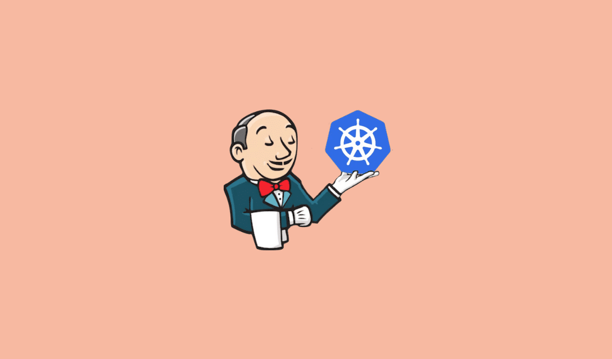
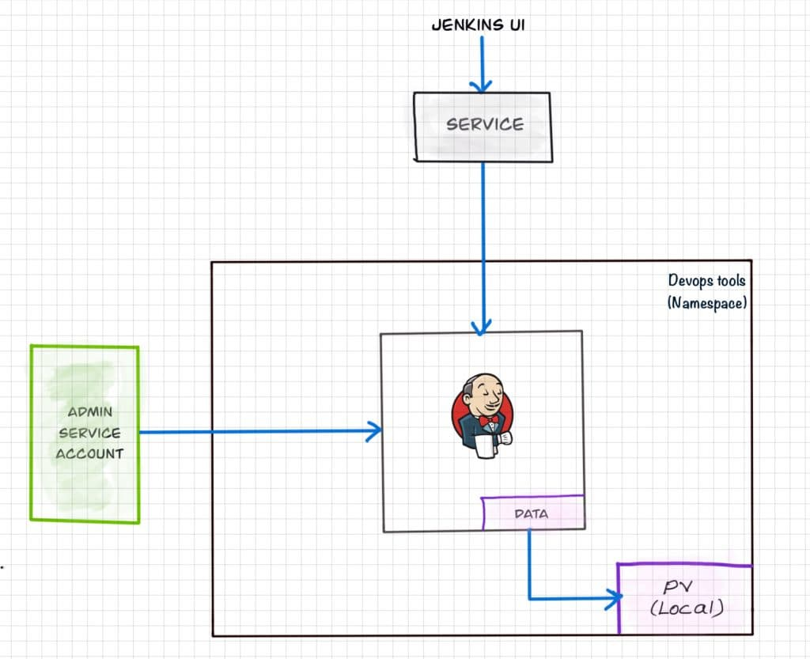
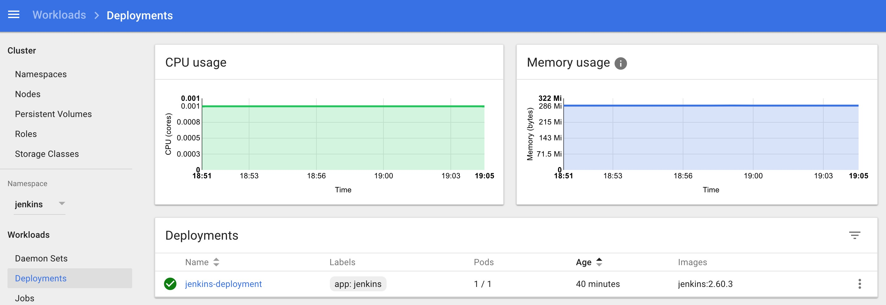
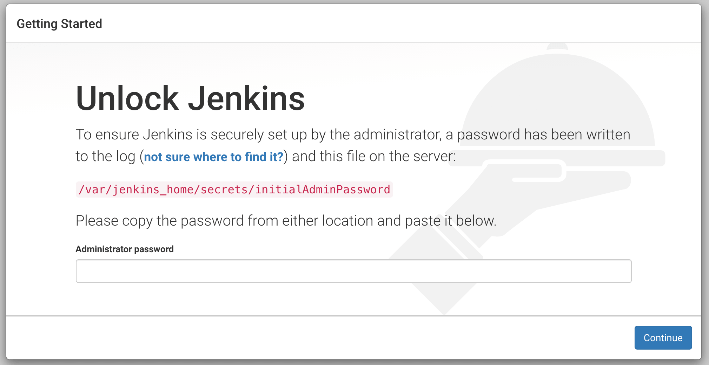
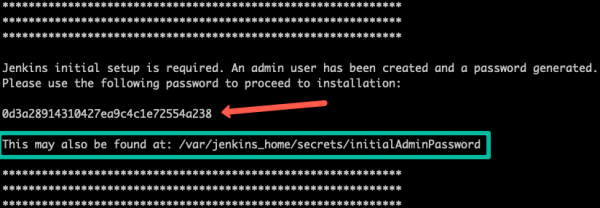

【运维干货分享】如何在kubernetes集群上安装设置Jenkins-初学者指南



在 Kubernetes 集群上托管 Jenkins 有利于基于 Kubernetes 的部署和基于容器的动态可扩展 Jenkins 代理。

在本指南中，我解释了在 Kubernetes 集群上设置 Jenkins 的分步过程。

## 在 Kubernetes 集群上设置 Jenkins
要在 Kubernetes 上设置 Jenkins 集群，我们将执行以下操作。

- 创建 Namespace
- 创建具有 Kubernetes 管理员权限的服务帐户。
- 在 Pod 重启时为持久 Jenkins 数据创建本地持久卷。
- 创建deployment YAML 并部署它。
- 创建service YAML 并部署它。
- 在 Node Port 上访问 Jenkins 应用程序。

注意：本教程不使用本地持久卷，因为这是一个通用指南。要对 Jenkins 数据使用持久性卷，您需要创建相关云或本地数据中心的卷并对其进行配置。

## Jenkins Kubernetes 清单文件
本博客中使用的所有 Jenkins Kubernetes 清单文件都托管在 Github 上。如果您在从博客复制清单时遇到问题，请克隆存储库。
```
git clone https://github.com/scriptcamp/kubernetes-jenkins
```
使用 Github 文件作为参考，并按照下一节中的步骤操作

## Kubernetes Jenkins 部署
以下是我们将要执行的操作的高级视图。



让我们开始在 Kubernetes 上部署 Jenkins。

第 1 步：为 Jenkins 创建 Namespace。最好将所有 devops 工具分类为独立于其他应用程序的命名空间。
```
kubectl create namespace devops-tools
```
步骤2：创建文件并复制以下管理员服务帐户清单。serviceAccount.yaml
```
---
apiVersion: rbac.authorization.k8s.io/v1
kind: ClusterRole
metadata:
  name: jenkins-admin
rules:
  - apiGroups: [""]
    resources: ["*"]
    verbs: ["*"]

---
apiVersion: v1
kind: ServiceAccount
metadata:
  name: jenkins-admin
  namespace: devops-tools

---
apiVersion: rbac.authorization.k8s.io/v1
kind: ClusterRoleBinding
metadata:
  name: jenkins-admin
roleRef:
  apiGroup: rbac.authorization.k8s.io
  kind: ClusterRole
  name: jenkins-admin
subjects:
- kind: ServiceAccount
  name: jenkins-admin
  namespace: devops-tools
```
这将创建一个 clusterRole、ServiceAccount 并将其绑定到服务账户。serviceAccount.yamljenkins-adminjenkins-adminclusterRole

集群角色具有管理集群组件的所有权限。您还可以通过指定单个资源操作来限制访问。jenkins-admin

现在使用 kubectl 创建服务帐户。
```
kubectl apply -f serviceAccount.yaml
```
步骤3： 创建并复制以下持久卷清单。volume.yaml
```
kind: StorageClass
apiVersion: storage.k8s.io/v1
metadata:
  name: local-storage
provisioner: kubernetes.io/no-provisioner
volumeBindingMode: WaitForFirstConsumer

---
apiVersion: v1
kind: PersistentVolume
metadata:
  name: jenkins-pv-volume
  labels:
    type: local
spec:
  storageClassName: local-storage
  claimRef:
    name: jenkins-pv-claim
    namespace: devops-tools
  capacity:
    storage: 10Gi
  accessModes:
    - ReadWriteOnce
  local:
    path: /mnt
  nodeAffinity:
    required:
      nodeSelectorTerms:
      - matchExpressions:
        - key: kubernetes.io/hostname
          operator: In
          values:
          - worker-node01

---
apiVersion: v1
kind: PersistentVolumeClaim
metadata:
  name: jenkins-pv-claim
  namespace: devops-tools
spec:
  storageClassName: local-storage
  accessModes:
    - ReadWriteOnce
  resources:
    requests:
      storage: 3Gi
```
重要提示：替换为您的任何一个集群 worker nodes hostname。worker-node01

您可以使用 kubectl 获取 worker 节点主机名。
```
kubectl get nodes
```
对于卷，我使用了 storage 类进行演示。这意味着，它会在 location 下的特定节点中创建卷。localPersistentVolume/mnt

由于存储类需要节点选择器，因此您需要正确指定 Jenkins Pod 的工作节点名称，以便在特定节点中调度。local

如果 Pod 被删除或重新启动，数据将持久化在节点卷中。但是，如果节点被删除，您将丢失所有数据。

理想情况下，您应该使用使用云提供商提供的可用存储类或集群管理员提供的存储类的持久卷，以便在节点故障时保留数据。

让我们使用 kubectl 创建卷
```
kubectl create -f volume.yaml
```
步骤2：创建一个名为 Deployment 的文件，并复制以下部署清单。deployment.yaml

在这里，我们使用的是来自 Docker 中心的最新 Jenkins LTS docker 镜像。
```
apiVersion: apps/v1
kind: Deployment
metadata:
  name: jenkins
  namespace: devops-tools
spec:
  replicas: 1
  selector:
    matchLabels:
      app: jenkins-server
  template:
    metadata:
      labels:
        app: jenkins-server
    spec:
      securityContext:
            fsGroup: 1000 
            runAsUser: 1000
      serviceAccountName: jenkins-admin
      containers:
        - name: jenkins
          image: jenkins/jenkins:lts
          resources:
            limits:
              memory: "2Gi"
              cpu: "1000m"
            requests:
              memory: "500Mi"
              cpu: "500m"
          ports:
            - name: httpport
              containerPort: 8080
            - name: jnlpport
              containerPort: 50000
          livenessProbe:
            httpGet:
              path: "/login"
              port: 8080
            initialDelaySeconds: 90
            periodSeconds: 10
            timeoutSeconds: 5
            failureThreshold: 5
          readinessProbe:
            httpGet:
              path: "/login"
              port: 8080
            initialDelaySeconds: 60
            periodSeconds: 10
            timeoutSeconds: 5
            failureThreshold: 3
          volumeMounts:
            - name: jenkins-data
              mountPath: /var/jenkins_home         
      volumes:
        - name: jenkins-data
          persistentVolumeClaim:
              claimName: jenkins-pv-claim
```
在此 Jenkins Kubernetes 部署中，我们使用了以下内容。

- securityContext以便 Jenkins Pod 能够写入本地持久卷。
- 活跃度和就绪度探测。
- 基于保存 Jenkins 数据路径的本地存储类的本地持久卷/var/jenkins_home

注意：部署文件对 Jenkins 数据使用本地存储类持久卷。对于生产使用案例，您应该为 Jenkins 数据添加特定于云的存储类持久卷。请参阅 Google Kubernetes Engine 中 Jenkins 持久卷的示例实现

如果您不需要本地存储持久卷，则可以将部署中的卷定义替换为主机目录，如下所示。

```
volumes:
      - name: jenkins-data
        emptyDir: {}
```

使用 kubectl 创建部署。
```
kubectl apply -f deployment.yaml
```
检查部署状态。
```
kubectl get deployments -n devops-tools
```
现在，您可以使用以下命令获取部署详细信息。
```
kubectl  describe deployments --namespace=devops-tools
```
此外，您可以从 kubernetes 仪表板获取详细信息，如下所示。



## Kubernetes 集群上的 Jenkins 部署
使用 Kubernetes Service 访问 Jenkins
我们已经创建了一个部署。但是，它不向外界开放。要从外部访问 Jenkins 部署，我们应该创建一个服务并将其映射到部署。

步骤1：创建并复制以下服务清单。service.yaml
```
apiVersion: v1
kind: Service
metadata:
  name: jenkins-service
  namespace: devops-tools
  annotations:
      prometheus.io/scrape: 'true'
      prometheus.io/path:   /
      prometheus.io/port:   '8080'
spec:
  selector: 
    app: jenkins-server
  type: NodePort  
  ports:
    - port: 8080
      targetPort: 8080
      nodePort: 32000
```
注意：在这里，我们使用的类型 as 将在端口 32000 上的所有 kubernetes 节点 IP 上公开 Jenkins。如果您有入口设置，则可以创建入口规则来访问 Jenkins。此外，如果您在 AWS、Google 或 Azure 云上运行集群，则可以将 Jenkins 服务作为负载均衡器公开。NodePort

## 使用 kubectl 创建 Jenkins 服务。
```
kubectl apply -f service.yaml
```
现在，如果您浏览到端口上的任何一个节点 IP，您将能够访问 Jenkins 仪表板。32000
```
http://<node-ip>:32000
```
当您首次访问控制面板时，Jenkins 将要求提供初始管理员密码。

您可以从 kubernetes 控制面板或 CLI 的 Pod 日志中获取这些信息。您可以使用以下 CLI 命令获取 Pod 详细信息。
```
kubectl get pods --namespace=devops-tools
```
使用 pod 名称，您可以获取日志，如下所示。将 Pod 名称替换为您的 Pod 名称。
```
kubectl logs jenkins-deployment-2539456353-j00w5 --namespace=jenkins
```
密码可以在日志的末尾找到，如下所示。



或者，您可以运行 exec 命令直接从该位置获取密码，如下所示。

```
kubectl exec -it jenkins-559d8cd85c-cfcgk cat  /var/jenkins_home/secrets/initialAdminPassword -n devops-tools
```
输入密码后，您可以继续安装建议的插件并创建管理员用户。所有这些步骤在 Jenkins 仪表板中都是不言自明的。

## 结论
当您在 Kubernetes 上托管 Jenkins 以处理生产工作负载时，您需要考虑设置一个高度可用的持久性卷，以避免在删除 Pod 或节点期间丢失数据。

在 Kubernetes 环境中，Pod 或节点删除可能随时发生。它可以是修补活动或缩减活动。

希望本分步指南能帮助您学习和理解在 Kubernetes 集群上设置 Jenkins 服务器所涉及的组件。

如果您正在寻找在 Kubernetes 上设置基于容器的代理，请查看我关于将 Kubernetes pod 设置为 Jenkins 构建代理的指南