【运维干货分享】如何在 Kubernetes 上部署 Argo CD [初学者指南]

在这篇博客中，我们将使用分步说明在 Kubernetes 上安装 Argo CD。

安装后，我们将了解如何以 GitOps 方式部署示例应用程序。我们将使用 git 存储库通过 ArgoCD 部署应用程序。

我们还将研究如何配置 github webhook，以便在配置的 git 存储库发生更改后立即启用同步过程。


## 设置先决条件
要开始设置，你应该具备以下条件。

- 一个正在运行的 Kubernetes 集群
- Kubectl 配置了具有集群管理员权限的集群。
- Helm 在你的工作站上安装了配置..

让我们开始设置。

## 使用 Manifest 文件设置 ArgoCD
在 Kubernetes 上设置 ArgoCD 的最简单方法是使用 Argo 项目 Github 存储库中提供的普通 Kubernetes 清单文件。

你可以将此清单部署用于学习目的。如果要为项目需求设置 ArgoCD，请使用下一节中给出的 helm 图表。

我们将在名为 argocd 的自定义命名空间中部署 ArgoCD

以下 kubectl 命令将创建命名空间并部署清单
```
kubectl create namespace argocd

kubectl apply -n argocd -f https://raw.githubusercontent.com/argoproj/argo-cd/stable/manifests/install.yaml
```

它创建了许多与ArgoCD相关的Kubernetes对象 - Namespace scoped & cluster scoped resources

关键对象是 Argocd 服务、部署和状态集、ClusterRoles、Configmap 和 Secrets。

它还创建了 Argo CD 自定义资源，如应用程序、应用程序集和应用程序项目

你可以使用以下端口守护命令在我们的工作站中访问 ArgoCD UI。
```
kubectl port-forward svc/argocd-server -n argocd 8080:443
```
由于将自签名证书添加到 ArgoCD 服务器，你将收到 SSL 错误。你可以单击 继续 访问 UI。

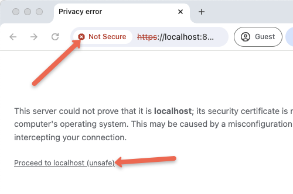

要登录 UI，你需要用户名和密码。

默认用户名为 admin。要获取密码，请执行以下命令。
```
kubectl -n argocd get secret argocd-initial-admin-secret -o jsonpath="{.data.password}" | base64 --decode ; echo
```

登录后，你将获得 ArgoCD 服务器仪表板，如下所示。

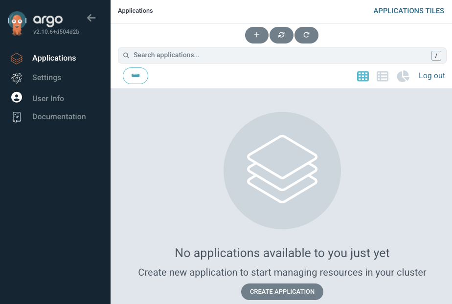
你可以使用以下命令清理设置。
```
kubectl delete -n argocd -f https://raw.githubusercontent.com/argoproj/argo-cd/stable/manifests/install.yaml
```
## 使用官方 Helm Chart 设置 ArgoCD
如果你出于项目目的设置 ArgoCD，我们强烈建议你使用 Helm 图表而不是普通清单文件进行设置。

按照以下步骤使用官方 Argoproject helm 图表设置 ArgoCD。

第 1 步：添加 argo cd repo
将 Argo CD repo 添加到你的系统中，以下载 helm chart 来设置 Argo CD。运行以下命令以添加存储库
```
helm repo add argo https://argoproj.github.io/argo-helm
```
现在，使用命令列出每个带有单词 argo 的存储库
```
helm search repo argo
```
你将获得带有单词 argo 的存储库列表，如下所示。我们需要的图表是 argo-cd

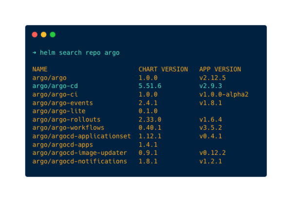
你可以使用下面给出的命令将 argo-cd Helm 图表转换为 Kubernetes 清单。这允许你浏览与 Helm 图表关联的所有配置。当将 Helm Chart 用于项目目的时，这一点尤其重要。
```
helm template argo argo/argo-cd --output-dir argocd-manifests
```
此 helm chart 部署以下 argocd 组件。

- argocd 应用程序控制器 （Statefulset）：Argo CD 的核心组件，负责管理和同步部署在 Kubernetes 集群中的应用程序（协调）与 Git 中的所需状态
- argocd 应用程序集 （Deployment）： 一个控制器，用于根据模板自动生成和管理 Argo CD 应用程序。
- argocd 通知（部署）：将有关 Argo CD 事件的通知发送到各种渠道，例如电子邮件、Slack 或 Webhook。
- argocd reposerver （部署）： 管理 Git 存储库并提供用于访问和同步应用程序清单的 API 的组件。
- argocd 服务器（部署）： 公开 Argo CD API 并为管理应用程序和配置的 Web UI 提供服务的主要组件。
- dex 服务器 （部署）：它是一个身份提供商，可以与 Argo CD 集成，以便与外部身份提供商（OIDC 提供商）（如 GitHub、SAML 等）进行用户身份验证和授权。
- Redis （Deployment） ：用于缓存以减少发送到 Kube API 和 Git 提供商的请求。

步骤 2：自定义 Helm Chart 配置值
在部署之前，你需要更新 helm chart 中的 NodePort 配置，以便你可以在浏览器中访问 Argo CD UI，为此，请使用以下命令将 helm chart 的默认值保存在 YML 文件中。
```
helm show values argo/argo-cd > values.yaml
```
在服务配置块中进行更改。将类型从 ClusterIP 更改为 NodePort，如下图所示。它负责公开 Argo CD 服务器 UI。默认的 nodePort 为 30080。你也可以对其进行自定义。
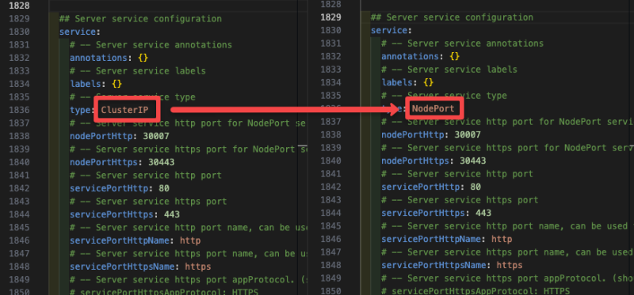

通过将类型更改为 NodePort，你可以在浏览器上使用 URL <你的 k8s 节点的公有/私有 IP>：<port> 访问浏览器上的 Argo CD。

确保使用你在 values.yml 文件中提到的相同节点端口号。

以下是此 Helm 图表中使用的图像。

- quay.io/argoproj/argocd
- ghcr.io/dexidp/dex
- 公共.ecr.aws/docker/library/redis
如果你想在项目环境中设置 ArgoCD，而无法访问这些公共注册表，则可能需要将它们上传到相关的内部注册表，然后使用自定义值运行 helm chart。

你还可以使用以下命令下载每个文件的整个 helm 图表
```
helm fetch argo/argo-cd
```
此命令将下载 .tgz 包中 helm chart 的每个文件，运行以下命令以解压文件

```
tar -zxvf argo-cd-<version>.tgz
```
现在，你可以看到包中打包的每个文件。

第 3 步：部署 Argo CD
在部署 Argo CD 之前，使用命令
```
kubectl create namespace argocd

```
现在，使用以下命令将 Argo CD 部署到上面创建的命名空间中
```
helm install --values values.yaml argocd argo/argo-cd --namespace argocd
```
成功部署后，你应该会看到以下输出。

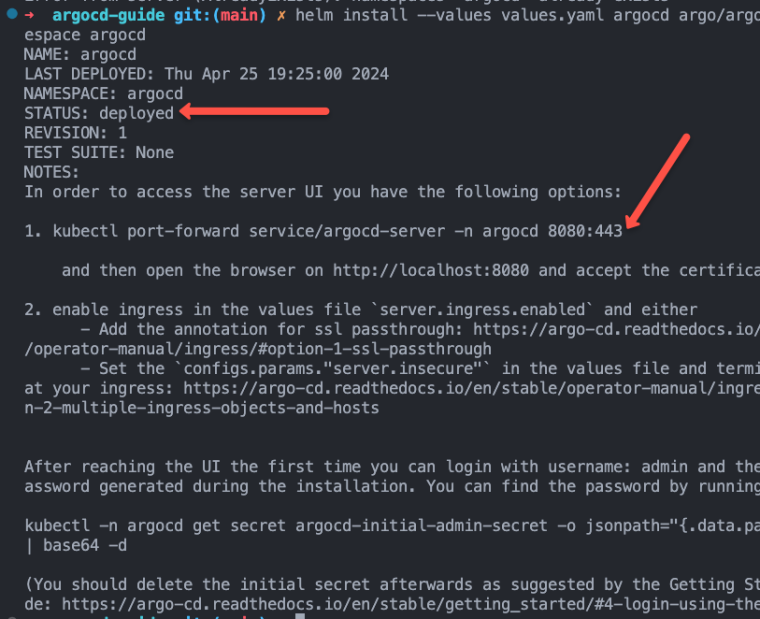
使用命令验证是否已创建并成功运行所有对象。

kubectl get all -n argocd
第 4 步：登录 Argo CD Web UI
你可以使用以下命令通过端口转发访问 Web UI。
```
kubectl port-forward svc/argocd-server -n argocd 8080:443
```
如果你访问 http://localhost:8080 你将能够访问 webUI。你需要接受自签名证书才能访问控制面板。

此外，我们还在 30080 上启用了 NodePort

你可以使用集群中任何节点的公有 IP 或私有 IP，节点端口号的格式为 <node IP>：<port>。在我的例子中，URL 将是 34.71.163.101：30080

现在，使用 URL 在浏览器中访问 UI，你将看到以下窗口

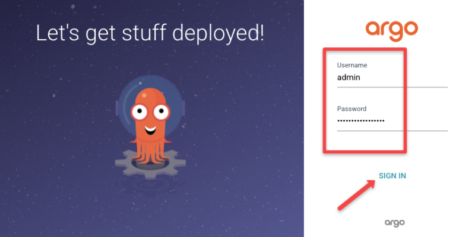
使用用户名和密码登录 Argo CD。

你的默认用户名将是 admin，要获取密码，请运行以下命令
```
kubectl -n argocd get secret argocd-initial-admin-secret -o jsonpath="{.data.password}" | base64 --decode ; echo
```
此命令将显示你的 Argo CD 密码，使用密码并登录 Argo CD UI。

登录后，你可以看到 Argo CD 的主界面，如下所示

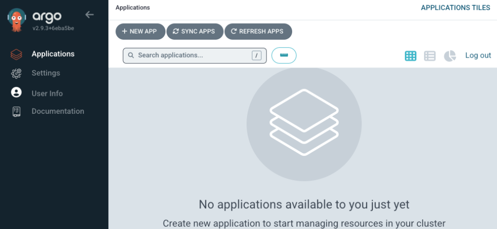


## 使用 ArgoCD 从 GitHub 部署应用程序 （GitOps Way）
现在我们已经准备好了 ArgoCD 设置，我们可以测试一个 Nginx 部署，该部署在 NodePort 32000 上公开的 Index 页面中显示自定义消息。

我们在 Argo CD Guide 存储库中有 Nginx 部署文件。
```
https://github.com/techiescamp/argocd-guide
```
清单按以下方式组织在 nginx-deployment 文件夹下。
```
➜  nginx-deployment

├── configmap.yaml
├── deployment.yaml
└── service.yaml
```
在 Argo CD 仪表板中，按 + NEW APP 按钮配置存储库。
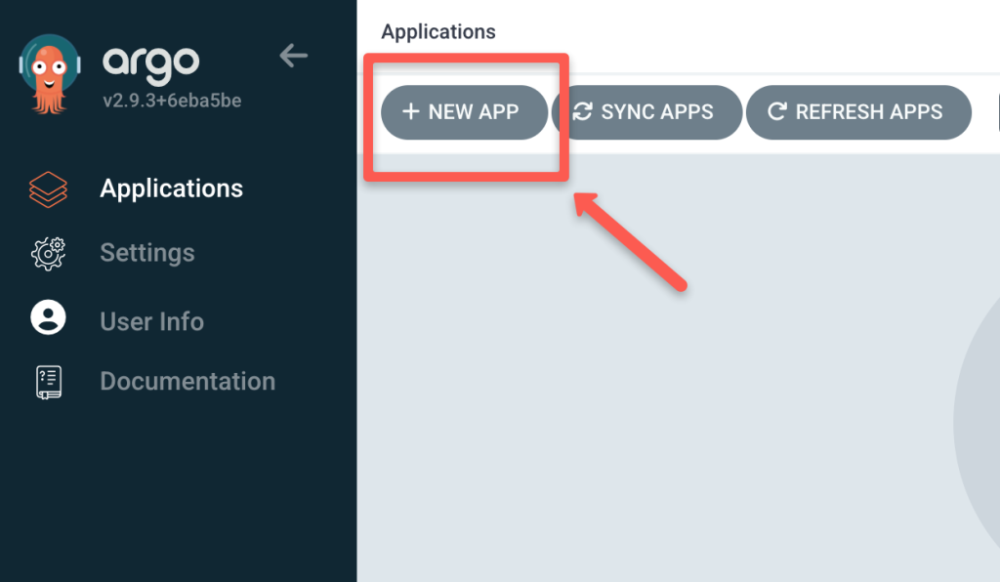

将弹出一个新窗口，将 Application Name 指定为 nginx-deployment，将 Project Name 指定为 default，并将 SYNC POLICY 设置为 automatic 或 manual 根据需要。

如果将 设置为 automatic，则 Argo CD 会自动检测 Git 存储库中所做的更改并触发部署，或者如果将 SYNC POLICY 设置为 manual，则必须手动触发它才能启动部署。SYNC POLICY

默认情况下，自动同步使用轮询来查找 git 存储库中发生的更改。默认轮询间隔为 3 分钟 （180 秒）。它是 helm chart 中的一个可配置选项。你可以根据同步要求修改 timeout.reconciliation。

此外，启用 AUTO-CREATE NAMESPACE 选项，以便在命名空间不存在时创建命名空间。

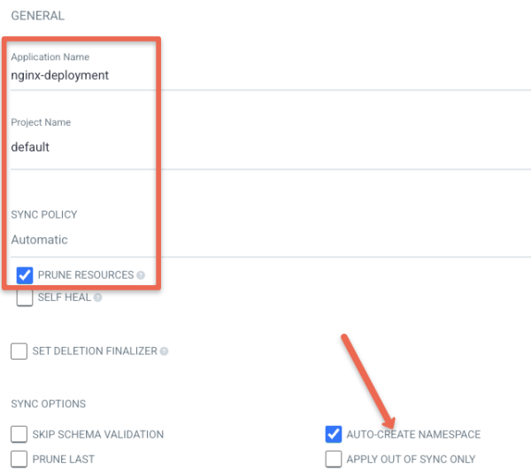
此外，还有其他 SYNC POLICY 选项，请根据你的需要启用它们。

现在，添加源信息，即你的 Git 存储库 URL，以及 YML 文件的路径。

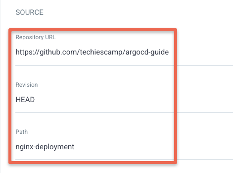
然后，选择 Cluster URL，当你选择 Cluster URL 选项卡时将显示该 URL。选择 https://kubernetes.default.svc，因为我们正在将应用程序部署在部署 Argo CD 的同一集群上。

此外，将命名空间指定为 webserver。现在点击 创建 按钮，如下所示。
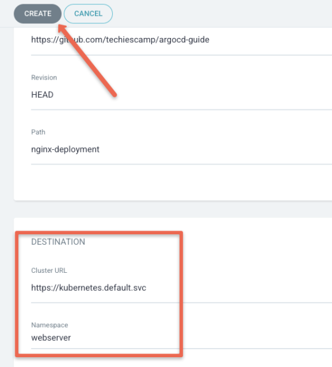

当你单击 create 按钮时，它将同步存储库清单并部署它。你可以在控制面板中查看部署信息，如下所示。
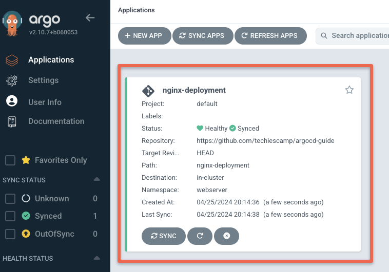

单击应用程序可查看有关你的部署的详细信息，如下所示。

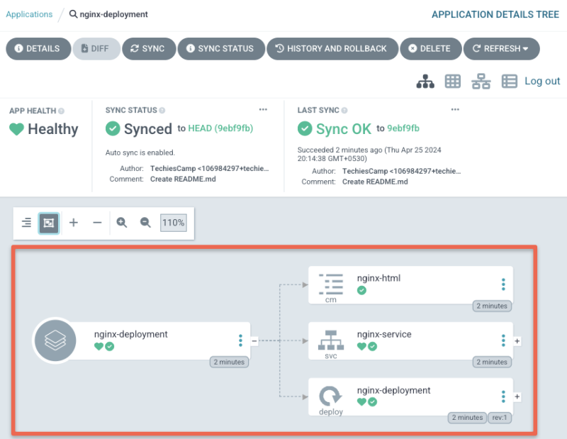
为了验证我们的部署，让我们尝试访问 NodePort 32000 上的 Nginx 部署。你应该会看到如下所示的页面。

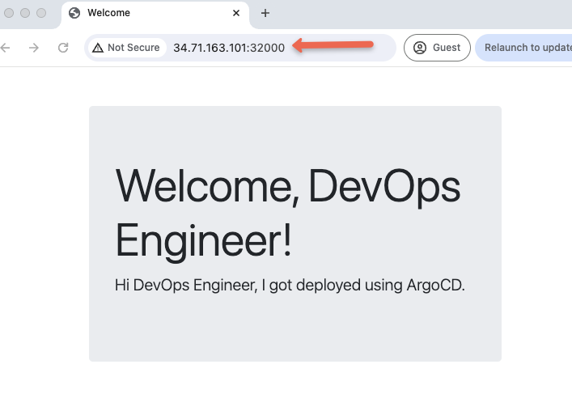
## 配置 Github Webhook
尽管 Argo CD 会持续监控 Git 的更改，但同步更改会有时间延迟，为了消除时间延迟，我们可以使用 webhook，一旦在 Git 中进行更改，它就会触发同步过程。

让我们看看如何在 Argo CD 上配置 webhook。

首先，转到你使用 Argo CD 配置的 Git 存储库，然后转到

Setting->Webhooks->Add webhook，如下图所示以配置 Webhook。

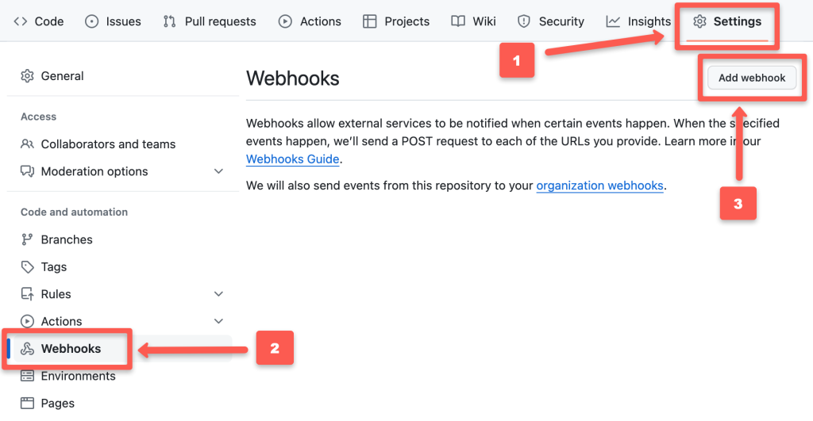
按下 Add webhook 按钮后，你可以看到如下所示的配置窗口。

负载 ULR 将是附加了 /api/webhook 的 ArgoCD webUI 终端节点。即 <node IP>：<port>/api/webhook

例如，https://34.71.163.101:30080/api/webhook。

将 Content type （内容类型） 更改为 application/json，并根据需要提供 Secret。

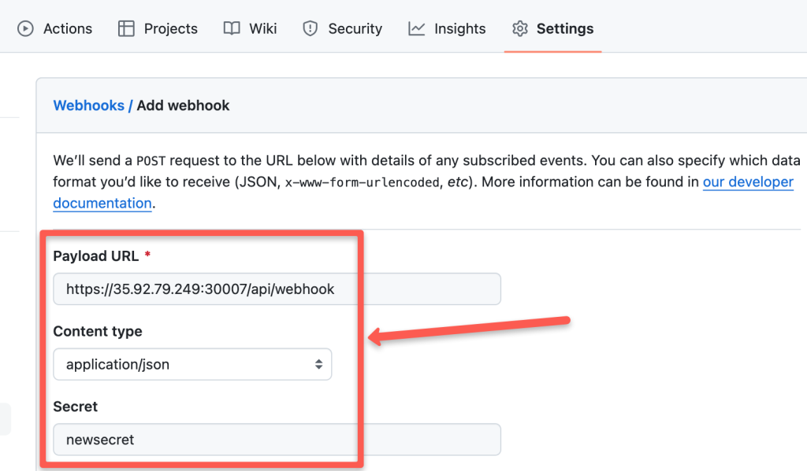
现在，如果你为 Argo CD 使用 SSL 证书，请选择 Enable SSL verification，如果你未使用 SSL 证书，请选择 Disable。

然后选择要触发 webhook 的事件，它会根据你选择的事件触发 webhook。
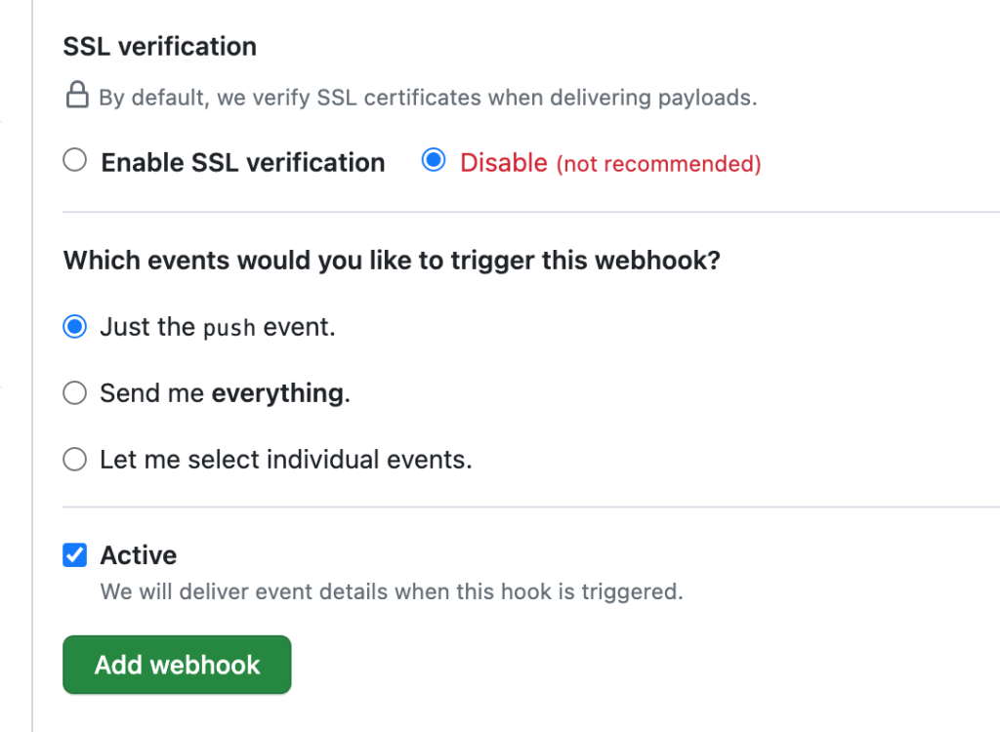

按 Add webhook 按钮为你的 Argo CD 添加 webhook 配置，你可以看到 webhook 已添加，如下所示
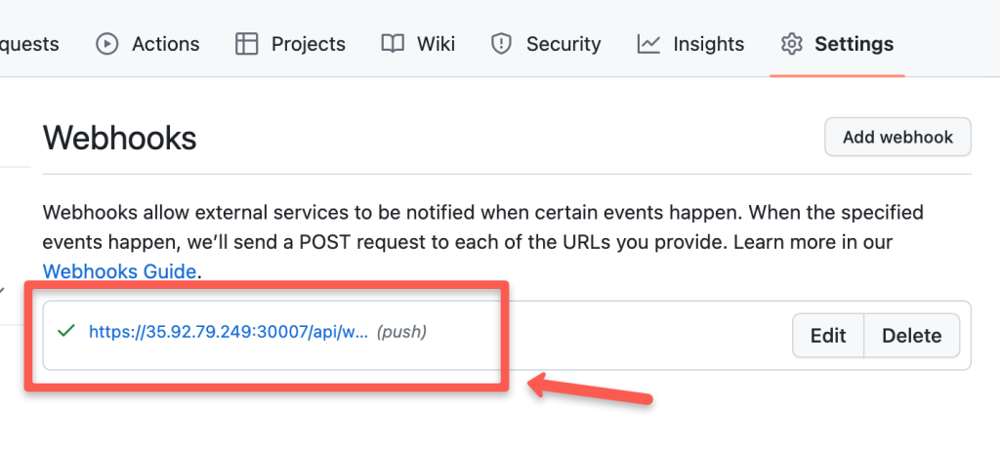

通过选择它，你可以看到 hook 创建的触发器，如下所示

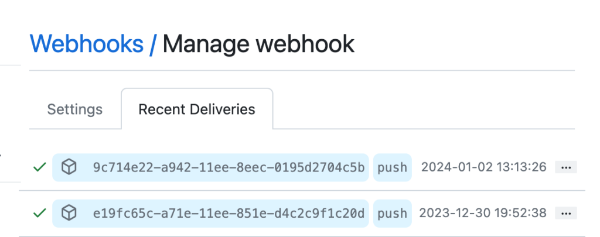
## ArgoCD 设置最佳实践
以下是在为生产使用案例运行 ArgoCD 时需要遵循的一些最佳实践。

- 标准做法是每个环境（dev、stage、prod）运行一个 Argo CD 实例，以避免潜在的冲突。
- 确保启用 RBAC 以限制对 ArgoCD 实例的访问，以遵循最小权限原则。根据角色和职责对用户进行分类，并定期对其进行审核。
- 定期修补 ArgoCD 镜像以避免安全漏洞。
- 备份 ArgoCD 配置，用于灾难恢复和备份目的。
- 使用 Prometheus 等工具针对部署失败、资源限制等事件设置监控和警报。
## Argo CD 配置常见问题解答
ArgoCD 如何存储数据？
由于 Argo CD 是一个无状态的应用程序，它不需要任何卷来存储数据。所有数据都存储为 Kubernetes 对象。因此，最终所有 ArgoCD 数据都存储在 kubernet 的 etcd 中。此外，它还使用 Redis 作为一次性缓存。