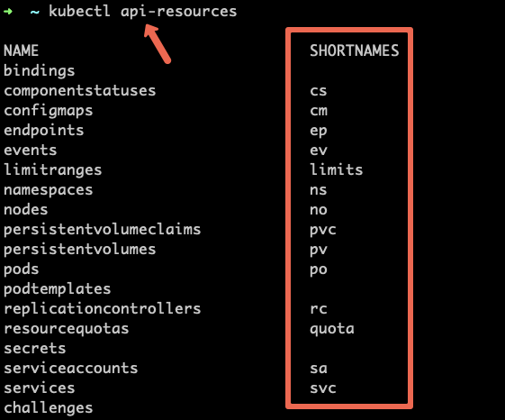
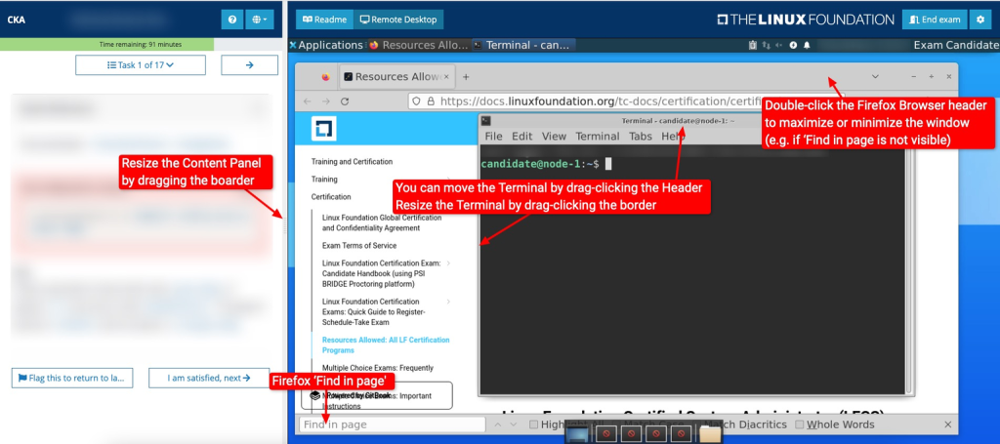

【运维干货分享】CKA 认证考试：终极学习指南


通过我们的综合学习指南，为 Kubernetes 认证管理员 （CKA） 考试做准备。获取专家提示、基本资源和实践测试，以获得 CKA 认证并推动你在 Kubernetes 管理领域的职业生涯。

认证 Kubernetes 管理员 （CKA） 是 Linux 基金会最好的 kubernetes 认证之一。你甚至可以说它是目前顶级的 DevOps 认证。它面向对设置和管理 Kubernetes 集群感兴趣的工程师。

本指南涵盖了你需要了解的有关 CKA 认证的所有信息

官方 CNCF 认证页面说：

>认证 Kubernetes 管理员 （CKA） 计划的目的是确保 CKA 具备履行 Kubernetes 管理员职责的技能、知识和能力。

作为速度最快的开源项目之一，Kubernetes 正在爆炸式增长。在这种情况下，对具有 Kubernetes 集群管理知识的熟练 DevOps 工程师的需求正在增长。

根据 cncf 年度报告，2023 年认证认证考试的注册人数达到 176,000 人。

因此，通过 CKA 认证可以增加你在使用 Kubernetes 的广泛公司和组织中的职业发展机会


要开始成为 Kubernetes 认证管理员的旅程 – 首先在 Linux Foundation 门户上注册考试。


以下是有关考试的一些注意事项。

- CKA 考试将在线进行，并远程监考。
- 必须获得 66% 或以上的分数才能通过。
- CKA 认证的有效期为两年。
- 注册后，你有一年的时间来安排考试。
- 注册后，你最多可以尝试参加 2 次测试。如果你因任何原因错过了已安排的考试 – 你的第二次尝试将被取消。

注意： 你可以随时查看最新的 Kubernetes 认证优惠券代码，以节省 CKA、CKAD、CKS 和 KCNA 认证注册的费用

## CKA 认证准备指南
本节将介绍可以帮助你准备 CKA 考试并以非常好的成绩通过 CKA 认证的资源和链接。

### CKA 考试先决条件
CKA 不要求任何考生在参加 CKA 考试之前拥有任何其他认证。通过考试唯一需要的是对 Kubernetes 组件和原生对象的概念和实践理解。还有很多动手实践。

### CKA 考试详情
|||
|-|-|
|考试时间|	2 小时|
|通过百分比|	66%
|CKA 考试 kubernetes 版本|	Kubernetes 1.30 版
|CKA 有效性	|2 年|
|考试费用	|395 美元

CKA 考试是一项开卷考试，即你可以在参加考试时使用以下网站。

- https://kubernetes.io/docs/
- https://github.com/kubernetes/
- https://kubernetes.io/blog/ 及其子域。这包括这些页面的所有可用语言翻译（例如 https://kubernetes.io/zh/docs/）
CKA 考试大纲

下表包含教学大纲的领域和能力部分及其各自的权重。


| 主题                   | 副主题                                                                 | 权重  |
|------------------------|----------------------------------------------------------------------|------|
| 集群架构、安装和配置   | 1. 管理基于角色的访问控制（RBAC）                                      | 25 % |
|                        | 2. 使用 Kubeadm 安装基本集群                                          |      |
|                        | 3. 管理高可用性 Kubernetes 集群                                       |      |
|                        | 4. 预置底层基础设施以部署 Kubernetes 集群                             |      |
|                        | 5. 使用 Kubeadm                                                      |      |
|                        | 6. 对 Kubernetes 集群进行版本升级。实施 etcd 备份和恢复                |      |
| 工作负载和调度         | 1. 了解部署以及如何执行滚动更新和回滚                                  | 15 % |
|                        | 2. 使用 ConfigMap 和 Secrets 配置应用程序                              |      |
|                        | 3. 了解如何扩展应用程序                                              |      |
|                        | 4. 了解用于创建健壮、自我修复的应用程序部署的基元                      |      |
|                        | 5. 了解资源限制如何影响 Pod 调度                                      |      |
|                        | 6. 对清单管理和常用模板工具的认识                                    |      |
| 服务与网络             | 1. 了解集群节点上的主机网络配置                                       | 20 % |
|                        | 2. 了解 Pod 之间的连接                                               |      |
|                        | 3. 了解 ClusterIP、NodePort、LoadBalancer 服务类型和终端节点           |      |
|                        | 4. 了解如何使用 Ingress 控制器和 Ingress 资源                         |      |
|                        | 5. 了解如何配置和使用 CoreDNS                                        |      |
|                        | 6. 选择合适的容器网络接口插件                                        |      |
| 存储                   | 1. 了解存储类、持久卷                                                 | 10 % |
|                        | 2. 了解卷的卷模式、访问模式和回收策略                                 |      |
|                        | 3. 了解持久卷声明基元                                                |      |
|                        | 4. 了解如何使用持久存储配置应用程序                                  |      |
| 故障排除               | 1. 评估集群和节点日志记录                                             | 30 % |
|                        | 2. 了解如何监控应用程序                                              |      |
|                        | 3. 管理容器 stdout & stderr 日志                                      |      |
|                        | 4. 排查应用程序故障                                                  |      |
|                        | 5. 排查群集组件故障                                                  |      |
|                        | 6. 网络故障排除                                                      |      |


## CKA 实践实验室
准备 CKA 认证考试的最佳方法是清楚地了解所涉及的概念并进行大量动手练习。

即使你正在 Kubernetes 生产环境中积极工作，你仍然需要练习才能通过考试

CKA 考试不包括多项选择题，因此动手练习是必不可少的

以下设置将为你提供一个 Kubernetes 集群，你可以在其中执行所有必需的练习。考试要求你解决实时集群上的问题。

注意：我强烈建议你设置一个基于 Kubeadm 的集群。实际考试也使用 kubeadm clusters。

- KillercodA（基于浏览器的 CKA 游乐场）
- 使用 Kubeadm 进行 Kubernetes 设置 [基于 CKA 要求的自托管设置。这是推荐的学习设置]
- Minikube
- 使用 Kubeadm 设置 Kubernetes Vagrant 

另外，如果你想获得真实考试终端的感觉，你可以在 Killercoda 远程桌面环境中尝试所有实践。每节课将提供一小时。练习绰绰有余。航站楼大约需要 10 分钟才能准备就绪。此外，它类似于真实考试 UI 中给出的远程桌面界面。这样，当你尝试考试时，你将很容易。

### Kubectl别名和简称
准备好 CKA 实践实验室设置后，在你的实践实验室终端中设置以下别名。你可以将它们添加到你的 or 文件中（取决于你的 shell），然后运行 or ..bashrc.zshrcsource ~/.bashrcsource ~/.zshrc
```
alias k='kubectl'
alias kgp='kubectl get pods'
alias kdr='kubectl --dry-run=client
alias kgs='kubectl get svc'
alias kdesc='kubectl describe'
alias kga='kubectl get all'
```
如果你想在考试期间使用别名并节省时间，你需要从第一天开始练习别名。每当你选择要学习的主题时，请在演习会话期间使用别名。

此外，在考试终端中，你将默认设置 kubectl 别名。如果需要，你可以选择创建其他 Cookie。

重要提示：本指南中给出的命令示例使用 kubectl alias 和 object short-names 来简化你的练习。

例如
```
k get po --all-namespaces
```
要了解所有可用的对象短名称，请执行以下命令。
```
kubectl api-resources
```


现在你已经为学习做好了所有设置，让我们深入了解考试大纲主题以及相关的官方资源和任务。

## CKA 考试指南：基于教学大纲的方法

在这里，我们将讨论可用于准备 CKA 考试每个主题的 CKA 教学大纲的官方和有用资源。

### 集群架构、安装和配置 [ 25% ]

本节主要介绍集群设置、配置和管理。

在进入动手实验之前，了解 Kubernetes 架构非常重要。

#### 管理基于角色的访问控制 （RBAC）

基于角色的访问控制是一种管理应用程序或单个用户访问级别的方法。它是管理员手中的便捷工具，可为其他人提供精细的控制。
|||
|-|-|
|RBAC 基础知识|	查看 RBAC 文档(kubernetes.io/docs/reference/access-authn-authz/rbac/)|


#### 使用 kubeadm 安装基础集群

考试：使用 kubeadm 创建集群 – 在考试期间练习并使用官方文档作为参考。

本节重点介绍如何使用 kubeadm 工具设置集群。候选人必须对 Kubernetes 的底层组件有清晰的了解，例如 etcd、Kube API 服务器、SSL 证书管理等。

注意：在部署 Kubeadm 集群之前，确保在所有节点上禁用交换。
|||
|-|-|
|了解 kubeadm	|Kubeadm 文档(kubernetes.io/docs/setup/production-environment/tools/kubeadm/create-cluster-kubeadm/)
|教程	|[使用 Kubeadm 设置 Kubernetes 集群](https://mp.weixin.qq.com/s?__biz=MzU4MjY3Mzc3OQ==&mid=2247493046&idx=2&sn=152d327f15e6c1b4721c9b324455669f&chksm=fdb611aacac198bcffdb86d1099433031bbfeddcc4e6007fdee8183aee9664e0bfdbb954edf6&token=582551660&lang=zh_CN#rd)

以下是考试需要关注的内容

- 在官方文档中，练习 kubeadm cluster 创建命令及其关联参数。
  
#### 管理高可用性 Kubernetes 集群
尽管 CKA 考试不会有任何与 HA 相关的问题，但了解高可用性架构是件好事。

Kubernetes 管理员的职责之一是确保集群的高可用性。这涉及对集群进行适当的维护任务以及管理 Worker 节点。
|||
|-|-|
|HA Kubernetes 集群	|使用 Kubeadm 设置 HA 集群(kubernetes.io/docs/setup/production-environment/tools/kubeadm/high-availability/)

如今，大多数集群都是在 AWS、Azure 或 GCP 上创建的，相应的云提供商负责集群可用性。但是，了解 HA kubernetes 集群背后的逻辑非常重要。

#### 预置底层基础设施以部署 Kubernetes 集群

要使 Kubernetes 正常工作，你需要具备以下条件。

- 某些系统配置
- 容器运行时（CRI-O、Containerd 或 Docker）
- kubeadm
- kubelet 
- kubectl

在 kubeadm cluster 安装过程中，你将完成所有这些配置。

|||
|-|-|
|Kubernetes 的底层基础设施	|检查 Kubeadm 安装 guide，其中涵盖了所有底层组件安装

#### 使用 kubeadm 在 Kubernetes 集群上执行版本升级

在考试中，你将被要求使用 Kubeadm 升级 Kubernetes 集群和节点。

Kubernetes 是一个不断改进的工具。时不时地，新版本会出现改进和功能。管理员有责任负责版本升级。
|||
|-|-|
|kubeadm 升级任务|	Kubernetes 版本升级使用 kubeadm

### 实施 etcd 备份和恢复
你需要学习和练习使用 etcdctl 实用程序进行 etcd 备份和恢复。

etcd 是集群的键值存储。所有集群配置和有关 Pod、服务等的信息都以键值格式存储在此处
|||
|-|-|
|参考任务	|[Etcd 备份和恢复：关于备份 etcd 和从备份中恢复它的详细指南](https://mp.weixin.qq.com/s?__biz=MzU4MjY3Mzc3OQ==&mid=2247493542&idx=2&sn=f050a3c152d18cd84fba52143aa2cc24&chksm=fdb613bacac19aacb30f673c192ee4b1456df45ef49550f3fcfd1956bcaaf76177fd8c78e1f9&token=1403121859&lang=zh_CN#rd)

### 工作量和调度 [ 15% ]
#### 了解 Static Pod
Kubernetes 中的静态 Pod 是使用 Kubelet 在特定节点上部署 Pod 的概念。这些 Pod 不由 API 服务器直接管理。这些组件主要用于集群引导目的，以启动作为 Pod 运行的集群组件。

#### 了解部署以及如何执行滚动更新和回滚
Kubernetes 部署可确保始终运行最少数量的应用程序副本。如果副本出现故障，Kubernetes API 可确保在几分钟内创建一个新副本。

命令式命令：这些命令允许你通过 CLI 创建 Kubernetes 对象。这意味着它们消除了编写整个 YAML 的需要。了解命令式命令可以帮助你节省考试时间。我强烈推荐他们！

Kubectl 命令：

以下是使用 dry-run 标志创建部署 YAML 的命令性命令。

```
k create deploy web-deployment \
     --image=nginx \
     --dry-run=client -o yaml > deployment.yaml
```

```
k create deploy <name> --image=<name> //create deployment

k create deploy <name> --image=<name> -- sleep 300 //with command arguments

k scale deploy <name> --replicas=4 //scale up or down
```

参考:Kubernetes 部署概念(kubernetes.io/docs/concepts/workloads/controllers/deployment/)

有时，你可能想要回滚 Deployment;例如，当 Deployment 不稳定时，例如崩溃环回错误，你可以回滚 Deployment

Kubectl 命令：
```
kubectl set image deployment <name of deployment> <name of container>=<new image name> // update image

kubectl rollout status deployment <name of deployment> //see status

kubectl rollout history deployment <name of deployment> //see history 
```

参考:Kubernetes 滚动更新(kubernetes.io/docs/concepts/workloads/controllers/deployment/#rolling-back-a-deployment)

#### 使用 Config Map 和 Secret 配置应用程序
Kubernetes Configmap 可用于以键值对格式存储非关键数据。它们还可用于将环境变量注入 pod。

参考:Kubernetes Configmap 概念(kubernetes.io/docs/concepts/configuration/configmap/)

Configmap 的 kubectl 命令：
```
kubectl create cm <name of configmap> --from-file=hello.txt 
kubectl create cm <name of configmap> --from-literal=key1=value1 
```

密钥可用于以键值对格式存储敏感数据。它们还可用于将环境变量注入 pod。

参考:Kubernetes Secrets 概念(kubernetes.io/docs/concepts/configuration/secret/)

Kubectl 命令：
```
kubectl create secrets <name of secret> --from-file=hello.txt 
kubectl create secrets <name of secret> --from-literal=key1=value1 
```

#### 了解如何扩展应用程序
Kubernetes 提供了不同的方法来扩展应用程序。你可以使用部署对象并增加应用程序的副本数量。

Horizontal Pod Autoscaleers （HPA） 还可用于根据应用程序指标增加副本数量。

任务:使用 Horizontal Pod Autoscaler(kubernetes.io/docs/tasks/run-application/horizontal-pod-autoscale/)

#### 了解用于创建健壮、自我修复的应用程序部署的基元
本节主要是概念性的，对于任何自我修复的应用程序，你都应该使用 deployment 或 stateful set，这样每当 Pod 宕机时，Kubernetes 都会立即重新创建它们。

部署还为你提供了跟踪你所做的所有更改的选项。你还可以非常轻松地回滚到以前的状态。
```
kubectl set image deployment <name of deployment> <name of container>=<new image name> // update image

kubectl rollout status deployment <name of deployment> //see status

kubectl rollout history deployment <name of deployment> //see history 
```

#### 了解资源限制如何影响 Pod 调度
集群管理还涉及工作负载的管理，作为管理员，你应该确保每个 Pod 都能够根据其需求获取资源。

在 Kubernetes 中，你可以为每个 Pod 分配最小和最大 CPU 和内存使用量。

编号01:管理容器资源(kubernetes.io/docs/concepts/configuration/manage-resources-containers/)

编号02:具有资源请求的 Pod(kubernetes.io/docs/concepts/configuration/manage-resources-containers/#how-pods-with-resource-requests-are-scheduled)

#### 对清单管理和常用模板工具的认识

本节希望你熟悉 kustomization、helm 等工具。

Kubernetes清单：管理 Kubernetes 对象（kubernetes.io/docs/tasks/manage-kubernetes-objects/）

Kustomization：使用 Kustomize 管理对象（kubernetes.io/docs/tasks/manage-kubernetes-objects/kustomization/）

#### Init 容器
了解 init 容器。系统可能会要求你创建一个 init 容器，以执行 Pod 中主容器所需的特定操作或文件。

官方任务：配置 Pod 初始化（kubernetes.io/docs/tasks/configure-pod-container/configure-pod-initialization/）

### 服务与网络 [ 20% ]

#### 了解集群节点上的主机网络配置
Kube-proxy 是每个 worker 节点上 Pod 相互通信所需的组件。节点之间的联网也涉及 Kube 代理参与。

Kubelet 是 worker 节点与 master 节点联网的方式。所有这些概念都是理解 kubernetes 内部网络所必需的。

参考：Kubernetes 网络（kubernetes.io/docs/concepts/cluster-administration/networking/）

#### 了解 Pod 之间的连接
Kubernetes Pod 使用服务相互通信。Kube 代理是使这成为可能的组件。

参考：了解 Kube-proxy（kubernetes.io/docs/reference/command-line-tools-reference/kube-proxy/）

#### 了解 ClusterIP、NodePort、LoadBalancer 服务类型和终端节点
了解每种服务类型及其使用案例非常重要。应特别注意了解如何在 Service 下添加 Pod。

参考：Kubernetes 服务说明（kubernetes.io/docs/concepts/services-networking/service/）
#### 了解如何使用 Ingress 控制器和 Ingress 资源
入口资源是向外部实体分配对内部集群服务的访问权限的方式。Ingress 控制器是使之成为可能的负载均衡器。

编号01：Kubernetes 入口（kubernetes.io/docs/concepts/services-networking/ingress/）

编号02：Kubernetes 入口控制器（kubernetes.io/docs/concepts/services-networking/ingress-controllers/）

博客：[面向初学者的 Kubernetes Ingress 教程](https://mp.weixin.qq.com/s?__biz=MzU4MjY3Mzc3OQ==&mid=2247493850&idx=2&sn=81d534a1ca4a121a7e367797436daf52&chksm=fdb61cc6cac195d087ccf2607b13de869364df2308fc62f49a60235caf712127d3646719f187&token=1830017738&lang=zh_CN#rd)

[如何使用 Nginx 控制器在 Kubernetes 上设置 Ingress](https://mp.weixin.qq.com/s?__biz=MzU4MjY3Mzc3OQ==&mid=2247493851&idx=2&sn=4891520a0b82420a2d64f1fff07fd208&chksm=fdb61cc7cac195d1d4d0a63adfbe5310f86e09322639fc213a9da9779db93ee5af21b08b0000&token=1830017738&lang=zh_CN#rd)

SSL博客：[如何为 Kubernetes Ingress 配置 SSL/TLS](https://mp.weixin.qq.com/s?__biz=MzU4MjY3Mzc3OQ==&mid=2247493885&idx=2&sn=07bf53ba9390539eb09cd13d02f1f99c&chksm=fdb61ce1cac195f7ff6917877428e31de166d7b315cef1fca641797e8506d9df35722fde667c&token=2055857181&lang=zh_CN#rd)

#### 了解如何配置和使用 CoreDNS
CoreDNS 是一个灵活的、可扩展的 DNS 服务器，可以用作 Kubernetes 集群 DNS。与 Kubernetes 一样，CoreDNS 项目由 CNCF 托管。

任务使用 CoreDNS 进行服务发现(kubernetes.io/docs/tasks/administer-cluster/coredns/)

#### 选择合适的容器网络接口插件

CNI 代表容器网络接口，其目标是为容器创建基于插件的通用网络解决方案。

有很多解决方案，例如 Flannel、Calico 等。本节将探讨其中的一些问题。


### 存储 [ 10% ]
#### 了解存储类、持久卷、持久卷声明
StorageClasses 的StorageClass 提供了一种描述可用存储的“类”的方法。

PersistentVolume 的 PersistentVolume 中：它是集群中的一块存储，由管理员预置或使用 StorageClasses 动态预置。它们是通过 StorageClasses 创建的。

PersistentVolumeClaim 中：这是用户的存储请求。它们是通过 PersistentVolume 创建的。

参考:Kubernetes 持久卷(kubernetes.io/docs/concepts/storage/persistent-volumes/)

- 了解卷的卷模式、访问模式和回收策略
- volume模式： Kubernetes支持两种类型的卷模式：文件系统和块。

-  访问模式：Kubernetes支持三种类型的访问模式：ReadWriteOnce，ReadOnlyMany和ReadWriteMany。

- 回收政策： Kubernetes支持三种策略：保留、回收和删除

参考:Kubernetes 卷模式(kubernetes.io/docs/concepts/storage/persistent-volumes/#volume-mode)


#### 了解如何使用持久存储配置应用程序
应用程序 Pod 可以通过挂载 PVC 来使用持久存储。

任务:在 Pod 中配置 Kubernetes 卷(kubernetes.io/docs/tasks/configure-pod-container/configure-volume-storage/)

### 故障排除 [ 30% ]

#### 评估集群和节点日志记录并管理日志
应用程序日志有助于了解应用程序的活动和状态。这些日志对于调试问题和监控集群活动特别有用。

浏览 kubernetes 控制平面组件（如 etcd）的日志，调度器也非常有用。

kubectl 命令中有一些标志可以帮助加快调试情况，它们在下面给出。

kubectl 命令查看日志：
```
kubectl logs deployment/<name of deployment> 
kubectl logs deployment/<name of deployment> --tail=10
kubectl logs deployment/<name of deployment> --tail=10 -f
```

参考:Kubernetes 日志记录(kubernetes.io/docs/concepts/cluster-administration/logging/)

#### 了解如何监控应用程序
可以通过存储日志和研究应用程序的指标来监控应用程序。

像Prometheus和Grafana这样的工具非常受欢迎，因为它们使指标的管理变得非常容易。

很多时候，sidecar 容器用作主应用程序容器的指标导出器。

#### 排查应用程序故障
管理员还需要帮助用户调试部署到 Kubernetes 中且行为不正确的应用程序。

参考:了解 Kubernetes 日志记录(kubernetes.io/docs/concepts/cluster-administration/logging/)

任务:调试 Kubernetes 对象(kubernetes.io/docs/tasks/debug-application-cluster/)

#### 排查集群组件故障问题
当用户确定其应用程序已完美设置所有内容时，需要调试集群组件并执行故障故障排除。


#### 网络故障排除
在某些情况下，网络端可能会出现问题，例如入口资源中的某些配置不正确等。


### 一些非官方的有用 CKA 资源
- 了解 kubernetes SSL 证书(jvns.ca/blog/2017/08/05/how-kubernetes-certificates-work/)
- 用于动手练习的模拟器(killer.sh/cka)
- Vim 快捷方式。这将帮助你节省考试时间。(devhints.io/vim)
- Github 上的动手 CKA 实践题库(github.com/StenlyTU/K8s-training-official)
- 快速创建 Kubernetes YAML 的提示

## CKA 考试 DO
以下是你应该为 CKA 认证做的事情。

- 获取 CKA 考生手册并仔细阅读所有说明。
- 在预定时间前 30 分钟开始考前流程。该过程包括 PSI 浏览器设置、考试环境验证等。总体而言，考前过程需要 10-15 分钟。
- 在进行 CKA 练习考试时，尽量在截止日期前 15 分钟结束——这将为你提供额外的时间来修改解决方案。
- 做几次练习考试，确定你的薄弱环节，并花更多时间在这些主题上。
- 如果任何特定问题需要 6-7 分钟以上的时间来解决，请标记/标记它以备后用，并在解决其余问题后返回。
- 确保你在参加考试时拥有非常好和稳定的互联网连接。由于某种原因，如果你失去连接，你将不得不再次进行验证过程。这将使你解决 CKA 任务的时间减少。
- 在考试当天，尽量备有备用互联网来源，以防 Wi-Fi 互联网出现故障。我们不希望所有的手工工作都被浪费，不是吗？

## 常见错误以及如何避免它们
CKA 是一项具有挑战性的考试。因此，避免人们经常犯的错误非常重要，这样你才能避免它们。

以下是一些常见错误和如何避免这些错误的提示。

- 不要急于回答问题。在开始回答之前，请仔细阅读并理解每个问题。
- 不要在一个问题上花费太多时间。继续下一个问题，稍后在解决其他问题后再回来。
- 完成每个问题后，花点时间仔细检查答案。例如，你重定向输出的文件路径。
在考试压力下，你很有可能甚至会忘记基本命令。因此，请反复练习所有基本命令，并让它们牢记在你的记忆中。
- 考试期间你需要保持冷静。如果你无法解决问题，请不要惊慌。继续下一个。紧张会导致粗心的错误。
- 即使你每天都在 Kubernetes 上工作，为考试进行大量的动手实践也非常重要。使用实验室和真实场景反复测试你的技能。
- 大多数人甚至不使用别名。因此，无需用 for everything 来压倒自己。alias
- 不要将考试安排在到期的最后一天。我们的想法是在无压力的环境中进行。

## CKA 考试日检查清单
让我们看看你需要准备什么以及参加考试时应该期待什么。你最不想做的就是因为你忘记了考试的重要事情而感到压力。此清单可帮助你跟踪考试所需的所有内容，并准备好只关注考试方面。

首先，确保你已完成 Linux Foundation 考试门户中的备考清单。

### CKA 考试准备清单
以下是 CKA 考试清单中应包含的关键项目。

- 确保你有稳定的互联网连接。建议准备好备用连接。
- 确保计算机摄像头正常工作。
- 仔细检查你是否满足所有必要的系统要求。按照 Linux Foundation 的建议运行系统检查。
- 拥有整洁的桌子和房间，因为考官会通过摄像头检查周围环境。Linux Foundation 对 CKA 考试环境有严格的规定。
- 确保你有舒适的座位设置，因为考试需要 2 小时才能完成。
- 准备好你的身份证件以供验证。
- 在附近放一些水，以保持水分和精力充沛。


### 我可以在 CKA 考试中使用扩展监视器吗？
是的。只要你安装了相机，则支持连接到单台计算机的扩展监视器。此外，你应该能够使用附带的摄像头在房间内四处展示。

你一次只能使用一个屏幕。如果要使用笔记本电脑的扩展屏幕，则需要关闭笔记本电脑并仅使用带有活动网络摄像头的扩展屏幕。

此外，扩展监视器是一个不错的选择，因为你将获得大量空间来处理这些任务。

例如，下图显示了考试 UI。如你所见，借助出色的宽显示器，你可以根据自己的喜好调整终端和浏览器。




## 结论
本 CKA 考试学习指南将帮助你以更好的方式了解集群组件及其管理，并有助于你的职业发展。

如果你的目标是成为一名 DevOps 工程师，那么拥有 CKA 认证是一项巨大的资产。它的重要性每年都在增长。所以全力以赴，做好充分准备吧！

本指南为你提供了所有资源、提示和方法，以帮助你做好准备。我们将使用新的工具和资源不断更新它。祝你准备工作顺利..

此外，请查看 Kubernetes 初学者教程以了解有关 Kubernetes 的更多信息。如果你想要结构化的路线图，请查看 Kubernetes 学习路径。