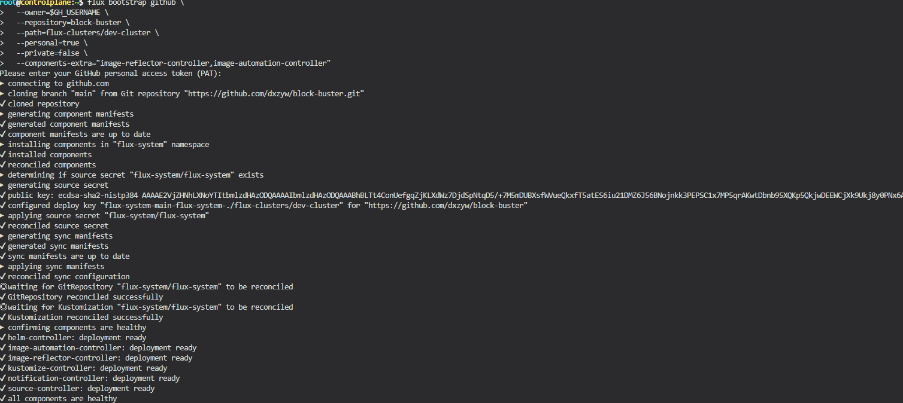
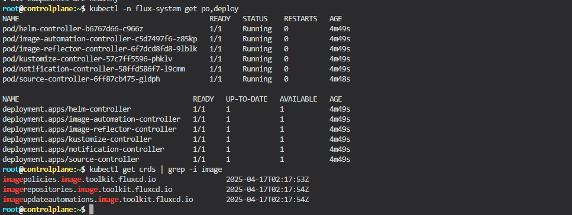
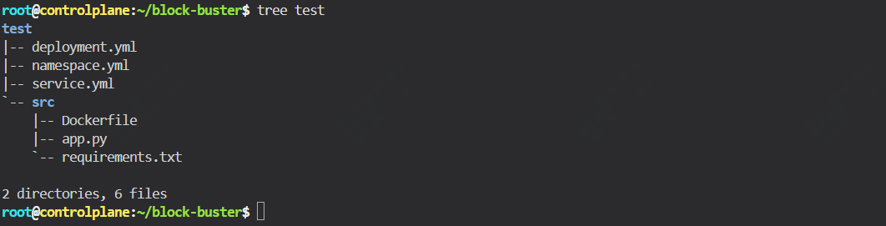
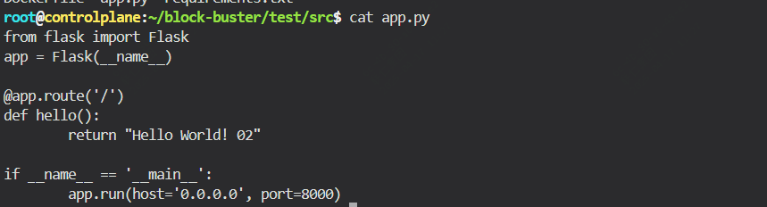
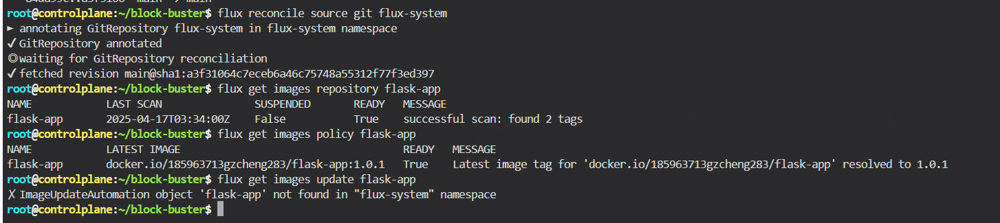
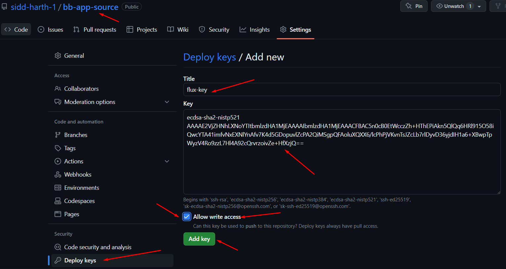
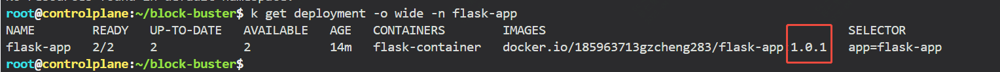

前面已经聊过flux的简介及简单使用，今天这篇文章介绍下，如果通过捕获镜像标签的变更，实现自动更新。

## 提前准备

在开始之前，需要有的环境包括：

已经安装flux的k8s环境，还需要github、docker账户，后面两者可以用gitlab、hrbor替换，这里因为方便演示，我们用github及doker官方仓库。

导入如下仓库,因为里面有一些操作文件，在正式开始前，只需要保留这个路径及文件在就可以flux-clusters/dev-cluster/flux-system

```
https://github.com/dxzyw/block-buster
```

通过如下命令确认flux版本

```bash
flux -v
```

## 安装Image Automation Controller

```
export GH_USERNAME=REPLACE-WITH-YOUR-GITHUB-USERNAME
```

```
flux bootstrap github \
  --owner=$GH_USERNAME \
  --repository=block-buster \
  --path=flux-clusters/dev-cluster \
  --personal=true \
  --private=false \
  --components-extra="image-reflector-controller,image-automation-controller" 
```

执行到这步需要输入github pat，然后等待执行完成，直到出现如下标志

```
✔ all components are healthy
```



然后可以看到新的deployments及crds，如下

```
kubectl -n flux-system get po,deploy

kubectl get crds | grep -i image
```



## 发布一个demo应用

我们发布一个python的demo应用，主要包含如下几个文件

源代码：app.py、requirements.txt、Dockerfile
部署清单：namespaces.yaml、deployment.yaml、service.yaml

相关代码均在前面代码仓库的test目录下。



我们要完成demo应用的部署，需要完成两步，打包镜像，这一步一般是通过jenkins完成，这里我们手动完成，第二步，配置基于git的Kustomization

这里用到了官方的docker 仓库，所以需要提前登录docker hub，如果内部用到的是harbor，步骤类似。

```
export DOCKER_USERNAME=你的用户

docker login --username $DOCKER_USERNAME

```
拉取仓库，打包镜像

```bash
cd ~
git clone  https://github.com/dxzyw/block-buster
cd ~/block-buster/test/src
docker build -t $DOCKER_USERNAME/flask-app:1.0.0 .
docker push $DOCKER_USERNAME/flask-app:1.0.0
```
注意：在deployment中 需要修改image为你的仓库地址

```bash
image: docker.io/你的用户名/flask-app:1.0.0
```

然后配置Kustomization

```bash
cd ~/block-buster/flux-clusters/dev-cluster/
vim falsk-app.yaml
```
这个配置作用是Flux 从一个名为 flux-system 的 Git 存储库中定期拉取位于 ./test 目录下的配置文件，并将其应用到 flask-app 命名空间中。
```bash
---
apiVersion: kustomize.toolkit.fluxcd.io/v1
kind: Kustomization
metadata:
  name: flask-app
  namespace: flux-system
spec:
  interval: 1m40s
  path: ./test
  prune: true
  sourceRef:
    kind: GitRepository
    name: flux-system
  targetNamespace: flask-app
```

做完这步，我们去提交git更新

```
cd ~/block-buster
git config --global user.email "fluxcd@killercoda.com"
git config --global user.name "FluxCD-Killercoda"
git pull
git add .
git commit -m flask-app-1
git push
```

提交完成后，我们应该可以看到对应的组件已经部署到k8s中


## 更新image

终于来到了今天的重点介绍内容

目前我们的python demo只是输出一个 hello world

我们修改为 hello world 02，然后重新打包镜像为1.0.1，如何通过识别tag的变更，然后实现应用的更新

###  创建一个flux Image Repository

还是之前的配置文件，我们继续添加

```
---
apiVersion: image.toolkit.fluxcd.io/v1beta2
kind: ImageRepository
metadata:
  name: flask-app
  namespace: flux-system
spec:
  image: docker.io/你的用户名/flask-app
  interval: 10s
```

这是定义 Flux `ImageRepository` 资源的 YAML 配置，用于管理镜像的源信息。以下是配置的主要内容和作用：

#### **资源定义**
1. **`apiVersion`:**
   - 指定资源的 API 版本，这里是 `image.toolkit.fluxcd.io/v1beta2`。

2. **`kind`:**
   - 定义资源的类型，这里是 `ImageRepository`，用于表示一个镜像存储库的资源。

3. **`metadata`:**
   - **`name`:** 资源名称，表示该镜像源的名称是 `flask-app`。
   - **`namespace`:** 资源所在的命名空间是 `flux-system`。


#### **核心配置**
1. **`spec.image`:**
   - 指定镜像的存储路径，通常包括镜像仓库地址（如 Docker Hub 的 `docker.io`）和镜像名称

2. **`spec.interval`:**
   - 定义镜像信息的同步频率，表示 Flux 每隔 `10秒` 会检查镜像仓库的更新状态。

---

#### **作用**
- 此配置告诉 Flux 定期从指定的镜像仓库（`docker.io/heng283/flask-app`）拉取最新的镜像信息。
- 它为 Flux 的其他组件（如 `ImagePolicy` 和 `ImageAutomation`）提供镜像数据来源，以便实现自动更新和部署。

### 创建一个 Image Policy

如果我们要实现动态扫描镜像库的更新，还需要设置一定的规则

```
---
apiVersion: image.toolkit.fluxcd.io/v1beta2
kind: ImagePolicy
metadata:
  name: flask-app
  namespace: flux-system
spec:
  imageRepositoryRef:
    name: flask-app
  policy:
    semver:
      range: 1.0.x

```

这一段定义 Flux `ImagePolicy` 资源的 YAML 配置文件，用于为镜像设置版本更新策略。以下是配置的具体内容和作用：

---

#### **资源定义**
1. **`apiVersion`:**
   - 定义资源的 API 版本，这里是 `image.toolkit.fluxcd.io/v1beta2`。

2. **`kind`:**
   - 资源类型为 `ImagePolicy`，表示这是一个镜像版本控制策略的定义。

3. **`metadata`:**
   - **`name`:** 资源的名称是 `flask-app`，用于标识该策略。
   - **`namespace`:** 资源位于 `flux-system` 命名空间中。

---

#### **核心配置**
1. **`imageRepositoryRef`:**
   - 指定该策略关联的镜像存储库。
   - **`name`:** 引用了之前定义的 `ImageRepository` 资源（名称为 `flask-app`）。

2. **`policy`:**
   - 定义镜像版本的选择规则。
   - **`semver`:**
     - 使用语义化版本规则（Semantic Versioning）。
     - **`range: 1.0.x`:** 指定镜像版本范围，表示选择所有 `1.0` 开头的版本（例如 `1.0.1`、`1.0.5`），但不包括 `1.1` 或更高版本。

---

#### **作用**
- 该配置为名为 `flask-app` 的镜像存储库设定了版本选择策略。
- Flux 将根据此策略，从镜像仓库中选择符合 `1.0.x` 范围的最新版本，供自动化更新使用（通常结合 `ImageAutomation`）。


到这步的时候，我们对代码做出更新调整app.py,然后重新打包镜像上传，我们来看下结果



```
docker build -t $DOCKER_USERNAME/flask-app:1.0.1 .

docker push $DOCKER_USERNAME/flask-app:1.0.1
```

然后提交更新

执行这条命令 ，可以立马同步git更新

```
flux reconcile source git flux-system
```



可以看到关于image 的repository及policy都已经生效，已经识别到镜像tag的变更，下一步我们实现update

### 创建更新规则


```
---
apiVersion: image.toolkit.fluxcd.io/v1beta2
kind: ImageUpdateAutomation
metadata:
  name: flask-app
  namespace: flux-system
spec:
  git:
    checkout:
      ref:
        branch: main
    commit:
      author:
        email: fluxcdbot@users.noreply.github.com
        name: fuxcdbot
    push:
      branch: main
  interval: 1m40s
  sourceRef:
    kind: GitRepository
    name: flask-app
  update:
    path: ./test
    strategy: Setters      
```

这段 YAML 配置定义了 Flux 的 `ImageUpdateAutomation` 资源，用于实现自动更新容器镜像版本并推送更改到 Git 存储库。以下是主要内容的简要介绍：

---

#### **资源定义**
1. **`apiVersion`:**
   - API 版本，指定该资源属于 Flux 的 Image Automation Toolkit。

2. **`kind`:**
   - 资源类型是 `ImageUpdateAutomation`，表示这是一个用于自动化更新镜像配置的资源。

3. **`metadata`:**
   - **`name`:** 资源的名称是 `flask-app`。
   - **`namespace`:** 资源的命名空间是 `flux-system`。

---

#### **核心配置**
1. **`git`:**
   - 配置 Git 操作相关的参数：
     - **`checkout.ref.branch`:** 指定 Git 的 `main` 分支用于拉取代码。
     - **`commit.author`:** 定义提交的作者信息。
     - **`push.branch`:** 将更新后的配置推送到 Git 的 `main` 分支。

2. **`interval`:**
   - 设置自动化任务的运行间隔（这里是每隔 1分40秒）。

3. **`sourceRef`:**
   - 指定更新的源资源。
   - **`kind`:** 表明源是一个 `GitRepository` 资源。
   - **`name`:** 源资源的名称是 `flask-app`。

4. **`update`:**
   - 定义更新策略：
     - **`path`:** 表示更新文件所在的路径（`./test`）。
     - **`strategy`:** 设置更新的策略为 `Setters`，即自动更新配置文件中设定的镜像版本。

---

#### **作用**
该配置主要负责：
- 定期检查镜像更新，并根据策略更新 Kubernetes 配置文件。
- 自动将更新后的配置推送到 Git 存储库中，确保代码和集群配置保持一致。

#### 镜像声明与 Flux 的 ImagePolicy 关联

添加该配置后，并不会立马发生更新，还需要对deployment文件做一个标记

格式如下：

```
# {"$imagepolicy": "flux-system:flask-app"}
```

通过如下命令对deployment文件更新
```
sed -i 's/image:.*/&  # {"$imagepolicy": "flux-system:flask-app"}/g' ./test/deployment.yml
```

Flux 的 ImageUpdateAutomation 组件会扫描带有此标记的镜像字段。

根据标记中的 ImagePolicy 信息，Flux 查询镜像仓库获取符合 ImagePolicy 的最新镜像版本（例如通过语义化版本规则，如 1.0.x）。

#### 配置 Deploy Key

我们对deployment做出更改后，通过git去修改，还需要一个写的权限，不然会有这个报错

```
failed to update source: failed to push to remote: unknown error: ERROR: The key you are authenticating with has been marked as read only
```


这里通过deploy key来配置

```
flux create secret git flux-system --url=ssh://git@github.com/$GH_USERNAME/block-buster.git --ssh-key-algorithm=ecdsa --ssh-ecdsa-curve=p521
```
上述会生成一个key，配置到github中



然后更新flask-app的git源

```
flux create source git flux-system --url ssh://git@github.com/$GH_USERNAME/block-buster.git --branch main --timeout 10s --secret-ref flask-app-auth --export > ~/block-buster/test/flask-app.yml
```

更改完成后，git提交

这个时候，就会自动更新deployment文件，然后重新拉取新的镜像文件，进行部署

可以看下使用的镜像情况，以及服务访问情况




然后我们只需要和你现在有的CI/CD打通，其实只要控制docker build生成新的镜像就可以完成发布了！

