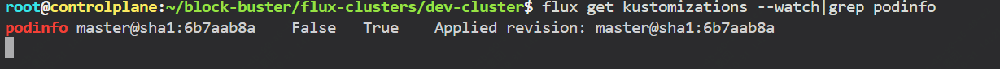

在介绍flux之前，先来简单介绍下什么是gitops。

在gitops之前经历了手动发布、脚本化部署、以及目前占据主流的CI/CD，而CI/CD的大部分实现方式是利用gitlab、jenkins等完成自动化构建及部署。

而gitops它是利用git提交来完成应用的部署甚至基础设施的部署，从而使得发布过程更加自动化和一致性。

目前用到最多的gitops工具主要有flux、argocd等，argocd前面的文章有过一些介绍。

后面将会有一系列文章来介绍flux，今天先来简单介绍下flux的核心概念、如何部署、关键命令等。

## flux简介

flux是一款开源的gitops工具，它是专门为kubernetes集群的持续交付而设计。

可以通过git的状态来自动化管理和同步k8s的资源，开发人员可以通过git的提交来完成管理和部署应用程序。

### flux重点概念

如下是在使用flux前需要了解的一些核心概念

#### gitops toolkit

flux是通过一系列的gitops toolkit组件构建的，它包括：

- 专用工具和 Flux 控制器（source、kustomize、helm、notification、image）
- 可组合的api
- 一系列存储在flux 官方github中的可以重用的go包


#### sources

sources是放置期望系统达到什么状态的仓库，里面还会存储一些登录凭证或者版本选择器。

包括： GitRepository、OCIRepository、HelmRepository和Bucket资源。

它主要是用于生成供其他Flux组件使用的工件，并在定义的间隔时间内检查源的变化。

#### Reconciliation

确保集群中的实际状态（实际部署的情况）与声明的期望状态（git仓库中定义的资源状态）一致。

示例: HelmRelease、Bucket和Kustomization资源的协调。

#### Kustomization

Kustomization是k8s中的用于定义一组资源状态合集。

而flux可以依据该合集内容进行调整，默认5分钟检测一次，具体可以通过配置调整

#### Bootstrap

用于引导flux初始化，需要git仓库用户及凭证。


### flux的安装及简单使用

#### 开始之前

- 需要一个k8s集群
- github仓库并且有个人访问令牌（正式环境采用gitlab）


我们这篇文章，将会介绍如何在k8s环境中部署flux，并且通过flux部署应用程序，然后完成一次版本更新。


#### 安装flux cli

```
curl -s https://fluxcd.io/install.sh | sudo bash
```

根据实际情况配置你的github访问凭证

```
export GITHUB_TOKEN=<your-token>
export GITHUB_USER=<your-username>
```

然后通过如下命令去检查是否一切就绪

```
flux check --pre
```

如下输出表示正常：

```
► checking prerequisites
✔ Kubernetes 1.31.0 >=1.28.0-0
✔ prerequisites checks passed
```

#### 将flux安装到k8s集群中

这里展示github引导，其它gitlab同理

如下仓库名及路径可以根据实际情况来配置

```
flux bootstrap github \
  --owner=$GH_USERNAME \
  --repository=block-buster \
  --path=flux-clusters/dev-cluster \
  --personal=true \
  --private=false
```

这部分命令的作用在于：

- 新建git仓库
- 将flux组件清单添加到仓库中
- 将flux组件部署到集群中
- 这些flux组件在仓库中的路径

直到所有都就绪即可


查看相关组件部署情况

```
k -n flux-system get all
NAME                                           READY   STATUS    RESTARTS   AGE
pod/helm-controller-7f788c795c-rrbwd           1/1     Running   0          2m47s
pod/kustomize-controller-b4f45fff6-hslwq       1/1     Running   0          2m47s
pod/notification-controller-556b8867f8-r5887   1/1     Running   0          2m47s
pod/source-controller-77d6cd56c9-wt56d         1/1     Running   0          2m47s

NAME                              TYPE        CLUSTER-IP       EXTERNAL-IP   PORT(S)   AGE
service/notification-controller   ClusterIP   10.101.11.109    <none>        80/TCP    2m48s
service/source-controller         ClusterIP   10.104.18.30     <none>        80/TCP    2m48s
service/webhook-receiver          ClusterIP   10.103.116.150   <none>        80/TCP    2m48s

NAME                                      READY   UP-TO-DATE   AVAILABLE   AGE
deployment.apps/helm-controller           1/1     1            1           2m48s
deployment.apps/kustomize-controller      1/1     1            1           2m48s
deployment.apps/notification-controller   1/1     1            1           2m48s
deployment.apps/source-controller         1/1     1            1           2m48s

NAME                                                 DESIRED   CURRENT   READY   AGE
replicaset.apps/helm-controller-7f788c795c           1         1         1       2m48s
replicaset.apps/kustomize-controller-b4f45fff6       1         1         1       2m48s
replicaset.apps/notification-controller-556b8867f8   1         1         1       2m48s
replicaset.apps/source-controller-77d6cd56c9         1         1         1       2m48s

```

然后将仓库克隆到本地

```
cd ~
git clone https://github.com/$GH_USERNAME/block-buster
```

然后我们通过部署一个简单的go写的web程序来演示，开源地址为：github.com/stefanprodan/podinfo

##### 创建一个source，指向的是这个仓库的master分支

```
flux create source git podinfo \
  --url=https://github.com/stefanprodan/podinfo \
  --branch=master \
  --interval=1m \
  --export > ./block-buster/flux-clusters/dev-cluster/podinfo-source.yaml
```

内容如下：

```
cat ./block-buster/flux-clusters/dev-cluster/podinfo-source.yaml
---
apiVersion: source.toolkit.fluxcd.io/v1
kind: GitRepository
metadata:
  name: podinfo
  namespace: flux-system
spec:
  interval: 1m0s
  ref:
    branch: master
  url: https://github.com/stefanprodan/podinfo
```

#### 部署程序 使用 flux create 命令创建应用 podinfo 部署的 Kustomization

```
flux create kustomization podinfo \
  --target-namespace=default \
  --source=podinfo \
  --path="./kustomize" \
  --prune=true \
  --wait=true \
  --interval=30m \
  --retry-interval=2m \
  --health-check-timeout=3m \
  --export > ./block-buster/flux-clusters/dev-cluster/podinfo-kustomization.yaml
```

内容如下：

```
cat ./block-buster/flux-clusters/dev-cluster/podinfo-kustomization.yaml
---
apiVersion: kustomize.toolkit.fluxcd.io/v1
kind: Kustomization
metadata:
  name: podinfo
  namespace: flux-system
spec:
  interval: 30m0s
  path: ./kustomize
  prune: true
  retryInterval: 2m0s
  sourceRef:
    kind: GitRepository
    name: podinfo
  targetNamespace: default
  timeout: 3m0s
  wait: true
```

#### git 提交 

```
cd ~/block-buster
git config --global user.email ".com"
git config --global user.name ""
git pull
git add .
git commit -m 'flux-test'
git push
```

#### 查看部署情况

```
flux get kustomizations --watch
```



```
kubectl -n default get deployments,services
NAME                      READY   UP-TO-DATE   AVAILABLE   AGE
deployment.apps/podinfo   2/2     2            2           95s

NAME                 TYPE        CLUSTER-IP       EXTERNAL-IP   PORT(S)             AGE
service/kubernetes   ClusterIP   10.96.0.1        <none>        443/TCP             23d
service/podinfo      ClusterIP   10.104.148.254   <none>        9898/TCP,9999/TCP   95s
```

如果要暂停更新，命令如下：

```
flux suspend kustomization <name>
```

#### flux in-line patches

通过 flux in-line 来更改podinfo的部署

将以下内容添加到 podinfo-kustomization.yaml 文件的字段spec中：

```
  patches:
    - patch: |-
        apiVersion: autoscaling/v2
        kind: HorizontalPodAutoscaler
        metadata:
          name: podinfo
        spec:
          minReplicas: 3             
      target:
        name: podinfo
        kind: HorizontalPodAutoscaler
```

然后我们提交更改，然后pod个数发现已经3个pod在运行了

