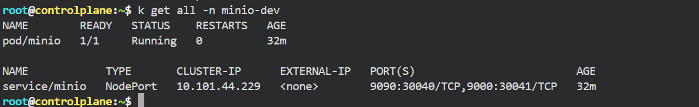
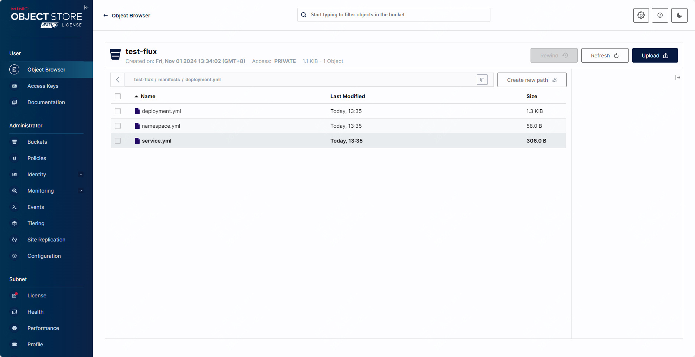
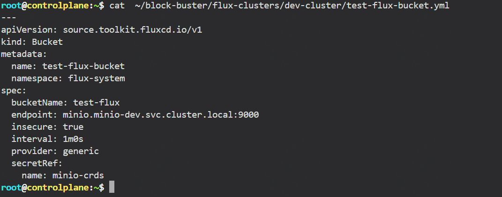
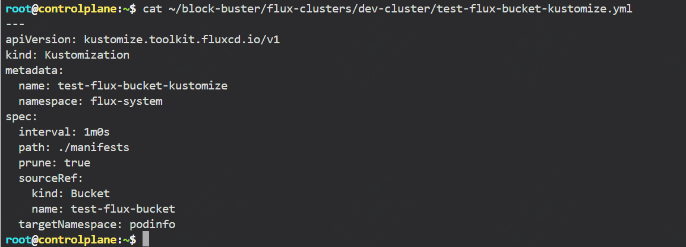
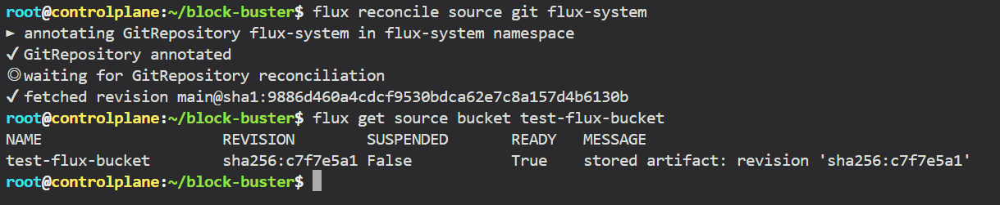
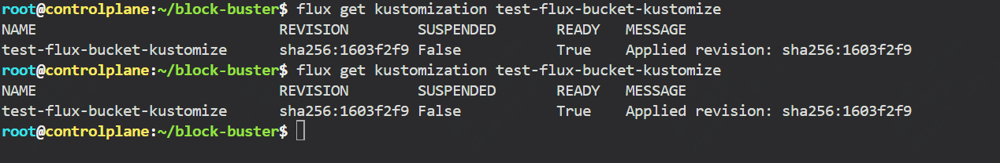
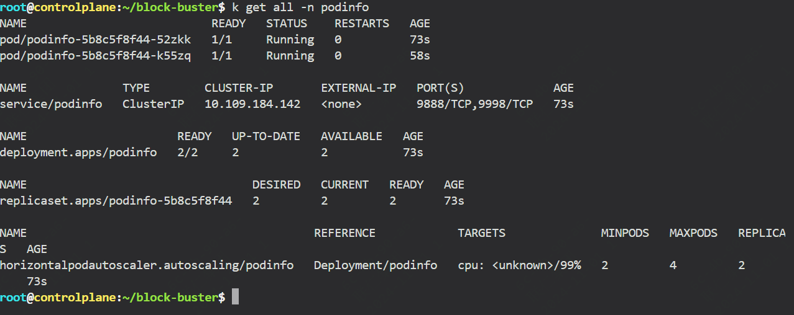

前面文章介绍了source为git仓库，今天介绍下基于对象存储的部署。

在之前也有介绍过flux支持的source可以有：Git Repositories、buckets、OCI Repositories、helm Repositories

本文介绍的就是如何从对象存储桶中获取kubernetes资源的清单文件。

整体的一个过程如下：对象存储中存放清单文件，flux配置bucket为source，从桶中获取对应的清单文件，然后git提交，然后实现自动部署。

具体flux部署的介绍不再展开，可以参考前面的文章。

### 前置准备

因为在本实验中用到了对象存储，我们以minio来实践。

这边已经部署好了minio,并且已经新建了桶



桶里面已经配置好了清单文件



因为访问对象存储是需要账户的，所以需要配置一个k8s secret作为flux访问桶的凭证。

这里用到的是默认账户密码，可以根据需要配置其它用户

```
kubectl -n flux-system create secret generic minio-crds \
--from-literal=accesskey=minioadmin \
--from-literal=secretkey=minioadmin 
```

### git clone

```

```

### 配置source指向该minio

```
flux create source bucket test-flux-bucket \
  --bucket-name test-flux \
  --secret-ref minio-crds \
  --endpoint minio.minio-dev.svc.cluster.local:9000  \
  --provider generic \
  --insecure \
  --export > ~/block-buster/flux-clusters/dev-cluster/test-flux-bucket.yml
```




### 配置 Kustomization

```
flux create kustomization test-flux-bucket-kustomize \
  --source Bucket/test-flux-bucket \
  --target-namespace podinfo \
  --path ./manifests \
  --prune true \
  --export > ~/block-buster/flux-clusters/dev-cluster/test-flux-bucket-kustomize.yml
```



### git 提交

对应修改邮箱及用户


```
cd ~/block-buster
git config --global user.email ""
git config --global user.name ""
git pull
git add .
git commit -m 'flux-test'
git push
```

### 查看部署状态

flux get source bucket test-flux-bucket



```
flux get kustomization test-flux-bucket-kustomize
```


