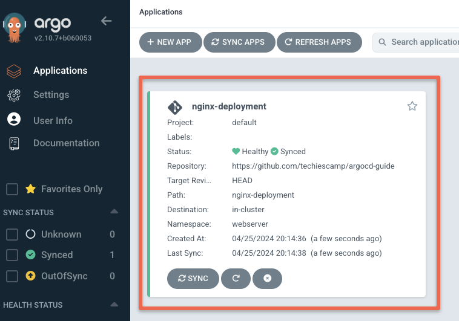
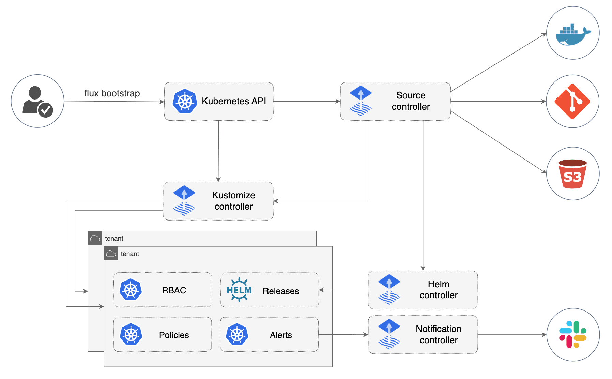

### ArgoCD 与 Flux：两大 GitOps 工具的异同

在现代 DevOps 的蓝图中，GitOps 被视为自动化部署和基础设施管理的范式转变。ArgoCD 和 Flux 是 GitOps 世界中的两大明星，它们以自动化、声明式的方式同步 Kubernetes 集群状态，但在实现细节、设计理念和适用场景上却各有千秋。

#### 核心理念与架构：简洁对决功能

**ArgoCD** 倾向于提供一站式、图形化的用户体验。作为一个 Kubernetes 控制器，它的核心设计思想是将 Git 仓库视为单一的真理来源（Source of Truth），并通过持续监控和同步集群状态来保持一致性。ArgoCD 的界面直观，用户可在 Web 控制台中实时查看应用的部署状态、回滚版本历史，甚至通过点击操作执行复杂的回滚或重新同步。

另一方面，**Flux** 以模块化和轻量级为目标，是一个更纯粹的 Kubernetes-native GitOps 解决方案。Flux 专注于控制器模式，通过一系列独立但协同工作的组件（如 `kustomize-controller`、`helm-controller`）实现功能扩展。这种设计让 Flux 在需要高度定制化或与现有系统深度集成的场景中表现出色。

#### 功能对比：灵活性与全面性之争

**1. 部署方式与兼容性**
ArgoCD 直接支持 Helm、Kustomize 等流行的模板化工具，并允许用户管理多集群配置。它还支持多源同步，这意味着可以从多个 Git 仓库中拉取资源。相较之下，Flux 更强调 Kubernetes 原生集成，其功能模块化设计让它可以无缝嵌入现有的 DevOps 管道。

**2. UI 与操作便捷性**
ArgoCD 以其强大的用户界面著称。它的 Web 界面和 CLI 工具结合，使用户能够快速调试和管理复杂的部署情况。Flux 则更依赖 Kubernetes 原生工具链，UI 支持通过合作项目（如 Weave GitOps）实现。对于熟悉 CLI 工具链的工程师，Flux 的简单性反而是一种优势。

**3. 自动化与通知**
ArgoCD 的事件通知系统极为灵活，支持集成 Slack、Email 等多种渠道。而 Flux 则专注于核心同步功能，通知功能相对较少，但可以通过 GitOps Toolkit 自定义扩展。

#### 社区生态与发展方向

ArgoCD 背靠 CNCF，拥有活跃的开发者社区和强大的生态支持，其功能随着时间推移愈发强大，但也带来了相应的复杂性。Flux 的 GitOps Toolkit 体现了其模块化哲学，允许用户根据需求组合功能，但对于新手可能需要更多学习成本。

#### 性能与资源使用：轻量与全面的博弈

在资源使用方面，Flux 的轻量级控制器设计使其在资源受限的环境下更具优势。ArgoCD 则由于引入了图形化界面和多源支持，稍显沉重，但在生产环境的可观察性和可操作性方面更胜一筹。

#### 适用场景与选择建议

- 如果你的团队偏向全功能、直观的可视化界面，且需要在多集群环境中快速部署，那么 ArgoCD 是绝佳选择。
- 如果你的需求是模块化、高度可定制化的 Kubernetes-native GitOps 实现，或希望深度集成现有工具链，Flux 则是最佳选择。

### 总结

ArgoCD 和 Flux 都是 GitOps 实践的优秀工具。ArgoCD 以全面性和可视化著称，而 Flux 则在模块化和轻量性上占优。选择适合的工具，取决于团队需求和项目复杂度。正如现代技术的哲学，适配而非强行，是实现高效与稳定的关键。