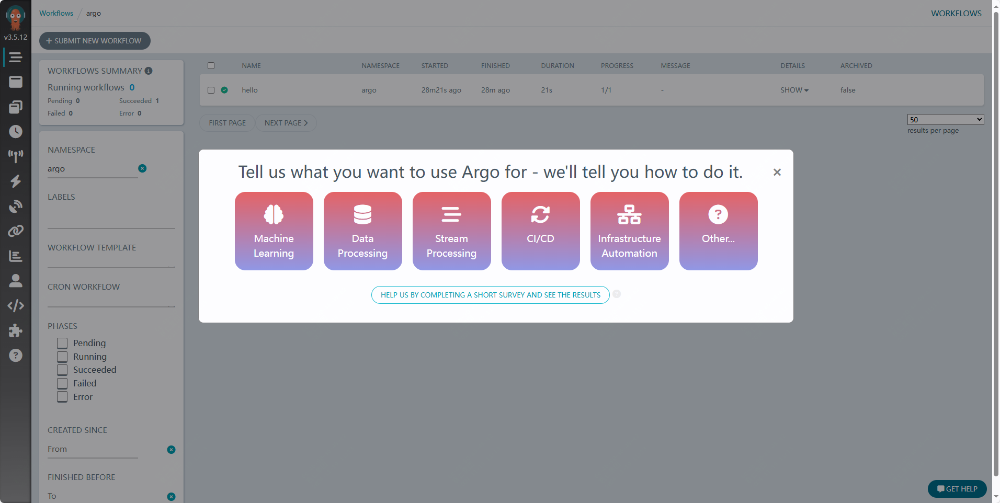
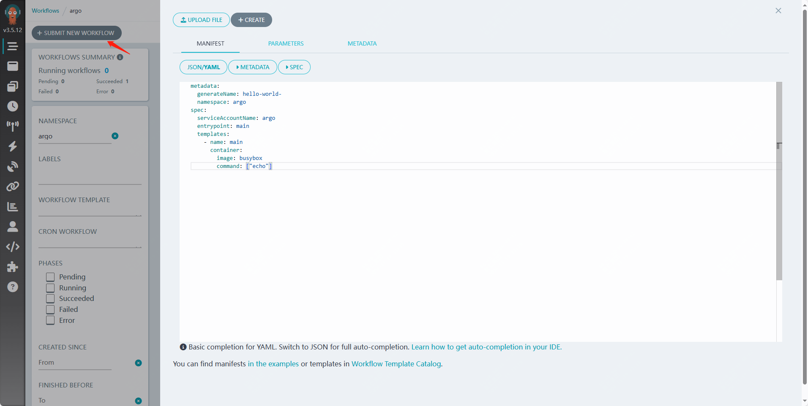
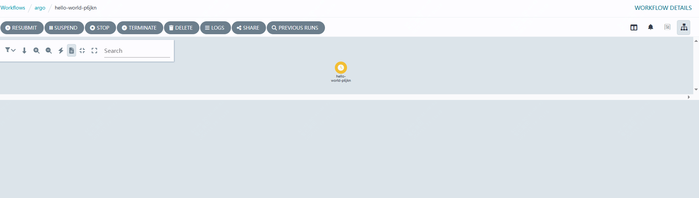
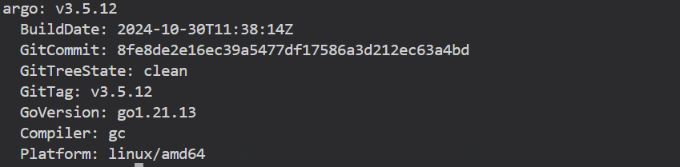
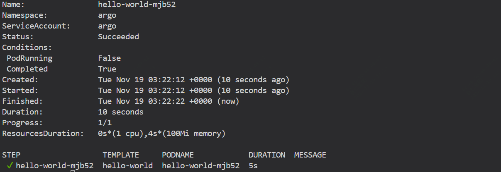

## argocd 入门

- 1. 安装 argocd
- 2. 运行第一个argocd工作流
- 3. 使用 argocd cli 管理 argocd

### 1. 安装 argocd

先创建argo的namespace

```
kubectl create namespace argocd
```
根据你需要的版本，选择对应的yaml文件，然后应用

```
kubectl apply -n argo -f https://github.com/argoproj/argo-workflows/releases/download/v3.5.12/install.yaml
```

安装完成后，确认下argo-server是否正常运行

```
kubectl get pods -n argo
# 确认workflow-controller是否正常运行
kubectl -n argo get deploy workflow-controller
# 确认argo-server是否正常运行
kubectl -n argo get deploy argo-server
```

在开始之前，我们需要等待argo-server和workflow-controller都正常运行

```
kubectl -n argo wait deploy --all --for condition=Available --timeout 2m
```

### 2.什么是工作流？

工作流在kubernetes中是使用argo-workflows来实现的，argo-workflows是argo项目的一部分，argo-workflows是基于kubernetes的编排引擎，可以用来编排和管理复杂的任务和流程。

每个工作流由一个或多个模板组成，其中一个模板被定义为入口点，而模板有多种类型，如容器

如下是是一个简单的hello world工作流

```
apiVersion: argoproj.io/v1alpha1
kind: Workflow
metadata:
  name: hello
spec:
  serviceAccountName: argo # this is the service account that the workflow will run with
  entrypoint: main # the first template to run in the workflows
  templates:
  - name: main
    container: # this is a container template
      image: busybox # this is the image to run
      command: ["echo"]
      args: ["hello world"]
```
我们通过如下命令来执行该工作流

```
kubectl -n argo apply -f hello-workflow.yaml
```

等待上述完成

```
kubectl -n argo wait workflows/hello --for condition=Completed --timeout 2m
```

#### 使用ui查看工作流


关于argo-server的认证有三种配置
- 1.server模式 在托管模式下，使用服务器的服务账户，在本地模式下，使用本地kube配置
- 2.client模式，使用客户端的k8s不记名令牌
- 3.sso模式，单点登录

对于 v3.0 及更高版本，默认为client 。在 v3.0 之前，它是server

这里配置为server模式，可以暂时绕过ui登录

为了演示这里禁止了https，生产建议开启

```
kubectl patch deployment \
  argo-server \
  --namespace argo \
  --type='json' \
  -p='[{"op": "replace", "path": "/spec/template/spec/containers/0/args", "value": [
  "server",
  "--auth-mode=server",
  "--secure=false"
]},
{"op": "replace", "path": "/spec/template/spec/containers/0/readinessProbe/httpGet/scheme", "value": "HTTP"}
]'
```
然后等待server的重新部署

```
kubectl -n argo rollout status --watch --timeout=600s deployment/argo-server
```

然后通过端口转发来查看用户界面

```
kubectl -n argo rollout status --watch --timeout=600s deployment/argo-server
```



我们可以在页面上尝试新建一个工作流



可以使用如下的临时配置

```
metadata:
  generateName: hello-world-
  namespace: argo
spec:
  serviceAccountName: argo
  entrypoint: main
  templates:
    - name: main
      container:
        image: busybox
        command: ["echo"]
```
可以看到由黄色变为了绿色即部署完成



### 3. 使用 argocd cli 管理 argocd

先安装argocd cli

```
curl -sLO https://github.com/argoproj/argo-workflows/releases/download/v3.5.12/argo-linux-amd64.gz
chmod +x argo-linux-amd64
mv ./argo-linux-amd64 /usr/local/bin/argo
```

通过如下查看

```
argo version
```



通过如下命令来尝试下通过cli运行工作流

```
argo submit -n argo --serviceaccount argo --watch https://raw.githubusercontent.com/argoproj/argo-workflows/master/examples/hello-world.yaml
```



如下命令可以查看

```
argo list -n argo
```

如何使用--name 更改工作流名称

```
argo submit -n argo --serviceaccount argo --name my-hello-world --watch https://raw.githubusercontent.com/argoproj/argo-workflows/master/examples/hello-world.yaml
```
