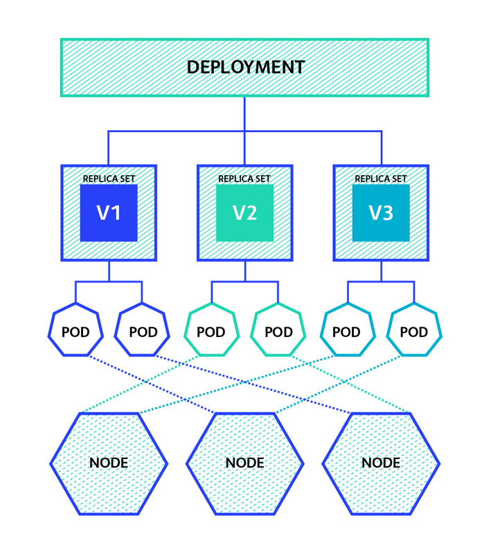
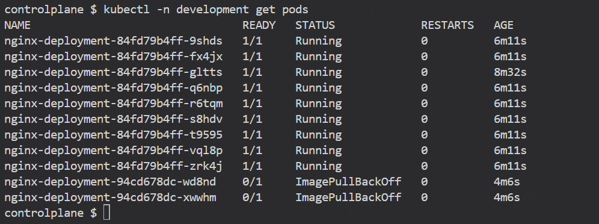

在k8s文档中，是这样介绍deploymnet的,它可以完成：


>描述 Deployment 对象中的所需状态，Deployment 控制器以受控速率将实际状态更改为所需状态。您可以定义 Deployment 来创建新的副本集，或者删除现有的 Deployment 并通过新的 Deployment 采用它们的所有资源。

这篇文章中，我们将实践及解释deployment是如何工作的，通过创建一个deployment并查看它与Replicaset和pod对象的关系来动手实践

### 通过kubectl创建deployment

Kubernetes 部署管理集群中运行的无状态服务（而不是 StatefulSets，例如，它管理有状态服务）。

它们的目的是保持一组相同的 Pod 运行并以受控方式升级它们 - 默认执行滚动更新。

有不同的部署策略适用于 Deployment。但是，它们超出了此方案的范围。有关部署策略的更多信息，可以去阅读 Kubernetes 文档。



#### 在 kubectl 中创建 Deployment

首先新建一个名为deployment的命名空间来完成本次实验

```
kubectl create namespace development
```

使用 nginx 镜像创建名为 nginx-deployment 的基本部署，并在容器中公开端口 80

```
kubectl create deployment nginx-deployment -n development --image=nginx --port 80
```

现在，让我们检查一下刚刚创建的部署：
```
kubectl get deployment nginx-deployment -n development -o yaml

```
元数据包含部署的名称（必须是唯一的）、Kubernetes 使用的内部 uid 和 annotations 对象。它包含一个注释，即当前部署修订版为 1。此外，从本课程中的其他场景中可以看到，Kubernetes 中的每个对象都可以有一组标签，这些标签是键值对。
```
apiVersion: apps/v1
kind: Deployment
metadata:
  annotations:
    deployment.kubernetes.io/revision: "1"
  creationTimestamp: "2024-10-15T06:48:06Z"
  generation: 1
  labels:
    app: nginx-deployment
  name: nginx-deployment
  namespace: development
  resourceVersion: "2582"
  uid: 1e2400c0-1e4c-4cdd-b5d9-fb63728174a6
```

### Deployment Object

接下来，我们将介绍主要的部署对象或 spec

```
spec:
  progressDeadlineSeconds: 600
  replicas: 1
  revisionHistoryLimit: 10
  selector:
    matchLabels:
      app: nginx-deployment
  strategy:
    rollingUpdate:
      maxSurge: 25%
      maxUnavailable: 25%
    type: RollingUpdate
  template:
    metadata:
      creationTimestamp: null
      labels:
        app: nginx-deployment
    spec:
      containers:
      - image: nginx
        imagePullPolicy: Always
        name: nginx
        ports:
        - containerPort: 80
          protocol: TCP
        resources: {}
        terminationMessagePath: /dev/termination-log
        terminationMessagePolicy: File
      dnsPolicy: ClusterFirst
      restartPolicy: Always
      schedulerName: default-scheduler
      securityContext: {}
      terminationGracePeriodSeconds: 30
```

部署的 spec （specification） 有两个键，您必须设置：

- replicas：描述此 Deployment 应该有多少个 Pod。在我们的例子中，将创建一个只有一个 Pod
- template：描述每个 pod 的外观。它描述了 Pod 中应包含的容器列表

可以设置其他两个键来自定义部署的行为。

- selector：确定哪些 Pod 被视为此部署的一部分。它使用标签来 “选择” pod
- strategy：说明应如何推出对部署的更新

#### 通过 manifest 创建部署


因为您之前已经创建了一个名为 nginx-deployment 的部署，所以我们需要先删除它，然后才能使用 YAML 清单创建新部署：

```
 kubectl delete deployment nginx-deployment -n development
```

在创建新部署之前，让我们检查一下文件

cat dep-manifest.yaml
```
apiVersion: apps/v1
kind: Deployment
metadata:
  labels:
    run: nginx-deployment
  name: nginx-deployment
  namespace: development
spec:
  replicas: 1
  revisionHistoryLimit: 10
  selector:
    matchLabels:
      run: nginx-deployment
  strategy:
    rollingUpdate:
      maxSurge: 1
      maxUnavailable: 1
    type: RollingUpdate
  template:
    metadata:
      labels:
        run: nginx-deployment
    spec:
      containers:
      - image: nginx
        imagePullPolicy: Always
        name: nginx-deployment
        ports:
        - containerPort: 80
          protocol: TCP
```          

创建部署

```
kubectl create -f dep-manifest.yaml
```

获取部署

```
kubectl get deployments -n development -o yaml
```

#### 在 Deployment 中扩展副本

现在您已经创建了部署，让我们看看扩展。与我们创建部署的方式类似，您可以通过部署清单或 kubectl 命令更新副本。例如：

```
kubectl scale deployment nginx-deployment --replicas=10 -n development
```

这会将 nginx-deployment Deployment 扩展到 10 个副本

您还可以在清单中编辑此内容。


```
spec:
  replicas: 10
```

```
kubectl replace -f dep-manifest.yaml
```

####  比例缩放

RollingUpdate Deployments 支持同时运行应用程序的多个版本。当你扩展正在推出（正在进行或已暂停）的 RollingUpdate Deployment 时，Deployment 控制器将平衡现有活动 ReplicaSet（带有 Pod 的 ReplicaSet）中的其他副本，以降低风险。这称为比例缩放。

例如，您正在运行具有 10 个副本的 Deployment，maxSurge=3 和 maxUnavailable=2

您更新到一个新镜像，该映像恰好无法从集群内部解析。

```
kubectl set image deploy/nginx-deployment nginx-deployment=nginx:unresolvabletag -n development
```



### 创建和扩展复制控制器

Replication Controller 是 Kubernetes 中原始的复制形式。它已被 ReplicaSets 取代，因此我们不会详细介绍它，但值得理解。

与 Deployment 类似，它允许您告诉 Kubernetes 调度器要确保多少个 Pod 保持运行。如果一个 Pod 确实死亡，则复制控制器将创建另一个 Pod 以确保副本计数匹配。