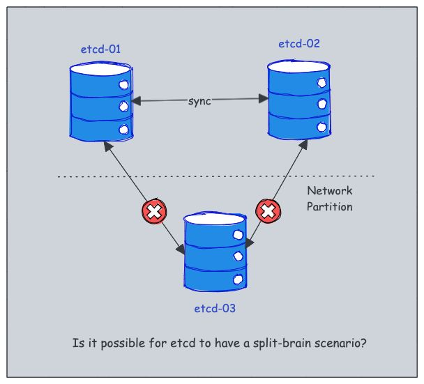

快速了解kubernetes中的etcd

在分布式系统中，尤其是业务数据量大、业务请求复杂的情况下，使用分布式数据库通常是最佳选择，以提高可扩展性和高可用性。而 Kubernetes 作为一套分布式系统，采用 etcd 来存储集群的配置和状态数据，确保一致性和可靠性。

## 什么是etcd？

etcd可以理解为就是kubernetes的主干，它既是作为后端服务发现的工具，又作为键值数据库。它是一种开源的，并且采用raft算法保持强一致性的分布式键值数据库。

我们具体理解下：

- 强一致性：分布式系统中，当其中一个节点话剧更改时，强一致性可以确保集群中所有数据立即更新，可以保证所有节点在任何时间拿到的数据都是一致的。
- 分布式：etcd节点分布在集群中的多个节点上，但同时保证数据一致，这种分布式架构可以确保系统的高可用性及弹性。
- kv结构：非关系型数据库，将数据存储为简单的键值对。它还提供了一个键值 API，可以轻松地与存储的数据进行交互。

etcd 使用 Raft 共识算法实现强一致性和可用性。该算法使etcd以leader-member方式运行，从而确保节点发生故障依旧可以保证可用性。


## etcd如何与kubernetes集成

那么在k8s中，你什么情况下会用到etcd呢？其实你的一次简单查询，比如执行一次kubectl命令，它就是一次与etcd的交互，同样当你部署一个pod时，它会往etcd中添加一条记录。

在k8s中我们需要了解关于k8s的信息：

- 集中存储：etcd 存储 Kubernetes 对象的所有配置、状态和元数据，例如 pod、secret、daemonsets、deployment、configmap 和 statefulsets。
- 实时跟踪：Kubernetes 利用 etcd 的 watch 功能（通过 Watch（） API）来监控对象状态的变化，从而实现实时跟踪和响应更新。
- API访问：etcd 使用 gRPC 公开了一个键值 API。此外，它还包括一个 gRPC 网关，一个将 HTTP API 调用转换为 gRPC 消息的 RESTful 代理。这使得 etcd 成为 Kubernetes 的理想数据库。
- 数据存储结构：所有 Kubernetes 对象都存储在 etcd 中的 /registry 目录键下，以键值格式组织。它被称为 etc d 键空间。例如，有关默认命名空间中名为 nginx 的 Pod 的信息可以在 /registry/pods/default/nginx 下找到。

etcd 是 Kubernetes 控制平面中唯一的  StatefulSet  组件。

## etcd的HA架构
在高可用性 （HA） 架构中部署 etcd 时，有两种主要模式：

- 与k8s控制平台绑定：此设置涉及将 etcd 与 control plane 节点一起部署 。这是一种更简单的部署模型，但在隔离和扩展方面可能存在权衡。
- 外部etcd集群：在这种模式下，etcd 部署为独立于 control plane 节点的专用集群，提供更好的隔离性、可扩展性和弹性。


## etcd中的Quorum和节点计数

Quorum 是分布式系统中的一个概念，指的是群集正常运行必须能够运行并能够通信的最小节点数。

在 etcd 中，使用 quorum 来确保在节点故障时保持一致性和可用性。

仲裁的计算公式为：
```
quorum = (n / 2) + 1
```
其中 n 是集群中的节点总数。

例如，要容忍一个节点的故障，至少需要三个 etcd 节点。要承受两个节点故障，你至少需要 5 个节点，依此类推。

etcd 集群中的节点数直接影响其容错能力。以下是它的分解方式：

- 3 个节点 ：可以容忍 1 个节点故障（仲裁 = 2）
- 5 个节点 ：可以容忍 2 个节点故障（仲裁 = 3）
- 7 个节点 ：可以容忍 3 个节点故障（仲裁 = 4）

集群可以容忍的节点故障数的一般公式为：

```
fault tolerance = (n - 1) / 2
```

其中 n 是节点总数。

## 如何避免etcd中的脑裂场景

在分布式系统中，当一组节点失去彼此之间的通信时，通常会发生裂脑情况，这通常是由于网络分区造成的。

这可能会导致系统状态不一致或冲突，这在 Kubernetes 等关键系统中尤其成问题。

但是，etcd 是专门为防止脑裂情况而设计的。



它采用强大的领导者选举机制，确保在任何给定时间只有一个节点主动控制集群。根据官方文档，在 etcd 中有效避免了裂脑场景。方法如下：

- 1.当网络分区发生时，etcd 集群分为两个部分：多数和少数。
- 2.多数 Segment 继续作为可用集群运行，而少数Segment 变得不可用。
- 3.如果 leader 位于 多数 segment 中，则系统会将少数segment视为失败。大多数 Segment 保持运行状态，不会影响一致性。
- 4.如果领导者是少数段的一部分，它会认识到由于与集群中的大多数节点失去通信而分离，并退出其领导角色。
- 5.然后，多数 segment 选举新的领导者，确保持续可用性和一致性。
- 6.解决网络分区后，少数 Segment 会自动从多数 Segment 中识别新的 Leader 并相应地同步其状态。

这种设计可确保 etcd 保持强一致性并防止出现裂脑场景，即使面对网络问题也是如此。