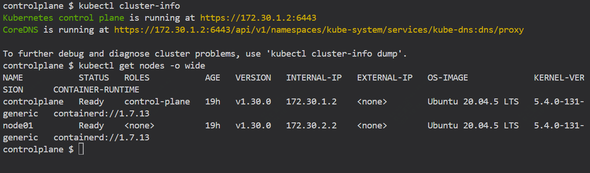
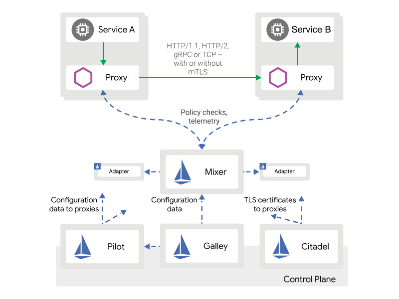
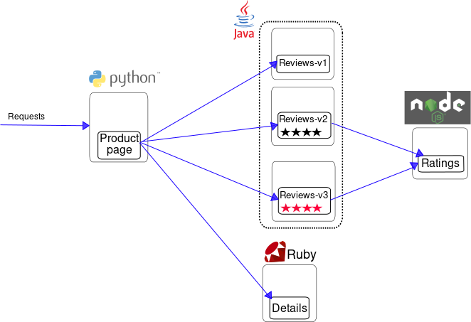
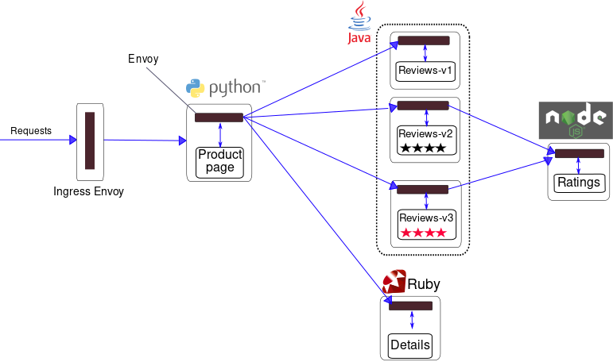

istio实践操作指南

本篇文章主要介绍，如何安装部署istio

Istio 是一个开放平台，提供统一的方式来连接、管理和保护微服务。 Istio 支持管理微服务之间的流量、实施访问策略和聚合遥测数据，所有这些都不需要更改微服务代码

本操作实践将会部署官方提供的一个bookinfo应用程序。

### k8s环境

在本次实验中环境为一个一主一从的k8s集群。


```
kubectl cluster-info
kubectl get nodes -o wide
```



### istio部署

更具体的部署操作可以参考官方文档

```
export ISTIO_VERSION=1.13.3
curl -L https://istio.io/downloadIstio | TARGET_ARCH=x86_64 sh -
echo "export PATH=/root/istio-${ISTIO_VERSION}/bin:\$PATH" >> .plainrc
export PATH=/root/istio-${ISTIO_VERSION}/bin:$PATH
```

部署完成后通过如下命令查看状态

```
istioctl version
```

然后通过istioctl来部署istio，如下将会部署Pilot、Mixer、Ingress-Controller、Egress-Controller 以及 Istio CA

```
mv /tmp/istio-course.yaml /root/istio-${ISTIO_VERSION}/manifests/profiles/
istioctl install --set profile=istio-course -y --manifests=/root/istio-${ISTIO_VERSION}/manifests
```

如下命令验证安装情况

```
kubectl get pods,services -n istio-system
```
### istio的架构介绍

Istio service mesh在逻辑上分为数据平面和控制平面。

数据平面由一组部署为 sidecar 的智能代理（Envoy）组成。这些代理与 Mixer（通用策略和遥测中心）一起协调和控制微服务之间的所有网络通信。


控制平面管理和配置代理以路由流量。此外，控制平面配置 Mixer 来执行策略并收集遥测数据。




#### istio组成部分

Envoy - 每个微服务的 Sidecar 代理，用于处理集群中服务之间以及从服务到外部服务的入口/出口流量。这些代理形成一个安全的微服务网格，提供丰富的功能，例如发现、丰富的第 7 层路由、断路器、策略执行和遥测记录/报告功能。

Pilot - Pilot 为 Envoy sidecar 提供服务发现、智能路由的流量管理功能（例如 A/B 测试、金丝雀部署等）以及弹性（超时、重试、断路器等）。


Mixer - 在基础设施后端之上创建一个可移植层。在基础设施级别实施 ACL、速率限制、配额、身份验证、请求跟踪和遥测收集等策略。

Ingress/Egress- 配置基于路径的路由。

Istio CA - 通过 TLS 保护服务到服务通信的安全。提供密钥管理系统以自动生成、分发、轮换和撤销密钥和证书


#### 收集监控指标

要收集和查看 Mixer 提供的指标，请安装 Prometheus 和 Grafana 插件。

```
kubectl apply -f /root/istio-1.13.3/samples/addons/prometheus.yaml
kubectl apply -f istio-1.13.3/samples/addons/grafana.yaml
```

### 部署应用程序

这里用到的是官方提供的应用程序，可以参考如下github项目
```
https://github.com/istio/istio/tree/master/samples/bookinfo
```
该示例部署了一个由四个独立的微服务组成的简单应用程序，该应用程序将用于演示 Istio 服务网格的各种功能。

开始之前，先设置default命名空间的标签，用于启用istio的自动sidecar注入功能

然后部署应用程序,相关yaml文件可到上述项目中获取

```
kubectl apply -f /root/istio-1.13.3/samples/bookinfo/networking/virtual-service-all-v1.yaml
kubectl apply -f /root/istio-1.13.3/samples/bookinfo/networking/bookinfo-gateway.yaml
kubectl apply -f /root/istio-1.13.3/samples/bookinfo/networking/destination-rule-all.yaml
kubectl apply -f /root/istio-1.13.3/samples/bookinfo/platform/kube/bookinfo.yaml
kubectl wait deploy --all --for condition=available --timeout=1h
```

可通过port-forward方式访问服务，我们临时开放1234端口来访问验证

```
kubectl port-forward -n istio-system --address 0.0.0.0 service/istio-ingressgateway 1234:80
```


#### 关于该服务的一些介绍

部署的 BookInfo 示例应用程序由四个微服务组成：
- productpage微服务调用详细信息和评论微服务来填充页面。
- details信息微服务包含书籍信息。
- reviews微服务包含书评。它还调用评级微服务。
- ratings微服务包含书评附带的书籍排名信息。

reviews微服务有 3 个版本：

- 版本v1不调用评级服务。
- 版本v2调用评级服务并将每个评级显示为 1 到 5 颗黑星。
- 版本v3调用评级服务并将每个评级显示为 1 到 5 颗红星。

服务通过 HTTP 进行通信，使用 DNS 进行服务发现。该架构的概述如下所示。




要使用 Istio 运行示例，不需要对应用程序本身进行任何更改。相反，您只需在支持 Istio 的环境中配置和运行服务，并在每个服务旁边注入 Envoy sidecar。最终的部署将如下所示：




所有微服务都将与 Envoy sidecar 打包在一起，该 sidecar 拦截服务的传入和传出调用，通过 Istio 控制平面、路由、遥测收集和整个应用程序的策略实施提供外部控制所需的挂钩。

### istio控制路由


Istio 的主要功能之一是其流量管理。随着微服务架构的扩展，需要更高级的服务间通信控制。

流量管理的一方面是基于 HTTP 请求（例如用户代理字符串、IP 地址或 cookie）控制流量路由。

下面的示例将把用户“jason”的所有流量发送到reviews:v2，这意味着他们只会看到黑色星星。

cat /root/istio-1.13.3/samples/bookinfo/networking/virtual-service-reviews-test-v2.yaml

```
apiVersion: networking.istio.io/v1alpha3
kind: VirtualService
metadata:
  name: reviews
spec:
  hosts:
    - reviews
  http:
  - match:
    - headers:
        end-user:
          exact: jason
    route:
    - destination:
        host: reviews
        subset: v2
  - route:
    - destination:
        host: reviews
        subset: v1
```

```
kubectl apply -f /root/istio-1.13.3/samples/bookinfo/networking/virtual-service-reviews-test-v2.yaml
```

访问产品页面并以用户 jason 身份登录（密码 jason）

